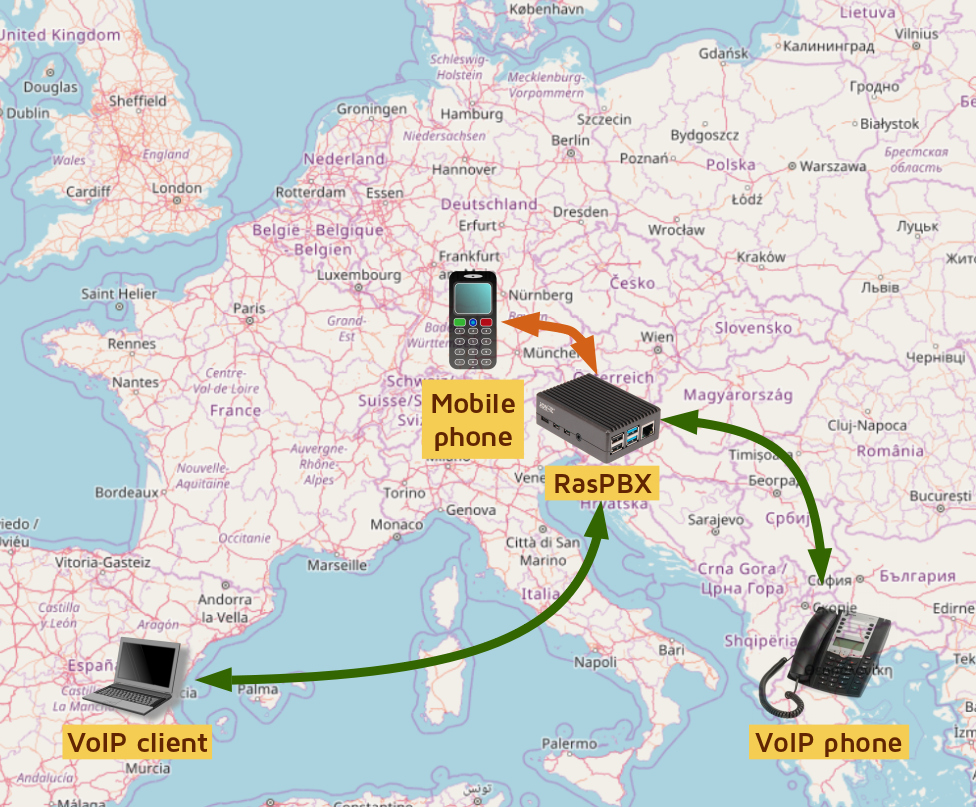

# Installation of RasPBX

*RasPBX installation for beginners*

A few years ago I came across a very interesting project from some guy, who [created a GSM bridge between two RasPBX hosts](http://www.otubo.net/2015/06/gsm-bridge-between-two-raspbx-hosts.html) and who wanted to make free long distance calls from Brazil to Germany with the help of his RaspberryPi.

That sounds just cool, so I decided to write a pretty complete guide how to do that.

In this guide we are covering how to set up your very own PBX on a RaspberryPi, how to set up a trunk to a mobile network and how to connect SIP clients to your PBX. SIP clients will be a computer (with SIP client), a mobile phone (with SIP client) and a physical VoIP desk phone.

Everything will be working through the VPN network and you will be able to have free phone calls among on your own infrastructure.

And there is more. When you will be traveling abroad (in the countries with high roaming costs), you will be able to receive and place calls and SMS messages to your mobile phone with little or almost no costs. And hey, retention data will be showing your SIM card is still at your home country, while you will be able to receive calls on a completely different location.

How to do that? Well, check the following guides:

- [RasPBX guide - English version](english.md)
- [RasPBX guide - Slovenian version (slovenska različica)](slovenian.md)
- [How to install Wireguard for RasPBX network](wireguard.md)
- [Sending AT commands to modem and using 2G network only](modem-at-commands.md)
- [VPN Bridge on *OpenWRT*](vpnbridge-on-openwrt.md)

I am preparing additional guides, so stay tuned!
