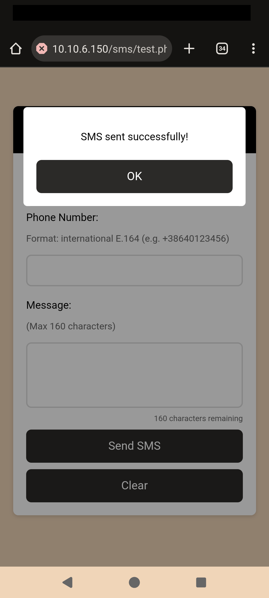

# Advanced SMS and MMS handling

Original RasPBX system can receive SMS messages and forward it to your e-mail address, but the received message looks really poor. You can see only the phone number, and no name of the contact, which means that you will need to lookup your contact list manually. Also, some SMS messages are split into several parts, so you will receive several e-mail messages for one SMS message, which really doesn't look cool.

You can also send SMS messages, but again, there is no log of sent messages, there is no phone number sanitiziang and validaton, and original SMS send script does not look good on mobile version.

And the most painful issue is, that receiving MMS messages does not work at all, when someone will send you a MMS message, you will even not receive the sending number, just a message, that you received SMS from number `MMSC` with empty content.

So I decided to change that and here are the scripts for your RasPBX system, that will allow you to receive and send SMS messages in more friendly way and to receive the sender of the MMS message.

So let's start!

## Store your contact list on RasPBX system

The first step is to prepare and store your contact list on your RasPBX system. First we would need to create a directory where we will have our contact list, received and sent messages:
```
mkdir -p /var/opt/raspbx
chown asterisk:asterisk /var/opt/raspbx
chmod 755 /var/opt/raspbx
```

Now we store our contact list. This is a simple tab-delimited text file with name of the contact in the first column and phone number in the second:
```
First contact	+38641123456
Second contact (from my job)	+38630987654
```
Please note that **phone numbers should be in international E.164 format** (general format for international telephone numbers).

The contact list should then be stored in a file `/var/opt/raspbx/my_contacts.txt`

To make things more simple, you can export your contacts list from your phone in VCF file and then use [vcf_4_raspbx.py](vcf_4_raspbx.py) script to convert VCF file to tab-delimited text file:
```
python3 vcf_4_raspbx.py MyContacts.vcf > my_contacts.txt
```

Please note that this script does not do any checks or converting phone numbers from local to international format, so you might want to check the final `my_contacts.txt` file if it looks fine!

## Script for receiving (multipart) SMS messages

As already mentioned, some SMS messages are received by USB dongle in several parts, which means, you will receive several e-mail messages for one received such a SMS.

When you send or receive SMS, the GSM standard limits a single SMS to 140 bytes. Depending on encoding this could be maximum 160 characters per SMS (if GSM-7 encoding is used) or maximum 70 characters per SMS (if UCS-2 encoding is used (Unicode)). If the message exceeds these limits the network will split the message into multiple parts. A proper SMS client is able to reassemble those multi parts automatically, but if since we are logging raw SMS from the USB dongle, Asterisk see multiple parts separately. Also, there seems to be a hardware limitation of (some?) USB dongles, which can not extract reference numbers of multipart SMS messages.

So here are two scripts, `sms_buffer.sh` and `sms_finalize.sh` which take care of that probem. When receiving a SMS, first script will create a temporary buffer file for that phone number. Then it will wait up to 5 seconds (see parameter `QUIET=5`). If in that time a new part from the same sender arrives, this new message will be added to this temporary buffer. If not, it will be sent as an e-mail by the second script. This ensures multipart SMS are assembled correctly per sender and you don’t get multiple emails for one SMS.

Here is the first script:

`nano /usr/local/bin/sms_buffer.sh`:

```
#!/bin/bash
# Usage: sms_buffer.sh <from_number> <basefilename> <base64_data>
# Buffers SMS parts per sender and schedules a quiet-window finalize.

FROM="$1"
BASENAME="$2"
B64DATA="$3"

PARTSDIR="/var/opt/raspbx/sms_parts"
FINALDIR="/var/opt/raspbx/received_messages"
QUIET=5   # seconds of silence after last part before we send the email

/bin/mkdir -p "$PARTSDIR" "$FINALDIR"

BUF="${PARTSDIR}/${FROM}.buf"
TSF="${PARTSDIR}/${FROM}.ts"
BASEF="${PARTSDIR}/${FROM}.base"

# Append decoded text to buffer (do NOT add extra newline)
echo "$B64DATA" | /usr/bin/base64 -d >> "$BUF"

# Remember the first BASEFILENAME we saw for this conversation
if [ ! -f "$BASEF" ]; then
  /bin/echo -n "$BASENAME" > "$BASEF"
fi

# Update "last part arrived" timestamp (epoch seconds)
NOW=$(/bin/date +%s)
/bin/echo -n "$NOW" > "$TSF"

# Schedule a finalize that will only run if no newer part arrived
/bin/sh -c "( /bin/sleep $QUIET; /usr/local/bin/sms_finalize.sh '$FROM' '$NOW' ) >/dev/null 2>&1 &" &
exit 0
```
**IMPORTANT**: this script stores SMS parts and SMS messages to two directories in `/var/opt/raspbx/`, so we need to create them:
```
mkdir -p /var/opt/raspbx/sms_parts/
chown asterisk:asterisk /var/opt/raspbx/sms_parts/
chmod 755 /var/opt/raspbx/sms_parts/

mkdir -p /var/opt/raspbx/received_messages
chown asterisk:asterisk /var/opt/raspbx/received_messages
chmod 755 /var/opt/raspbx/received_messages
```

The second script actually sends you an e-mail.

`nano /usr/local/bin/sms_finalize.sh`:
```
#!/bin/bash
# Usage: sms_finalize.sh <from_number> <expected_timestamp>
# Sends the email if no newer part arrived in the quiet window.

FROM="$1"
EXPECTED_TS="$2"

PARTSDIR="/var/opt/raspbx/sms_parts"
FINALDIR="/var/opt/raspbx/received_messages"
CONTACTS_FILE="/var/opt/raspbx/my_contacts.txt"

BUF="${PARTSDIR}/${FROM}.buf"
TSF="${PARTSDIR}/${FROM}.ts"
BASEF="${PARTSDIR}/${FROM}.base"

# If the timestamp has changed since we scheduled, a newer part arrived → abort
CURRENT_TS=$(/bin/cat "$TSF" 2>/dev/null)
[ "$CURRENT_TS" = "$EXPECTED_TS" ] || exit 0

# Read the base filename we saved for this conversation
BASENAME=$(/bin/cat "$BASEF" 2>/dev/null)
[ -n "$BASENAME" ] || BASENAME="MSG_${FROM}_$(/bin/date +%Y%m%d_%H%M%S)_$RANDOM"

DECODED="${FINALDIR}/${BASENAME}.decoded"
META="${FINALDIR}/${BASENAME}.meta"

# Move buffer to final decoded file (atomic-ish)
/bin/mv "$BUF" "$DECODED"

# Meta
/bin/echo -e "Type: SMS\nFrom: ${FROM}\nDate: $(/bin/date '+%Y-%m-%d %H:%M:%S')\nDecodedFile: ${DECODED}" > "$META"

# Lookup contact name
if [ -f "$CONTACTS_FILE" ]; then
    CONTACT_NAME=$(awk -F'\t' -v num="$FROM" 'num==$2 {print $1}' "$CONTACTS_FILE")
else
    CONTACT_NAME=""
fi

if [ -z "$CONTACT_NAME" ]; then
    CONTACT_NAME="sender is not on your contact list"
fi

# Generate timestamp
TIMESTAMP=$(date '+%Y-%m-%d %H:%M:%S')

# Email
(
  /bin/echo "From: obvestilo@myserver.si"
  /bin/echo "To: me@myserver.si"
  /bin/echo "Subject: [RasPBX] Received SMS message"
  /bin/echo "MIME-Version: 1.0"
  /bin/echo "Content-Type: text/plain; charset=UTF-8"
  /bin/echo "Content-Transfer-Encoding: 8bit"
  /bin/echo
  /bin/echo "NOTIFICATION"
  /bin/echo
  /bin/echo "You have received SMS from number ${FROM} (${CONTACT_NAME})."
  /bin/echo "Date and time of received SMS: ${TIMESTAMP}."
  /bin/echo
  /bin/echo "You can reply to this SMS via: http://reply_page/sms?number=${FROM}"
  /bin/echo
  /bin/echo "SMS content:"
  /bin/echo
  /bin/cat "$DECODED"
) | /usr/sbin/sendmail -t

# Clean up state for this sender
/bin/rm -f "$TSF" "$BASEF"
exit 0
```
**IMPORTANT**: change `From:` and `To:` addresses in the script (and you can also provide a link to your SMS reply page) - check this part:
```
  /bin/echo "From: obvestilo@myserver.si"
  /bin/echo "To: me@myserver.si"
```
Also change URL to **your** SMS sender script.

Now make both scripts executable (and owned by Asterisk) and you are good to go:
```
chmod +x /usr/local/bin/sms_buffer.sh /usr/local/bin/sms_finalize.sh
chown asterisk:asterisk /usr/local/bin/sms_buffer.sh /usr/local/bin/sms_finalize.sh
```

## Script for receiving MMS messages

As mentioned, RasPBX originally does not support receiving MMS messages. When you receive a MMS message, you just get will an empty a message with subject saying that you received SMS from number `MMSC`.

Now, the problem is, that MMS messages are encoded in slightly different way that SMS messages. So when your Asterisk dialplan tried to decode received SMS message, it will just (silently) fail and you will receive an empty message.

So I created an updated Asterisk dialplan to decode MMS message and sent a notification, which contains sender's phone number (and his/her name, if it is on your contact list). Decoder also extracts URL to download multimedia content. However, this URL is accessible from your mobile operator's network. So if you would like to donwload multimedia content, you would need to open data connection from your USB dongle, download MMS content and then close the connection.

This is quite complicated process and on my USB dongle I even have some hardware limitations, so for now, I just extract this information and send a notification e-mail. In that case you will at least see who is the sender and they you can send him (or her) a SMS and ask to send you the message through other communication channel.

So here is the script for sending e-mail about recieved MMS:

`nano /usr/local/bin/send_mms_email.sh`:

```
#!/bin/bash

# Read input variables
FROM="$1"
TO="$2"
SENDER="$3"
MMS_URL="$4"
CONTACTS_FILE="/var/opt/raspbx/my_contacts.txt"

# Lookup contact name (if file exists)
if [ -f "$CONTACTS_FILE" ]; then
    CONTACT_NAME=$(awk -F'\t' -v num="$SENDER" 'num==$2 {print $1}' "$CONTACTS_FILE")
else
    CONTACT_NAME=""
fi

# Fallback if no contact found
if [ -z "$CONTACT_NAME" ]; then
    CONTACT_NAME="sender is not in your contact list"
fi

# Generate the email
cat <<EOF | /usr/sbin/sendmail -t
From: $FROM
To: $TO
Subject: [RasPBX] Received MMS message
MIME-Version: 1.0
Content-Type: text/plain; charset=UTF-8

NOTIFICATION

You have received MMS from number +$SENDER ($CONTACT_NAME).
Date and time of receiving: $(date "+%d. %m. %Y ob %H:%M:%S").
MMS content can not be downloaded, URL to download MMS multimedia is: $MMS_URL
You can send SMS to the sender via: http://reply_page/sms?number=+$SENDER

EOF
```

Change URL to **your** SMS sender script.

Make the script executable (and owned by Asterisk), and you are good to go:
```
chmod +x /usr/local/bin/send_mms_email.sh
chown asterisk:asterisk /usr/local/bin/send_mms_email.sh
```

## Updated dialplan

Now we can update our Asterisk dialplan for handling incoming SMS and MMS messages. Dialplan for that is stored in `extensions_custom.conf`.

`nano /etc/asterisk/extensions_custom.conf`:

```
[from-trunk-dongle]
; === Handle incoming SMS/MMS ===
exten => sms,1,Verbose(== Incoming message from ${CALLERID(num)})

; Generate unique filename parts
 same => n,Set(MSGDATE=${STRFTIME(${EPOCH},,%Y%m%d)})
 same => n,Set(MSGTIME=${STRFTIME(${EPOCH},,%H%M%S)})
 same => n,Set(RNDSTR=${RAND(100,999)})
 same => n,Set(BASEFILENAME=MSG_${CALLERID(num)}_${MSGDATE}_${MSGTIME}_${RNDSTR})

; File paths
 same => n,Set(RAWFILE=/var/opt/raspbx/received_messages/${BASEFILENAME}.b64)
 same => n,Set(DECTMP=/tmp/${BASEFILENAME}.bin)
 same => n,Set(DECODEDFILE=/var/opt/raspbx/received_messages/${BASEFILENAME}.decoded)
 same => n,Set(META=/var/opt/raspbx/received_messages/${BASEFILENAME}.meta)

; Save raw base64
 same => n,System(/usr/bin/printf '%s' "${SMS_BASE64}" > ${RAWFILE})

; Decode Base64 to binary
 same => n,System(/usr/bin/printf '%s' "${SMS_BASE64}" | /usr/bin/base64 -d > ${DECTMP})

; Detect MMS signature
 same => n,Set(IS_MMS=0)
 same => n,ExecIf($[${SHELL(/usr/bin/strings ${DECTMP} | /bin/grep -i -m1 'application/vnd.wap.mms-message' >/dev/null && echo 1 || echo 0)} = 1]?Set(IS_MMS=1))

; Route accordingly
 same => n,ExecIf($[${IS_MMS} = 0]?Goto(smsproc,1))
 same => n,ExecIf($[${IS_MMS} = 1]?Goto(mmsproc,1))

; --------------------------------------------------------
; SMS processing → buffer & quiet-window finalize
exten => smsproc,1,Verbose(Processing as SMS - buffering)
 same => n,System(/usr/local/bin/sms_buffer.sh "${CALLERID(num)}" "${BASEFILENAME}" "${SMS_BASE64}")
 same => n,Hangup()

; --------------------------------------------------------
; MMS processing (immediate email)
exten => mmsproc,1,Verbose(Processing as MMS)
 same => n,System(cp ${DECTMP} ${DECODEDFILE})

 ; Extract MMS URL
 same => n,System(/usr/bin/strings ${DECTMP} | /bin/grep -Eo 'https?://[^ ]+' | /usr/bin/head -n1 > /tmp/${BASEFILENAME}_url.txt)
 same => n,Set(MMS_URL=${FILE(/tmp/${BASEFILENAME}_url.txt)})

 ; Sanitize MMS_URL (remove control chars)
 same => n,Set(MMS_URL_CLEAN=${FILTER(a-zA-Z0-9/:._-,${MMS_URL})})

 ; Extract MMS sender
 same => n,System(/usr/bin/strings ${DECTMP} | /bin/grep -Eo '\+?[0-9]{6,15}' | /usr/bin/head -n1 > /tmp/${BASEFILENAME}_from.txt)
 same => n,Set(MMS_SENDER=${FILE(/tmp/${BASEFILENAME}_from.txt)})
 same => n,ExecIf($["${MMS_SENDER}" = ""]?Set(MMS_SENDER=${CALLERID(num)}))

 ; Sanitize MMS_SENDER (remove control chars and newlines)
 ; 1) Make a safe sender (strip CR/LF, keep + and digits)
 same => n,Set(MMS_SENDER_CLEAN=${SHELL(/usr/bin/printf %s "${MMS_SENDER}" | /usr/bin/tr -d '\r\n' | /usr/bin/tr -cd '0123456789+')})
 ; 2) Fallback to CALLERID if it somehow ends up empty
 same => n,ExecIf($["${MMS_SENDER_CLEAN}" = ""]?Set(MMS_SENDER_CLEAN=${SHELL(/usr/bin/printf %s "${CALLERID(num)}" | /usr/bin/tr -cd '0123456789+')}) )

 ; Save metadata
 same => n,System(/bin/echo -e "Type: MMS\nFrom: ${MMS_SENDER}\nDate: ${STRFTIME(${EPOCH},,%Y-%m-%d %H:%M:%S)}\nRawFile: ${RAWFILE}\nDecodedFile: ${DECODEDFILE}\nMMS_URL: ${MMS_URL}" > ${META})

 ; Send email (via external script)
 same => n,System(/usr/local/bin/send_mms_email.sh "obvestilo@myserver.si" "me@myserver.si" "${MMS_SENDER_CLEAN}" "${MMS_URL_CLEAN}")

 same => n,System(rm -f ${DECTMP} ${RAWFILE} /tmp/${BASEFILENAME}_url.txt /tmp/${BASEFILENAME}_from.txt)
 same => n,Hangup()

; --------------------------------------------------------
; Fallback for calls
exten => _.,1,Set(CALLERID(name)=${CALLERID(num)})
 same => n,Goto(from-trunk,${EXTEN},1)
```

**IMPORTANT**: change `From:` and `To:` addresses in the script (check this part in MMS processing):
```
 ; Send email (via external script)
 same => n,System(/usr/local/bin/send_mms_email.sh "obvestilo@myserver.si" "me@myserver.si" "${MMS_SENDER_CLEAN}" "${MMS_URL_CLEAN}")
```

Dialplan consists of three parts. First part processes SMS messages, second part processes MMS messages and then you have fallback for calls. SMS and MMS messages are stored in a directory `/var/opt/raspbx/received_messages` on your RasPBX device. For each SMS messages you have three files: `.b64`, which is the original data received from USB dongle (it is Base64 encoded), `.decoded`, which is Base64 decoded content of the SMS message and `.meta`, which contains medatata (basically sender's number and date/time). Example:
```
MSG_+38641123456_20250818_204519_783.b64
MSG_+38641123456_20250818_204519_783.decoded
MSG_+38641123456_20250818_204519_783.meta
```
File names contain sender's number, date and time of receiving and some random text in so the files won't overwrite if you by some chance receive two SMS messages from the same number on exact same time.

MMS Messages are also stored, but in two files: `.decoded`, which contains decoded MMS (with some binary data also - from this data we parse sender's number and MMS URL), and `.meta`, which contains medatata (basically sender's number and date/time). Example:
```
MSG_MMSC_20250815_234458_504.decoded
MSG_MMSC_20250815_234458_504.meta
```

Finally we just need to reload the dialplan and then you can test receiving SMS and MMS messages:
```
/usr/sbin/asterisk -rx 'dialplan reload'
```
### Received SMS message


### Received MMS message


## SMS sender and SMS viewer script

SMS sender script is based on Chan_Dongle SMS Script by Troy Nahrwold, which was developed many years ago. This updated script is:
- mobile friendly
- has switchable regex for local or E.164 phone number formats
- does real-time JS sanitizing and server side phone number validation (currently you can allow only Slovenian numbers or international numbers in E.164 format)
- does show how many characters is left for SMS message (160 max.)
- transliterate UTF-8 to ASCII to handle special characters that can not be sent in normal SMS
- logs sent messages to `/var/opt/raspbx/sent_messages/`

SMS viewer script:
- shows you all sent messages (stored in `/var/opt/raspbx/sent_messages/`)
- uses `my_contacts.txt` file to show the name of the contact

Both scripts are using common authentication system - you can have multiple users and passwords are stored in bcrypt format.

When you send the SMS message, SMS sender script shows the Asterisk answer, which is basically the SMS queue ID. For now, it does not show if SMS was sent successfully, but you can manually check Asterisk log:
```
cat /var/log/asterisk/full | grep <queue_ID>
```

If there was an error seding SMSm you will see something like:
```
cat /var/log/asterisk/full | grep 0xb4005c60

[2025-08-11 21:18:00] VERBOSE[1604] at_response.c: [dongle0] Error sending SMS message 0xb4005c60
[2025-08-11 09:18:00] ERROR[1604] at_response.c: [dongle0] Error sending SMS message 0xb4005c60
```
If SMS was sent successfully, you will see:
```
cat /var/log/asterisk/full | grep 0xb3e61a00

[2025-08-11 21:22:07] VERBOSE[1604] at_response.c: [dongle0] Successfully sent SMS message 0xb3e61a00
[2025-08-11 21:22:07] NOTICE[1604] at_response.c: [dongle0] Successfully sent SMS message 0xb3e61a00
```

**How to install it?** Just put [index.php](index.php), [auth.php](auth.php), [view.php](view.php) and [get_contacts.php](get_contacts.php)in a folder `/var/www/html/sms`.

In [auth.php](auth.php) look for users and change default password:
```
$USERS = [
    "admin" => '$2y$10$D0FeVomZHGimeJ6cNaQLA.jOT1bfCQB6L.KRXLPNhY3B/rSQmKC.a', 
    // hash for "ChangeYourPassword"
    // IMPORTANT: you can change default (or forgotten) password by typing this command to terminal:
    // php -r "echo password_hash('ChangeYourPassword', PASSWORD_DEFAULT) . PHP_EOL;"
```

In [index.php](index.php) select the correct regex for phone number validation (currently it is enabled Slovenian phone numbers validation).

In [get_contacts.php](get_contacts.php) just check that your contacts file is on the correct location (`/var/opt/raspbx/my_contacts.txt`).

## Screenscoots of the RasPBX SMS system

### Login window


Login window on a mobile phone.

### SMS sender


Select contact from the list.


SMS sender.


SMS message sent.

### SMS viewer


SMS and MMS viewer (you can view received SMS and MMS messages and sent SMS messages).

## To do
- CSRF protection and security headers
- add Asterisk log parsing to check if SMS was sent successfully
- small error in SMS viewer (does not show MMS_URL)
