# Installation of RasPBX

*RasPBX installation for beginners.*

- [Basic concepts](#basic-concepts)
- [What you will need](#what-you-will-need)
- [Installation of the operating system](#installation-of-the-operating-system)
  - [Write the RasPBX image to a SD card](#write-the-raspbx-image-to-a-sd-card)
  - [Log in to the RasPBX device](#log-in-to-the-raspbx-device)
  - [First things to do after login](#first-things-to-do-after-login)
- [PBX installation and configuration](#pbx-installation-and-configuration)
  - [Setting up the e-mail system](#setting-up-the-e-mail-system)
  - [Set up VPN client](#set-up-vpn-client)
  - [Set up NTP](#set-up-ntp)
- [The security of your system](#the-security-of-your-system)
  - [Secure SSH](#secure-ssh)
    - [Login with SSH key](#login-with-ssh-key)
  - [Disable *root* user](#disable-root-user)
  - [Install intrusion prevention](#install-intrusion-prevention)
    - [How to unban IP address](#how-to-unban-ip-address)
  - [Install firewall](#install-firewall)
- [Installation of USB dongle](#installation-of-usb-dongle)
  - [Dongle configuration](#dongle-configuration)
  - [Freedom is calling... and sending SMS messages](#freedom-is-calling-and-sending-sms-messages)
  - [Install USSD webpage](#install-ussd-webpage)
  - [Install additional codec](#install-additional-codec)
- [FreePBX configuration](#freepbx-configuration)
  - [Set up the trunk](#set-up-the-trunk)
  - [Set up outbound routes](#set-up-outbound-routes)
    - [Setting up dial prefix for outgoing calls](#setting-up-dial-prefix-for-outgoing-calls)
  - [Set up extensions](#set-up-extensions)
  - [Set up inbound routes](#set-up-inbound-routes)
  - [Additional SIP settings](#additional-sip-settings)
  - [Enabling TCP instead of UDP](#enabling-tcp-instead-of-udp)
- [Setting up SIP clients](#setting-up-sip-clients)
  - [Your voicemail configuration](#your-voicemail-configuration)
  - [Voicemail Admin e-mail configuration](#voicemail-admin-e-mail-configuration)
- [Some other things to do](#some-other-things-to-do)
  - [Block extension to call outside](#block-extension-to-call-outside)
  - [Restrict extension to calling a specific number only](#restrict-extension-to-calling-a-specific-number-only)
- [Updating the system](#updating-the-system)
- [Backups](#backups)
- [Some other cool things to do](#some-other-cool-things-to-do)
  - [Testing](#testing)
  - [Connecting the physical phone](#connecting-the-physical-phone)
    - [Configuring and connecting VoIP phone to your local network](#configuring-and-connecting-voip-phone-to-your-local-network)
    - [Connecting VoIP phone to the VPN](#connecting-voip-phone-to-the-vpn)
      - [RaspberryPi as a router for the wired network](#raspberrypi-as-a-router-for-the-wired-network)
      - [Access to VoIP phone from the VPN network](#access-to-voip-phone-from-the-vpn-network)
      - [Change unchangeable default password](#change-unchangeable-default-password)
      - [Make your old VoIP phone wireless](#make-your-old-voip-phone-wireless)
  - [Volume in voicemail messages](#volume-in-voicemail-messages)
- [And what can you do?](#and-what-can-you-do)

A few years ago I came across a very interesting project from some guy, who [created a GSM bridge between two RasPBX hosts](http://www.otubo.net/2015/06/gsm-bridge-between-two-raspbx-hosts.html) and who wanted to make free long distance calls from Brazil to Germany with the help of his RaspberryPi. That sounded just cool, but other projects were waiting for me at that time and I didn't have time for that. Until now.

So, what do we intend to do? I am going to show you, how you can install the [*Asterisk*](https://www.asterisk.org/) telephony server on a small single board computer [*RaspberryPi*](https://www.raspberrypi.org/) in order to be able to make calls from your computer or smartphone to ordinary phone numbers. So basically, you will literally end up with your own PBX in your pocket. Actually no, because RaspberryPi needs to be connected to a power supply and network, and you would look weird with cables going into your pocket, but you get the idea.

But why would you do that? Well, besides that this sounds like a really cool project and you like hacking and learning, you can cover some interesting scenarios like:

- You have a small company and you would like to have your own PBX with the ability to call outside.
- Because of COVID-19, you would like that your employees can work at home, but have company phones.
- You would like to have the ability that your customers can call you and use your own automated voice system for customer support.
- You would like to have free telephone (audio and video) calls through the internet, but on your own infrastructure.
- You live in one country, but you have business and a mobile phone from the other country. And roaming between these two countries is expensive, so you would like to be able to use the internet to relay your calls between these two countries via the internet for free.
- You are travelling abroad and would like to reduce roaming costs, but be accessible on your home mobile number for calls and SMS messages.
- You are travelling abroad, but would like your mobile operator to think you are located at your home (i. e. hide your location data).

For me, the most important scenario is, that I would like to travel abroad (in the countries with high roaming costs), and be able to receive calls and SMS messages to my home mobile number. So if I receive a SMS message from my bank, I want this SMS to be delivered to my e-mail address. I would also like to be able to send SMS messages back to my bank. I would like to be able to receive phone calls and if I am without internet connection, the person calling me should be able to leave me a voice message which will be then delivered into my e-mail address. And of course, I would like to be able to call them back from my number.

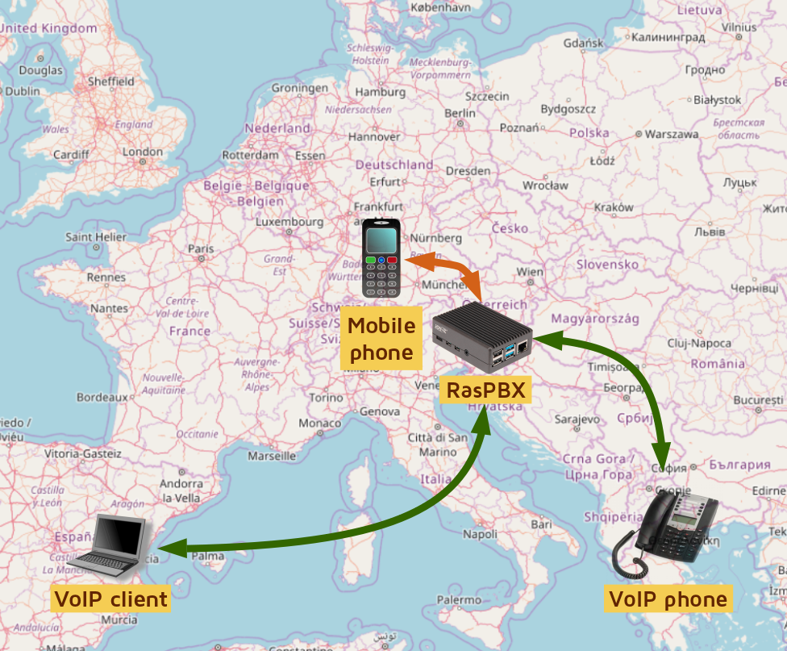

So in this article I will show you how you can do that. More specifically, how to install RasPBX to RaspberryPi, install a USB dongle and create a trunk to mobile phone network through that dongle for your endpoints. Sounds complicated? Well, it turns out, it is not.

But first thing's first. RaspberryPi, RasPBX, Asterisk, FreePBX, USB dongle, trunks, endpoints... what are you talking about???

## Basic concepts

So, very brief explanation of basic concepts. **RaspberryPi** is a small computer, which was originally developed for the promotion of teaching computer science in schools. However, the project evolved, and today there are several models of RaspberryPi available, with all kinds of accessories. But the most important thing is that RaspberryPi computers are relatively cheap (they cost between 40 and 100 EUR, depending of the model and accessories you want to buy) and that they are a great tool for learning new things. So, every true *hacker* - and here we are using term hacker in a positive way, so by *hacker* we mean *an expert at programming and solving problems with a computer* - should have one (or *more*) of these devices in his or her *arsenal*. For running RasPBX, you will need a RaspberryPi 3 or a RaspberryPi 4, additionally you would like to buy a strong enough power supply (5V 3A) and a case for your RaspberryPi. If your power supply is not strong enough, your RaspberryPi will not be able to handle the GSM dongle power consumption, and it will start rebooting. In that case, you will need to buy a powered USB hub.

**RasPBX** is an operating system for your RaspberryPi, based on a Debian Linux, which has integrated Asterisk and FreePBX software, so you don't need to install them by yourself. You can [download RasPBX](http://www.raspberry-asterisk.org/downloads/) from the project's official website, and here I am using version *10-10-2020* (*raspbx-10-10-2020.zip*), which has included Asterisk 16.13.0 and FreePBX 15.0.16.75. BTW, if you noticed the word *Linux* - yes, RasPBX **is** opensource and completely free. Just click download and you are good to go.

**Asterisk** is a software implementation of a private branch exchange (PBX). Basically, it is a voice over IP and telephony software used to establish and control telephone calls between telecommunication endpoints (which can be ordinary telephones or so called softphones - VoIP applications on an computer or mobile phone). Well, actually it is much more that that, but what is important, is to know that this software is opensource and free (however, there are several paid modules available), and that this software is used by many telecommunication companies around the world for very commercial purposes. So it is not just some funny toy, it is a serious project, with a lot of capabilities, which means hours of hours of fun learning and creating nice projects. BTW, did I mention, Asterisk is opensource and free?

**FreePBX** is web-based open-source graphical user interface (GUI) that manages Asterisk. Any yes, it is also opensource and free.

**USB dongle** in RasPBX is a special USB device, actually a USB modem in which you can insert a SIM card and then connect this modem to a computer (in our case a RaspberryPi) through a USB port. There are several USB modems available, but not all work with RasPBX. Compatible USB modems should be unlocked and must have voice capability enabled. You can buy one from the [list of officially supported](https://github.com/bg111/asterisk-chan-dongle/wiki/Requirements-and-Limitations). They cost around 20 EUR. You can also buy used one, but if it is not unlocked, you will need to use [DC Unlocker](https://www.dc-unlocker.com/downloads/DC_unlocker_software), which will cost you some additional money. (And *DC Unlocker* only work on Windows). I have used **Huawei E1752C**, but you can consider buying another supported model. BTW, instead of an USB dongle, you can setup RasPBX to be paired with a mobile phone via a Bluetooth connection and you can make calls through that connection, but I didn't test that.

Of course, you will need a SIM card, and before you insert the SIM card in your USB modem, you should **disable the SIM card's PIN**. You can do this with your phone, if you don't know how just be *a hacker* and use a search engine. :)

In telecom, trunking is used to connect two systems together. To put it simply, a **trunk** is a connection from your system (PBX) to another telephone system. From that trunk you can route outgoing and incoming calls.

An **endpoint** is basically your internal phone number (in your PBX), which is used by softphones (VoIP clients) and physical phones. Internally, you can use any numbering, but I decided to use internal PBX numbers like *1000*, *2000*, *3000*, etc.

*Enough talking, let's hack it together!*

## What you will need

As we already mentioned, you will need:

- A RaspberryPi 3 or RaspberryPi 4 (I have tested both, however, the RPi4 is much more powerful and can handle up to 200 concurrent phone calls (really, [I am not joking](https://www.youtube.com/watch?v=dVGf3HrKZl4)). I suggest you buy a RPi4 with 4 or 8 GB RAM);
- a power supply for the RaspberryPi (3A 5V or more), a case for RaspberryPi and a SD card (8 GB is minimum, but I suggest buying 32 GB and a little bit higher quality);
- a compatible USB dongle (I am using the Huawei E1752C);
- RasPBX, which you can freely [download from the official project's website](http://www.raspberry-asterisk.org/downloads/) (I am using version 10-10-2020);
- internet connection.

Additionally I am also using my own VPN network, and I will show you how to fence your PBX inside the VPN network. I am using Wireguard, with several security enhancements, hardened cryptography settings, etc. But I am not going to talk about how to set up your own VPN network, I will just assume you already have one. However, you can check my [guide how to set up Wireguard server](wireguard.md).

*So let's start.*

## Installation of the operating system

First we will take a look into the installation of a basic system. Since it is Linux, it helps if you are familiar with Linux, but if you are not, just follow the installation instructions and you will be fine. However, I assume you already know how to use terminal and how to login to a remote Linux system using SSH. Hint: under Windows you can use PuTTY or the built-in SSH client from Windows command prompt.

> [!NOTE]
> I am using Ubuntu Linux as my main operating system, and setting up some things (like SSH connections) are a little bit different under Linux and Windows. But don't worry, you can always use your favourite search engine and learn something new. (Or maybe you can start using Linux?)

### Write the RasPBX image to a SD card

After you download the RasPBX file *raspbx-10-10-2020.zip* you should unzip it and write the .IMG file to your SD card. For this I prefer Ubuntu's **Disks** tool, but if you are using other operating systems, just perform an online search and find out which tools can you use for that.

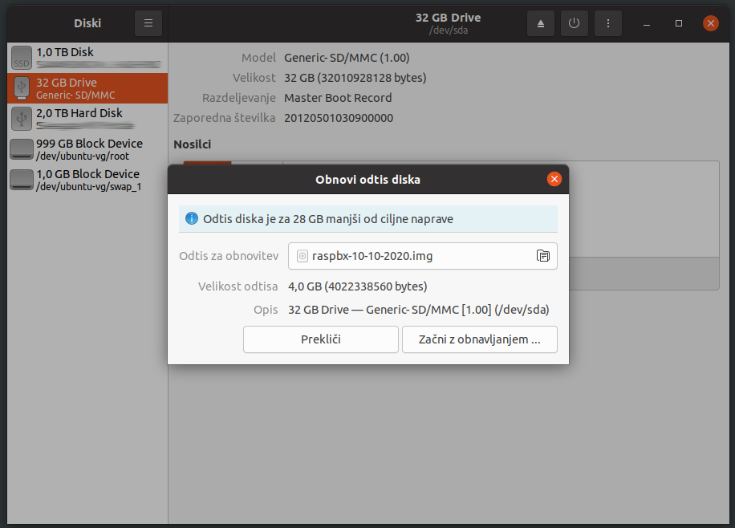

Then insert the SD card into the RaspberryPi and the SIM card in your USB dongle. Connect the USB dongle to the RaspberryPi. Connect your network cable... And finally - connect the RaspberryPi to the power supply.

### Log in to the RasPBX device

After booting the RaspberryPi device, we need to find out it's IP address. There are several ways to do that, but a true hacker would prefer the **nmap** command line tool.

So lets say `nmap 192.168.1.0/24` in your terminal (use the network where you and your Raspberry are connected, in my case it was `192.168.1.0/24`, but your local network settings may be different), and look for a device like this:

    Nmap scan report for 192.168.1.150
    Host is up (0.0091s latency).
    Not shown: 994 closed ports
    PORT     STATE SERVICE
    22/tcp   open  ssh
    53/tcp   open  domain
    80/tcp   open  http
    139/tcp  open  netbios-ssn
    445/tcp  open  microsoft-ds
    8088/tcp open  radan-http

Now you can connect to a device via **SSH**. The username is **root** and the default password is **raspberry**: `ssh root@192.168.1.150`. You will need to confirm the identity of RaspberryPi's SSH key:

    The authenticity of host '192.168.1.150 (192.168.1.150)' can't be established.
    ECDSA key fingerprint is SHA256:vtE5/xxxxxxxxxxxxxxxxxxACyoanxxxxxxxxxxxmDQ.
    Are you sure you want to continue connecting (yes/no/[fingerprint])? yes
    Warning: Permanently added '192.168.1.150' (ECDSA) to the list of known hosts.

...and after a successful login, we can see the welcome screen on your RasPBX device:

    Linux raspbx 5.4.51-v7l+ #1333 SMP Mon Aug 10 16:51:40 BST 2020 armv7l
    
    Welcome to RasPBX - Asterisk for Raspberry Pi
    
    RasPBX is based on Debian. The programs included with the Debian GNU/Linux
    system are free software; the exact distribution terms for each program are
    described in the individual files in /usr/share/doc/*/copyright.
    
    RasPBX comes with ABSOLUTELY NO WARRANTY, to the extent permitted by 
    applicable law.
    
    List of RasPBX specific commands:
    ----------------------------------------------------------------------------- 
    raspbx-upgrade      Keep your system up to date with the latest add-ons and
                        security fixes
    configure-timezone  Set timezone for both system and PHP
    install-fax         Install HylaFAX                          
    add-fax-extension   Add additional fax extension for use with HylaFAX
    install-fail2ban    Install Fail2Ban for additional security
    install-dongle      Install GSM/3G calling capability with chan_dongle
    raspbx-backup       Backup your complete system to an image file

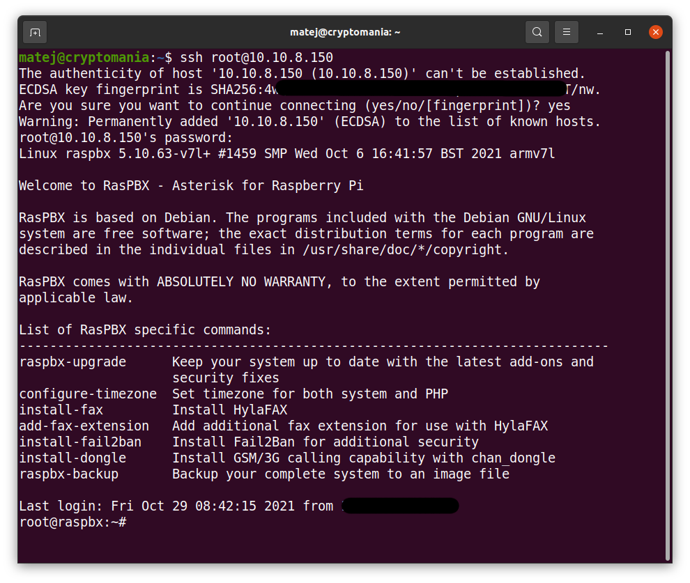

### First things to do after login

First, change the password with the command `passwd`.

Then create new SSH host keys in order to have individual keys for your setup: `regen-hostkeys`.

Then configure your timezone: `configure-timezone`. Since I live in Slovenia, Europe, I set it to `Europe/Ljubljana`.

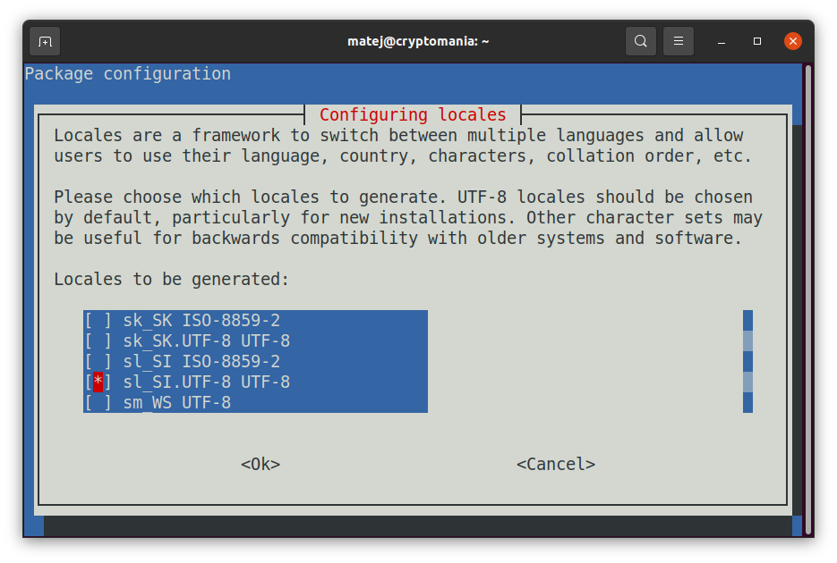

Then you should reconfigure locales: `dpkg-reconfigure locales`. In my case I added support for Slovenian local settings (`sl_SI.UTF-8 UTF-8`), and for default locale I selected `en_GB.UTF-8`.

Then it is time for security upgrades. We can use the `raspbx-upgrade` comand for this, however, running this command will return an error. The error message says *error occurred during the signature verification*, and that is because of an expired GPG key used to digitally sign some RaspPBX packages:

    The following signatures were invalid: EXPKEYSIG B188E2B695BD4743 DEB.SURY.ORG Automatic Signing Key <deb@sury.org>
    Reading package lists... Done
    E: Repository 'http://raspbian.raspberrypi.org/raspbian buster InRelease' changed its 'Suite' value from 'stable' to 'oldstable'

So we need to download and install the new signing key with the following command: `wget -O /etc/apt/trusted.gpg.d/php.gpg https://packages.sury.org/php/apt.gpg`.

Now we can update the repositories with `apt update`. However, we will see some warnings, which will be gone after we install all of the upgrades to the system:

    E: Repository 'https://packages.sury.org/php buster InRelease' changed its 'Suite' value from '' to 'buster'
    N: This must be accepted explicitly before updates for this repository can be applied. See apt-secure(8) manpage for details.
    Do you want to accept these changes and continue updating from this repository? [y/N] y

Here we should answer **Yes** (type y and press enter).

    Get:5 https://packages.sury.org/php buster/main armhf Packages [328 kB]       
    E: Repository 'http://raspbian.raspberrypi.org/raspbian buster InRelease' changed its 'Suite' value from 'stable' to 'oldstable'
    N: This must be accepted explicitly before updates for this repository can be applied. See apt-secure(8) manpage for details.
    Do you want to accept these changes and continue updating from this repository? [y/N] y

Here we should also answer **Yes** (type y and press enter).

Then we can upgrade all the software with `apt upgrade` command, and finally remove unused program packages with `apt autoremove`.

Now we can safely use `raspbx-upgrade`, which is basically just a script performing the update and upgrade commands in one step.

Finally, we can run `raspi-config` in order to expand the filesystem to the whole SD card. Unfortunately `raspi-config` will ask us some silly questions, because it could not determine the default user, but we can just press enter and that's it. Then you should select the option `Advanced Options` and finally `Expand Filesystem`.

After it is done, it will ask us to reboot, and we would willingly do that, of course.

The basic configuration of the operating system is now over.

## PBX installation and configuration

After the reboot, we would need to remove the identity of the old SSH key on our computer (where from we are connecting to RasPBX). Why? Because in the previous SSH session we issued the `regen-hostkeys` command to create new SSH host keys, that's why.

On my Ubuntu system I said: `ssh-keygen -f "/home/matej/.ssh/known_hosts" -R "192.168.1.150"`. Those using Windows systems need to figure this by themselves.

Now we can make a SSH connection to our RasPBX: `ssh root@192.168.1.150`.

### Setting up the e-mail system

First, we will set up the e-mail system, because our RasPBX sends us and our users e-mails. Since RasPBX is using the *exim* mail server, we should issue the following command: `dpkg-reconfigure exim4-config`.

Now we are guided through different settings. On the first configuration page we should select "*mail sent by smarthost; received via SMTP or fetchmail*".

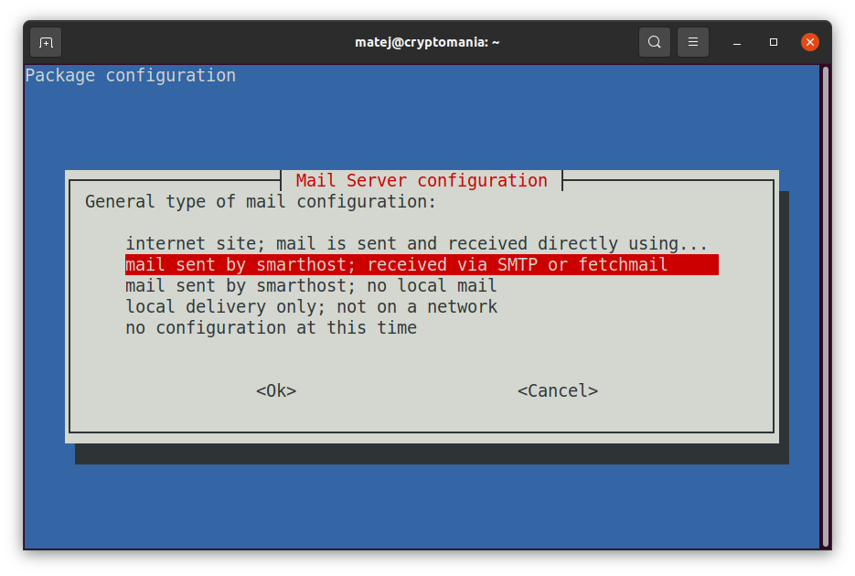

On the following pages we can just keep the default values by pressing enter. We keep doing so until we reach the page starting with the "*Please enter the IP address or the host name of a mail server...*" Here we need to enter the SMTP hostname of our email provider. Since I also use my own mail server, I have entered the settings of my mail server, but you can also use GMail or some other mail provider (preferably not one from the big evil tech companies).

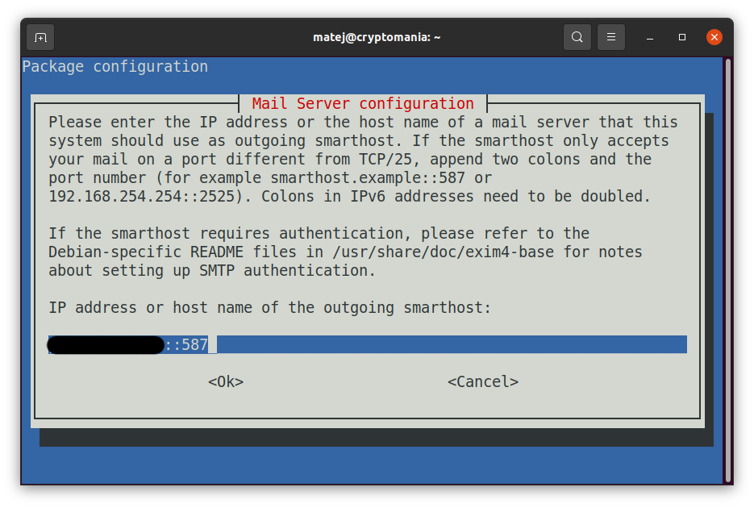

Anyway, here is a little trick: you need to enter the FQDN name and port of your mail server delimited by a double colon. For example: `mail.example.com::587` - please note the double colon (`::`) between FQDN and the port. Oh, and for the *non-hackers* not knowing what FQDN stands for - it means *fully qualified domain name*, so it is basically a domain name that specifies the location of your mail server exact location in the tree hierarchy of the Domain Name System.

For the rest of the configuration, we can just keep accepting the default values.

In case you entered something stupid or forgot to set your e-mail provider's server (*as it happened to me...*), just re-run the `dpkg-reconfigure exim4-config` command again.

Then, edit the file `/etc/exim4/passwd.client`. I am using the *nano* text editor, but you can use your own favourite text editor. For those unfamiliar with Linux, when you are done editing the text file, you press ctrl-x and *nano* will ask you whether to save the changes ("*Save modified buffer?*") to which you of course say **y** (Yes), and then *nano* will ask you which file changes should be saved to, and you just press enter (to save the changes in the currently opened file) and that is it.

So, we say: `nano /etc/exim4/passwd.client`

...and at the bottom of the file we add our credentials in the following format:

    SMTP_HOSTNAME:USERNAME:PASSWORD

So in my case I entered:

    mail.xxxxx.si:obvestilo@xxxxx.si:XXXYYYXXX

I mentioned that I am from Slovenia, so I configured the e-mail address `obvestilo@...,` which means `notification@...` in English . Because,... well, because RasPBX will be sending me notifications, right?

Please note that in most cases, the SMTP hostname used in this configuration file is identical to the hostname used as the smarthost in the exim4 configuration. If the e-mail fails to work, specify the reverse lookup of your email provider’s SMTP host IP address here.

Also, some email providers require you to use sender addresses identical to one of the public email addresses of your account. In this case, edit file `/etc/email-addresses` with the command:

    nano /etc/email-addresses

On the bottom of this file add:

    root: obvestilo@xxxxx.si
    asterisk: obvestilo@xxxxx.si

This configures the sender address of all outgoing e-mail to your e-mail address.

Now we configured everything, so we just need to activate our configuration with command: `update-exim4.conf`.

Now we can test if sending e-mails works. Enter the command: `send_test_email matej.kovacic@xxxxx.si`, hold your breath, and... a test e-mail should reach your inbox shortly.

After you receive the e-mail message saying "*This is a test. If you can read this, email delivery from your Raspberry Pi works.*", you can grab your coffee. Or a beer, if you prefer. Now, it is a time for the next step.

### Set up VPN client

As I mentioned, we will fence our RasPBX into a VPN network. In that case, the RasPBX and VoIP clients (physical telephones and VoIP softphones) will be closed in a VPN network, so the communication among them will take place inside a secured VPN network only. This is especially important if you do not set up the TLS encryption and enforce SRTP and/or ZRTP encryption protocols. On the other hand, devices closed in a VPN network are usually easier to manage and more secure - if you can ensure the security of the VPN network.

However, using a VPN for encryption of VoIP data could be a little problematic. Research has shown that using encrypted VBR (variable bit rate) encoding could pose a security risk. Why? Because when using the SRTP encryption with voice streams compressed using variable bit rate (VBR) codecs, the length of the compressed data packets depend on the characteristics of the speech signal. In other words, different sounds are encoded differently, and these small variations in packet sizes can be observed, and that could be used to reconstruct ("decrypt") encrypted data. This may sound very academic, but [researchers have shown](https://www.cs.jhu.edu/~fabian/papers/oakland08.pdf), that in specific circumstances phrases in a voice call could be recognised despite the encryption. (In short, researchers have shown that the lengths of encrypted VoIP packets can be used to identify the pre-recorded phrases spoken within a call.) So if you plan to do something really stupid (meaning: illegal) with your RasPBX, you should stop thinking about it right now.

However, enclosing the VoIP data transfer into encrypted VPN tunnels is not a bad idea and the negative impact of using VBR codecs with VPN encryption should be minimal.

Anyway, let's take a look into how connect RasPBX into the Wireguard network. As I mentioned, I already have my Wireguard server, so I will not cover that part. You can check out how to install Wireguard "server" and "client" on my [Wireguard guide](wireguard.md).

### Set up NTP

The next important thing is time. Correct time is important for the VPN to work, but also for other services. Asterisk also only starts after the time has been set correctly. RaspberryPis unfortunately do not have an internal persistent hardware clock, however you can buy one as an hardware add-on. In any case, it is good to have the correct (synchronized) time. Therefore on system boot, the current time is obtained through NTP servers.

However, if an internet connection is not continuously present or not present at all, this could lead to problems with time synchronisation. If an internet connection is restored later, the system can experience a large time jump. If Asterisk is started with the wrong time first and the time is properly set later, audio on calls can be seriously distorted. Also, in setups without an internet connection, Asterisk will not start by default.

And we don't want that, do we?

To overcome this problem, we need to install the package `fake-hwclock`, which saves the time on shutdown and loads it again on reboot. Additionally, we will install and set up continuous time synchronisation.

So first we say: `apt install fake-hwclock`. And then: `apt install ntp`. Then it is suggested to edit the NTP config file with `nano /etc/ntp.conf`, and at the end of the file we should add:

    server goodtime.ijs.si iburst
    server ntp1.arnes.si iburst
    server ntp2.arnes.si iburst

Well, I suggest you add your ISP's or your local NTP servers, but since I am from Slovenia, I am using famous Slovenian NTP servers.

Then we can restart the NTP service: `service ntp restart`. Then we can check if the time synchronisation is working by issuing `ntpq -c lpeer` and `ntpq -p | egrep "^\*|jitter"` commands (the latter will show us the time deviation). Finally we would like that NTP is automatically started at reboot by issuing a command `service ntp enable`. And we can check the correct date and time by typing command `date`.

## The security of your system

We have done a lot of things, but before we start installing the telephony part, we must take care of security for our RasPBX system. There are many important things, also in the telephony part, but for now, we will just take care of some basic stuff around SSH security and firewall. Please note that it is important to at least basically understand security considerations and mechanisms, if not, you can easily make a mistake or even lock yourself out of your system.

### Secure SSH

Regarding SSH security, there are several good practices, but we will implement the following:

- disable empty passwords;
- disable .rhosts files (verification);
- specify supported HostKey algorithms, available KEX (Key Exchange) algorithms, allowed ciphers and available MAC (message authentication code) algorithms;
- set up login with a SSH key instead of a password.

**Disabling empty passwords**: to explicitly disallow remote login from accounts with empty passwords, open the SSHd config file: `nano /etc/ssh/sshd_config` and add/enable the following line:

```ssh-config
PermitEmptyPasswords no
```

Disabling .rhosts files: to prevent reading the user’s `~/.rhosts` and `~/.shosts` files, open the SSHd config file: `nano /etc/ssh/sshd_config` and add/enable the following line:

```ssh-config
IgnoreRhosts yes
```

In the same file **set supported HostKey algorithms by order of preference**:

```ssh-config
HostKey /etc/ssh/ssh_host_ed25519_key
HostKey /etc/ssh/ssh_host_rsa_key
HostKey /etc/ssh/ssh_host_ecdsa_key
```

Then **specify the available KEX (Key Exchange) algorithms**:

```ssh-config
KexAlgorithms curve25519-sha256@libssh.org,ecdh-sha2-nistp521,ecdh-sha2-nistp384,ecdh-sha2-nistp256,diffie-hellman-group-exchange-sha256
```

Specify the **allowed ciphers**:

```ssh-config
Ciphers chacha20-poly1305@openssh.com,aes256-gcm@openssh.com,aes128-gcm@openssh.com,aes256-ctr,aes192-ctr,aes128-ctr
```

Specify the **available MAC (message authentication code) algorithms**:

```ssh-config
MACs hmac-sha2-512-etm@openssh.com,hmac-sha2-256-etm@openssh.com,umac-128-etm@openssh.com,hmac-sha2-512,hmac-sha2-256,umac-128@openssh.com
```

#### Login with SSH key

Finally, we will set up **login with SSH key** instead of with a password. Using SSH Keys for authentication is an very good way of securing your RasPBX device, because only someone with the private SSH key will be able to authenticate (login) to your system. Authentication with password means you identify yourself by entering a password, and usually people do not use long passwords, because it is hard to remember them. And many times people are recycling the passwords, which means they use the same or similar password for different systems.

On the other hand, authenticating with SSH keys means you are using public-key cryptography and a challenge-response authentication. Since a standard SSH key is usually 2048 characters long, it is much more complicated for attackers to perform brute force attack on your system.

So the first step is to generate an SSH key pair. Please note that private SSH key stays on your computer, while the public SSH key will go onto the RasPBX system.

**Please also note, that SSH keys are generated on YOUR computer, not on RasPBX system!**

Let's start. In Linux generating SSH keypair is quite simple. In my Ubuntu I just run the command `ssh-keygen`, and follow the instructions. On Windows systems is a little bit more complicated, but not really painful. Open your favourite search engine and figure it out (hint: *generating SSH keys with PuTTY*).

Then you need to copy public SSH key to RasPBX device. Again, in my Linux I just typed the command: `ssh-copy-id root@192.168.1.150`, and followed the instructions:

    /usr/bin/ssh-copy-id: INFO: attempting to log in with the new key(s), to filter out any that are already installed
    /usr/bin/ssh-copy-id: INFO: 5 key(s) remain to be installed -- if you are prompted now it is to install the new keys
    root@192.168.1.150's password: 
    
    Number of key(s) added: 5
    
    Now try logging into the machine, with:   "ssh 'root@192.168.1.150'"
    and check to make sure that only the key(s) you wanted were added.

On Windows... well, you know what to do.

After that, try to login to your RasPBX with key only (to see if everything works fine). If you did not made any mistake, you should be able to login smoothly.

And now the final step - disable password authentication **on a RasPBX system** completely, so only users with SSH keys will be able to login to you RasPBX. So, **on your RasPBX** run the command: `nano /etc/ssh/sshd_config`, and change the following values as described:

```ssh-config
ChallengeResponseAuthentication no
PasswordAuthentication no
UsePAM no
```

When you are finished, you should test SSH config with a command: `sshd -t`, or even run some more extended test: `sshd -T`.

If everything is OK, you should restart SSH with: `systemctl restart ssh`.

Now you can check if everything is working, so log out and try to login again. If you are in, you are good. If not... well you are in a little trouble, but nothing that a true hacker will be unable to solve. Just connect monitor and a keyboard to your RasPBX and fix what you have done wrong.

### Disable *root* user

A good security practice is also to disable *root* user and especially to disable SSH for *root* user.

To do that, we need to create a new user, let's say *matej*. So we say: `adduser matej` and answer some questions:

    Adding user 'matej' ...
    Adding new group 'matej' (1001) ...
    Adding new user 'matej' (1001) with group 'matej' ...
    Creating home directory '/home/matej' ...
    Copying files from '/etc/skel' ...
    New password: 
    Retype new password: 
    passwd: password updated successfully
    Changing the user information for matej
    Enter the new value, or press ENTER for the default
        Full Name []: Matej Kovacic
        Room Number []: 
        Work Phone []: 
        Home Phone []: 
        Other []: 
    Is the information correct? [Y/n] 

Then we add this user to *sudo* group: `usermod -aG sudo matej`. *Sudo* is a program that enables Linux users to run programs with the security privileges of another user, by default the superuser (*root* or *admin*, if you prefer).

Now we try to login to the system as *matej*: `su - matej`. Now we can check which is the effective username of the current user by issuing a command `whoami`. We will see that our username is `matej` (which is obvious).

But if we say: `sudo whoami`, we will be asked for our password and we will see that we are recognized as a `root`.

Now we need to copy our SSH keys to user *matej*. So we first need to became a root with `sudo su` and then open SSH configuration file: `nano /etc/ssh/sshd_config` and change the following values as described:

```ssh-config
ChallengeResponseAuthentication yes
PasswordAuthentication yes
UsePAM yes
```

Then we restart SSH: `systemctl restart ssh` and from **our computer** copy our public SSH key to user *matej* **on RasPBX** (**not** *root*!): `ssh-copy-id matej@192.168.1.150`.

Check that we are able to SSH, go back to OpenSSH configuration (`nano /etc/ssh/sshd_config`) and change the settings back:

```ssh-config
ChallengeResponseAuthentication no
PasswordAuthentication no
UsePAM no
```

Now, before closing the file, we will also disable login for root user. We can do this by changing the `PermitRootLogin` variable to `no`:

```ssh-config
PermitRootLogin no
```

Save the file, restart SSH (`systemctl restart ssh`) and you are done.

Now you can login to your RasPBX device with `ssh matej@192.168.1.150` (no root login anymore) and after successfull login you will need to enter `sudo su` to become *root*.

### Install intrusion prevention

For a firewall we will first install `fail2ban`, which is an intrusion prevention software framework that protects computer servers from brute-force attacks. To put it simply - if someone tries to login to your system several times by guessing the correct password, `fail2ban` will detect this and block his IP for some time.

The actual script is located in `/usr/bin/install-fail2ban`, and we can see that if IP fails to login to our system 3 times in a row (`maxretry = 3`), it is banned for half an hour (`bantime  = 1800`) out of a system. So if some stupid hacker is trying to guess the correct password, he will be able to perform only three guesses, and then he will be locked out of our system for 30 minutes before he will be able to try another three guesses. Which means he could perform mostly 144 guesses a day.

So a word of advice: use long and complex passwords. And check security logs regulary. Asterisk security logs are located in a file `/var/log/asterisk/security_log`. Use `cat`, `grep` and other fine Linux tools to check it.

Actually, this sounds quite nice, but *nobody*, and I mean **nobody** is really checking security logs. Even if they should. That's why you should configure `fail2ban` for sending you important notifications to your e-mail address. Check your logs will than mean "*read (and understand) your e-mail*". Which is much more simple thing to do.

So, let's install `fail2ban` tool. It is simple, just type `install-fail2ban` and answer the questions. Basically, you would want that system will be sending you notifications to your e-mail address, so enter it when asked. And at the end you will be asked if the install script should overwrite `/etc/fail2ban/filter.d/asterisk.conf` file, and you can say **y** (yes).

There are also some others things you need to do for securing your Asterisk system, but we will return to that a little bit later. But the most important thing is, that this `fail2ban` configuration works **only** if you have setting not to allow SIP guest to connect to your Asterisk system! We will configure that later.

#### How to unban IP address

So, you set up `fail2ban`, everything is working fine, but you made a mistake and entered the wrong password to one of your VoIP clients. VoIP client is trying to login to your system, and after three unsuccessful attempts, you receive an e-mail informing you that "*The IP 10.10.6.9 has just been banned by Fail2Ban after 3 attempts against Asterisk.*".

One simple thing you can do is to wait for half an hour. It is always time for a good coffee, so grab one and drink it *slowly*.

However, if you are in a little bit of hurry, you can *unban* the banned IP. First, you can check `fail2ban` status by typing `fail2ban-client status`:

    Status
    |- Number of jail: 2
    `- Jail list: asterisk, sshd

Here you can see, we have two jails, one is named *asterisk* and the other *sshd*. So let's check *asterisk* jail. `fail2ban-client status asterisk` will show you who is banned:

    Status for the jail: asterisk
    |- Filter
    |  |- Currently failed: 0
    |  |- Total failed: 3
    |  `- File list: /var/log/asterisk/security_log
    `- Actions
       |- Currently banned: 1
       |- Total banned: 1
       `- Banned IP list: 10.10.6.9

Now you can manually unban this IP address: `fail2ban-client set asterisk unbanip 10.10.6.9`. However, if user on this IP address is naughty (*and not banned yet*), you can also manually ban him with: `fail2ban-client set asterisk banip 10.10.6.9`.

### Install firewall

The final step for now will the installation of firewall. We will install `ufw`, which stands for *uncomplicated firewall*. The key word here is "*uncomplicated*", but if you are not familiar with Linux networking, it will look quite complicated to you. However, the term uncomplicated is relative - just look to another Linux firewall tool, `iptables`, and you will quickly see that `ufw` in fact is - uncomplicated.

So, let's install `ufw` by typing the command: `apt install ufw`.

Now it is a time to set up some rules. First, we will deny all incoming connections, and allow all outgoing connections:

```sh
ufw default deny incoming
ufw default allow outgoing
```

Wait, what? How we will be able to call then, if incoming connections are not allowed???
Hold your horses! This is just a general rule, and later we are going to define special rules allowing users to connect to our RasPBX. Actually, let's do this right now. So my rules are the following:

- allow all connections from VPN networking (so VoIP clients will be able to connect to my system only from VPN);
- from other networks (including my local network) allow only SSH connections to the system (this will allow me to perform basic management of the system from local network, in case VPN goes down);
- web management is available only from VPN from a specific IP address (so other VPN users will not be able to login to web management interface).

But first, let's take a look at my network setup.

My local network is in range 192.168.1.0/24, which means I can use IP addresses from 192.168.1.1 to 192.168.1.254 (192.168.1.0 is the network ID, and 192.168.1.255 is the broadcast address for the network). My RasPBX device has local IP 192.168.1.150.

But I am also using VPN (in range 10.10.6.0/24), and my RasPBX device has VPN IP address 10.10.6.150. In my VPN network there are several other devices, and I want that RasPBX web management will be accessible from 10.10.6.10.

Therefore we will set up the firewall the following way:

- first we will **allow SSH connections from anywhere** (SSH is running on TCP port 22): `ufw allow 22/tcp`;
- then we will **allow web management from my computer, but only if it is connected to VPN** (my VPN IP si 10.10.6.10): `ufw allow from 10.10.6.10 to any port 80 proto tcp`;
- then we will **block connections to web interface for all others**: `ufw deny to any port 80 proto tcp`;
- finally we will **allow all (other) connections from the VPN network**: `ufw allow from 10.10.6.0/24 to any`.

When we enter all these commands, we can enable ufw by typing `ufw enable`. We can also list the firewall rules: `ufw status numbered` and then delete rules we do not want any more with `ufw delete [number]`. Here is example from my device:

         To                         Action      From
         --                         ------      ----
    [ 1] 22/tcp                     ALLOW IN    Anywhere                  
    [ 2] 80/tcp                     ALLOW IN    10.10.6.10                 
    [ 3] 80/tcp                     DENY IN     Anywhere                  
    [ 4] Anywhere                   ALLOW IN    10.10.6.0/24              
    [ 5] 22/tcp (v6)                ALLOW IN    Anywhere (v6)             
    [ 6] 80/tcp (v6)                DENY IN     Anywhere (v6)  

Useful commands are also `ufw disable` and `ufw reset`, for more just check the UFW documentation.

Now we are done. Just check if everything is working by completely logging out and logging in again, and if you are able to connect from your local network (`ssh root@192.168.1.150`) and through VPN (`ssh root@10.10.6.150`), grab a cup of coffee - you deserved it well.

## Installation of USB dongle

Finally, the real thing. The reason why you decided to read all this stuff. Fulfilment of your desires. Let's install USB dongle and let the freedom call!

So, you have your SIM card PIN deactivated, you also have your compatible modem with the latest firmware installed and voice enabled. Now you can finally run this desired command: `install-dongle`.

First you have to enter the phone number of your SIM card (the one inserted in USB dongle). I am not going to tell you my phone number, so let's pretend it is +38641234567. So I entered `+38641234567`.

As you noticed, you need to enter phone number in E.164 international standard for phone number format. In my case 386 is country code for Slovenia, 41 is area code, and 234567 is phone number. More about [telephone numbers in Slovenia you can read on Wikipedia](https://en.wikipedia.org/wiki/Telephone_numbers_in_Slovenia).

Then you need to enter e-mail address for sending incoming SMS messages (I entered my e-mail address), phone number to which incoming SMS messages should be forwarded (I left this empty, because I do not want to use SMS forwarding), and finally the script asked me if I want to install a webpage (on RasPBX) for sending SMS with my USB dongle. Of course I want, what a stupid question, so I said `y` (*Yes*) and then entered password for SMS page, which would be `mytotallysecurepassword`. Nah, I am joking, I am not sharing that with you.

Anyway, if you forgot password for SMS page, just open a terminal and write: `echo -n "myNEWpassword" | sha1sum`. You will get SHA1 hash of a password (in our case it is: `72358c1e53720d0b9d6bcd377516fdcc96ecb931`). Now open the file for sending SMS through web page: `sudo nano /var/www/html/sms/index.php` and add this hash to a variable `$password`:

```php
$password = '72358c1e53720d0b9d6bcd377516fdcc96ecb931'; 
```

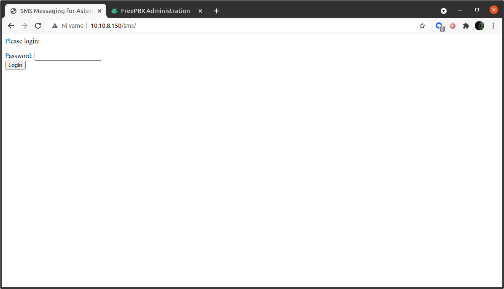

Regarding this webpage on RasPBX for sending SMS messages. If you are a web designer, it could look really insulting for your eyes. But this is not a problem, because you can change the outlook of SMS sending page. HTML files are located in `/var/www/html/sms` and you can edit them freely. If you managed to put together some likeble webpage, it would be much appreciated if you can share it with me.

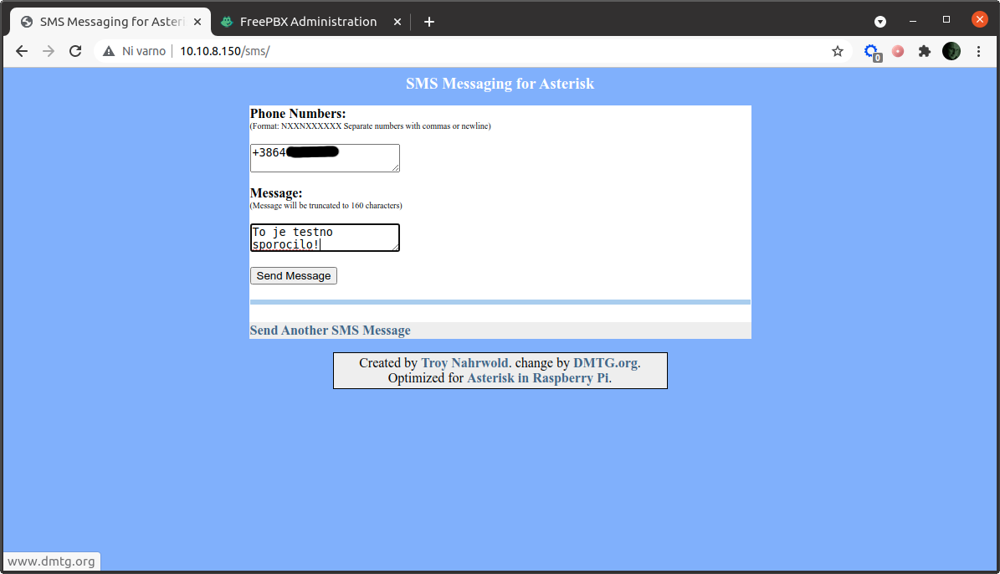

Actually... I already did it. You can download my [SMS sending script](send-sms.php), rename it to `index.php` and copy it into `/var/www/html/sms` directory. But don't judge me for bad programming. And don't run HTML validator on this script.

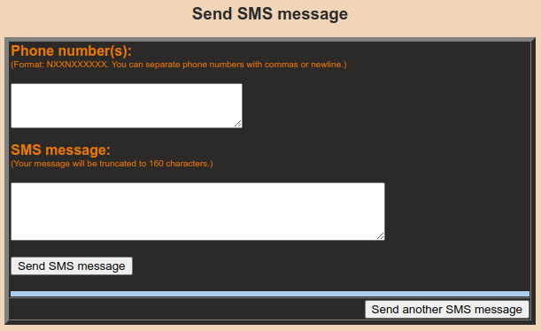

Now you can insert your USB dongle into your RaspberryPi. If it was already connected before, unplug it and plug it in again. However, some older modems require a complete reboot of the RaspberryPi, so you can just do that by typing `reboot`.

### Dongle configuration

After SSH-ing back again, you can check if you can see USB dongle connected to your RaspberryPi. Type `ls -l /dev/ttyUSB0*`, and you will see something like:

    crw-rw-rw- 1 root dialout 188, 0 okt 29 15:27 /dev/ttyUSB0

Now show dongle devices through Asterisk management console: `asterisk -rx 'dongle show devices'`. You will see something like this:

    ID           Group State      RSSI Mode Submode Provider Name  Model      Firmware          IMEI             IMSI             Number        
    dongle0      0     Free       21   3    3       BOB            E1752      11.126.03.01.314  xxxxxxxxxxxxxxx  2934xxxxxxxxxxx  Unknown       

You can see you have one USB dongle inserted (called *dongle0*), and several interesting info about that dongle, like IMEI, IMSI of your SIM card, etc. *State: Free* means that USB dongle is ready to accept calls. And if you are wondering if *dongle0* means there could also be *dongle1*, etc., the answer is yes, you can connect several dongles to your RaspberryPi (but note that you will need more power supply to power them).

Let's get some more information about your dongle (*dongle0*). Type `asterisk -rx 'dongle show device state dongle0'` and you will get a lot of interesting information:

    -------------- Status -------------
      Device                  : dongle0
      State                   : Free
      Audio                   : /dev/ttyUSB1
      Data                    : /dev/ttyUSB2
      Voice                   : Yes
      SMS                     : Yes
      Manufacturer            : huawei
      Model                   : E1752
      Firmware                : 11.126.03.01.314
      IMEI                    : xxxxxxxxxxxxxxx
      IMSI                    : 2934xxxxxxxxxxx
      GSM Registration Status : Registered, home network
      RSSI                    : 21, -71 dBm
      Mode                    : GSM/GPRS
      Submode                 : EDGE
      Provider Name           : BOB
      Location area code      : xxx
      Cell ID                 : xxx
      Subscriber Number       : Unknown
      SMS Service Center      : +38640441000
      Use UCS-2 encoding      : Yes
      USSD use 7 bit encoding : Yes
      USSD use UCS-2 decoding : No
      Tasks in queue          : 0
      Commands in queue       : 0
      Call Waiting            : Disabled
      Current device state    : start
      Desired device state    : start
      When change state       : now
      Calls/Channels          : 0
        Active                : 0
        Held                  : 0
        Dialing               : 0
        Alerting              : 0
        Incoming              : 0
        Waiting               : 0
        Releasing             : 0
        Initializing          : 0

Since I like to preserve my privacy, I am not disclosing my IMEI, IMSI, LAC code and Cell ID.

Now we can configure our dongle for calls and SMS messages. Open the config file: `nano /etc/asterisk/dongle.conf` and look for `[dongle0]`. You will see *audio* and *data* lines, and after that just add your *exten*, *imei* and *imsi* lines as in the following example:

```ini
[dongle0]
audio=/dev/ttyUSB1              ; tty port for audio connection;        no default value
data=/dev/ttyUSB2               ; tty port for AT commands;             no default value
exten=+38641234567;
imei=xxxxxxxxxxxxxxx;
imsi=2934xxxxxxxxxxx;
```

Save and close the file and login directly to Asterisk management console: `asterisk -rvvv`. Then type `dongle reload now`:

    raspbx*CLI> dongle reload now
    [2021-10-29 17:23:11] NOTICE[1421]: chan_dongle.c:429 do_monitor_phone: [dongle0] stopping by restart request
        -- [dongle0] Dongle has disconnected
        -- [dongle0] Trying to connect on /dev/ttyUSB2...
        -- [dongle0] Dongle has connected, initializing...
        -- [dongle0] Dongle initialized and ready

### Freedom is calling and sending SMS messages

As you can see, USB dongle is now ready. So let's check if we can send SMS message. In Asterisk management console type `dongle sms dongle0 +38640XXXXXX Test!`. This will send a SMS message to my personal mobile (*+38640XXXXXX*), with text `Test!`.

We can also check outgoing call by typing `channel originate dongle/dongle0/+38640XXXXXX application MusicOnHold`. In Asterisk management console you will see something like:

    -- Called dongle0/+38640XXXXXX
    -- Dongle/dongle0-0100000000 is making progress
    -- Dongle/dongle0-0100000000 answered
    -- Started music on hold, class 'default', on channel 'Dongle/dongle0-0100000000'
    -- Stopped music on hold on Dongle/dongle0-0100000000

The called phone will start ringing and if you pick up, you will hear some music.

Now you can close Asterisk management console by typing `exit`, and try to send SMS through webpage. In your browser you can open `/sms` webpage on your RasPBX device (in my case `http://10.10.6.150/sms/`) and send the SMS message. If you remember, we set up firewall, so webpage for SMS sending is available only from allowed IP addresses.

Oh, almost forgot. If you send SMS back to your USB dongle, SMS is received and RasPBX instantly send it to your e-mail address. How cool is that, ha?

Unfortunately, **receiving MMS messages does not work** (and sending also not). When someone will send you a MMS message, you will even not receive the sending number, just a message, that you received SMS from number `MMSC` with empty content. If you have any idea how to solve that, you are wellcome to share it with rest of us.

Anyway, e-mail message with received SMS looks really poor, so you can enter `nano /etc/asterisk/extensions_custom.conf` and add something like:

```ini
[from-trunk-dongle]
exten => sms,1,Verbose(Incoming SMS from ${CALLERID(num)} ${BASE64_DECODE(${SMS_BASE64})})
exten => sms,n,System(echo "To: matej.kovacic@xxxxx.si\nSubject: Incoming SMS from ${CALLERID(num)}\n\nHi,\n\non a nice day of ${STRFTIME(${EPOCH},,%d. %m. %Y at %H:%M:%S)} you have received SMS from number ${CALLERID(num)}.\n\nSMS content:\n " > /tmp/sms.txt)
exten => sms,n,Set(FILE(/tmp/sms.txt,,,a)=${BASE64_DECODE(${SMS_BASE64})})
exten => sms,n,System(sendmail -t < /tmp/sms.txt)
exten => sms,n,Hangup()
exten => _.,1,Set(CALLERID(name)=${CALLERID(num)})
exten => _.,n,Goto(from-trunk,${EXTEN},1)
```

Just be careful to enter your correct e-mail address.

### Install USSD webpage

*Unstructured Supplementary Service Data* (USSD), sometimes also called *quick codes* or *feature codes*, is a communications protocol used by GSM cellular telephones to communicate with the mobile network operator's computers. USSD can be used for WAP browsing, prepaid callback service, mobile-money services, location-based content services, menu-based information services or as part of configuring the phone on the network. USSD messages are up to 182 alphanumeric characters long, but unlike SMS messages, USSD messages create a real-time connection during a USSD session. The connection remains open, allowing a two-way exchange of a sequence of data.

I am not using USSD, but if case you do, just type the command `apt install ussd-webpage`, and after that you can browse to `/ussd` webpage of your RasPBX (in my case `http://10.10.6.150/ussd/`).

### Install additional codec

You may also like to install additional voice codec G.729, which is licensed and needs to be included into your system manually. G.729 is compressed and it uses less bandwidth at the cost of some sound quality, though it is still more than good enough for most calls. It offers very good trade-off between bandwidth and quality. For instance, standard G.711 calls take 64kbit/s per call, but the G.729 codec compresses the voice to 8kbit/s, which gives you up to eight times more capacity on the same connection. This is ideal for use f your bandwidth is limited. You can install the codec by typing `apt install asterisk16-codecg729`.

And that is it. You can let the console some rest for now.

## FreePBX configuration

Now the fun begins. Open your web browser and type the IP address of your RasPBX. In my case `http://10.10.6.150`.

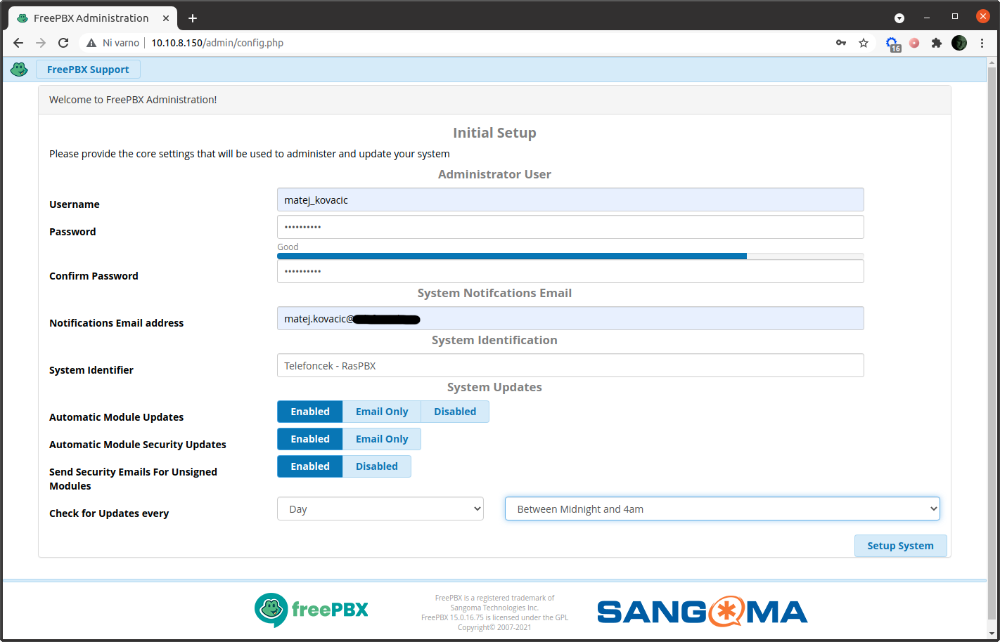

When we are trying to login to the FreePBX web interface for the first time, initial setup will be performed. Here we need to set default language. I strongly suggest you to select English, because if you need help on forums and browse the documentation, everything is mostly in English. You will also need to setup your time zone, and of course username and a password. And don't forget notification e-mail. I also strongly suggest you to enable automatic updates.

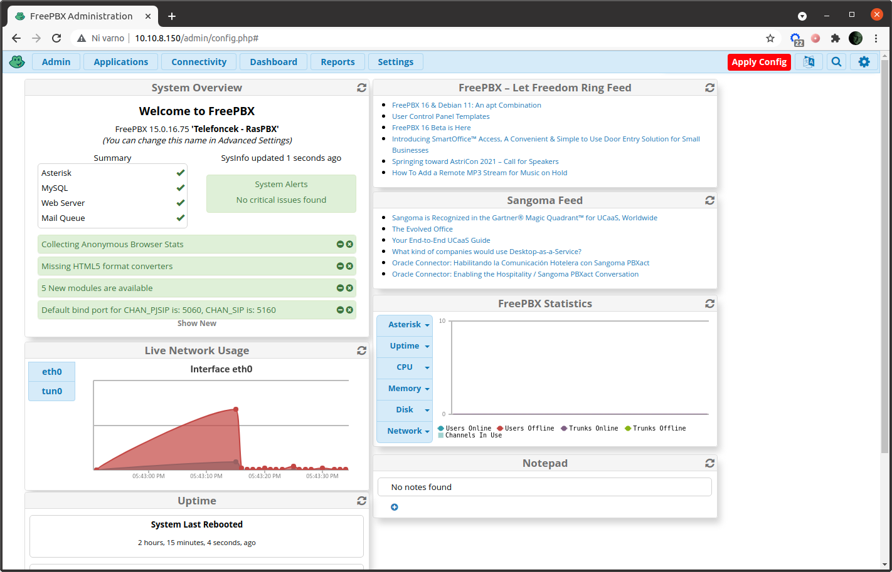

After successfull login to dashboard we need to apply the config. Now our system is ready for further settings.

### Set up the trunk

As I have explained, trunking is used to connect two systems together. With our trunk, we will connect our RasPBX system with our mobile operator through our USB dongle. From that trunk we will later route outgoing and incoming calls between our system and a public telephone network.

So we first need to setup a new custom trunk for our dongle. In FreePBX web interface go to under `Connectivity` → `Trunks` → `Add Custom Trunk` and set these values:

- `General` - `Trunk Name`: enter the name of your trunk, I used `gsm_dongle0`.
- `General` - `Outbound CallerID`: enter the telephone number of your SIM card in USB dongle in E.164 format. I entered `+38640XXXXXX` (well, not really with x-es, because I want to keep my phone number for myself, but you got the point).
- `Dialed Number Manipulation Rules`: here go to the field `match pattern` and enter `XXXXXXXXX`.
- `Custom Settings` - `Custom Dial String`: `dongle/dongle0/$OUTNUM$`.

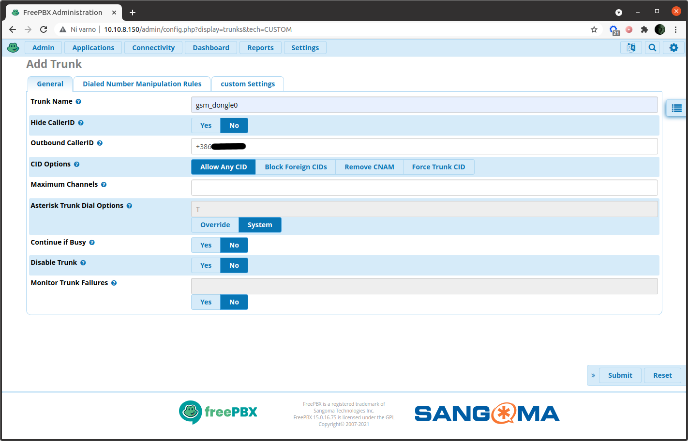

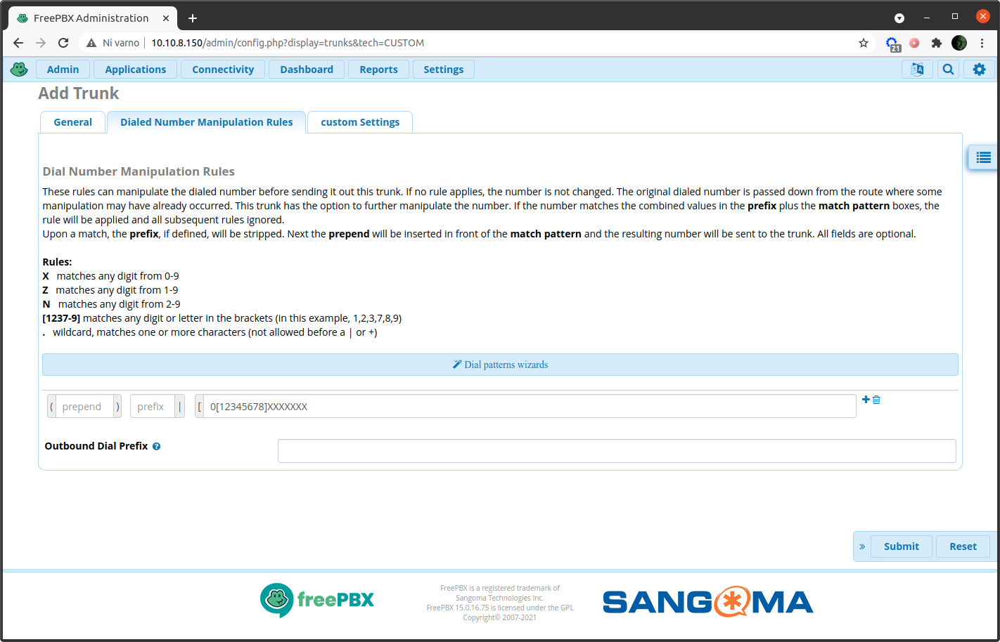

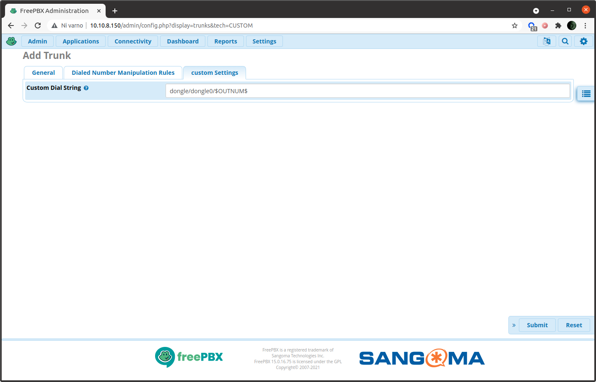

*Submit changes* (button down on the right) and then click to *Apply config* (upper right corner).

Now, before we continue, a little, but useful explanation regarding dialed number manipulation rules (in my case `XXXXXXXXX`). What does it mean anyway?

Under the trunk options, you can set rules to manipulate the dialed number before sending it out of the trunk. That means that you can add prefixes, etc. to the dialed number, before it is sent to the trunk. For instance, if user calls number *123456*, you can add *041* before that number, so the dialed number would be *041123456*. If no rule applies, the number is not changed. In our case we will not be applying any rules to the dialed numbers. However, we require that dialed numbers are 9 digits long, hence we used the pattern `XXXXXXXXX`.

BTW, if you go to `Dialed Number Manipulation Rules` and to the field `prepend`, you can enter a number that will be added in front of the called number. For instance, if you enter `#31#`, this will hide Caller ID on your trunk (this code is used in Europe for hiding Caller ID).

Anyway, what about the X-es? These are patterns used to "interpret" the number:

- **X** matches any digit from 0-9.
- **Z** matches any digit from 1-9.
- **N** matches any digit from 2-9.
- **[1237-9]** matches any digit in the brackets (in our case it matches numbers: 1,2,3,7,8,9).
- **.** dot matches one or more dialed digits.

So the rule `XXXXXXXXX` simply means you can call any 9-digits long number from 000000000 to 999999999 through this trunk.

Now you are probably thinking, that with these rules, you can restrict numbers that may be dialed. So you could restrict which numbers people using your PBX can dial and which not?

Yes, you are correct. You can do that, but on outbound routes settings. And this is what we are going to explain right now.

### Set up outbound routes

The outbound routes are used to tell your RasPBX system which numbers your phones are permitted to call and which trunk to send the calls to. Here you can set the numbers that can never be dialed, which is an emergency route (we are not going to cover this in this guide), and a route for ordinary calls. There could also be some special routes for international calls, or calls to different networks (for instance some operators are offering unlimited free calls inside their network).

So, we will set up the outgoing connection, that you will be able to call outside. In FreePBX click `Connectivity` → `Outbound routes` and click on a button `Add Outbound Route`. Now you should configure your outbound route:

- `Route Name`: enter the name of your outbound route, I used `gsm_out`.
- `Trunk Sequence for Matched Route`: from the drop down menu select `gsm_dongle0` (this is the name of our trunk we defined before).
- `Dial Patterns`: here go to the field `match pattern` and enter `0[12345678]XXXXXXX`.

This pattern will restrict user to be able to call only 9-digit numbers starting with 0 and followed with second digit, which could be any digit except 0 or 9. All other seven digits could be anything fro 0 to 9.

What does this rule means? Basically no international calls, and calling only to local networks from 01 to 08. 090 network is not allowed, because 090 numbers in Slovenia are commercial numbers where you can call fortune tellers, hot lines and other stupid things, and these calls could be very expensive.

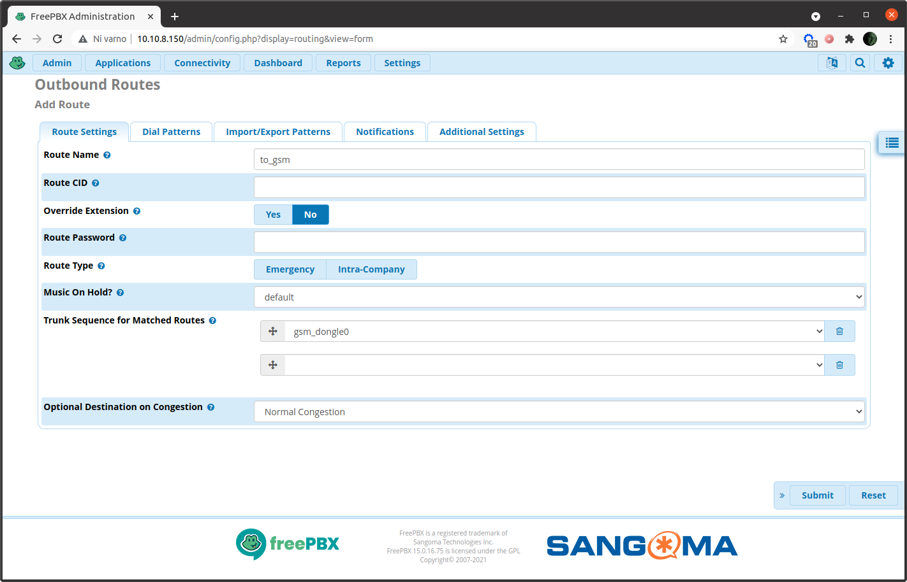

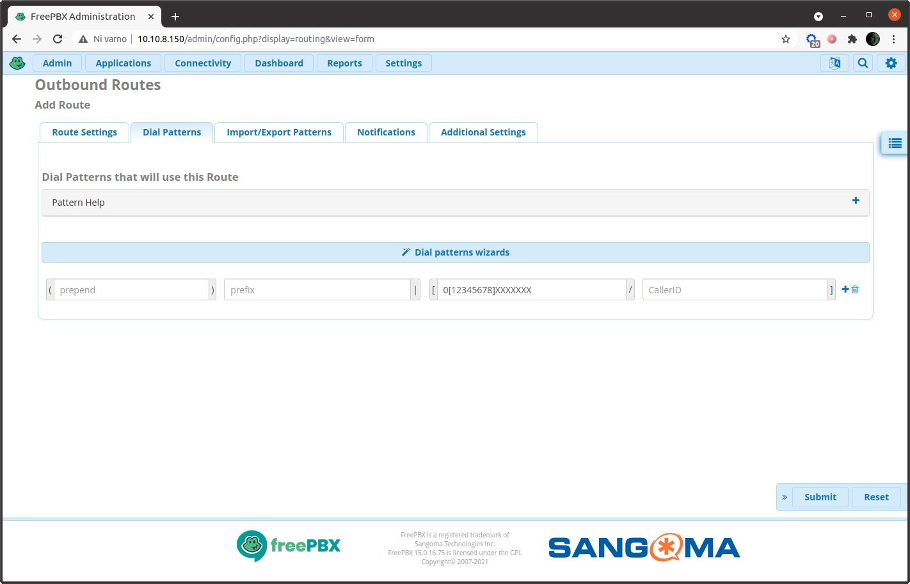

Anyway, click *Submit* changes and then *Apply config*.

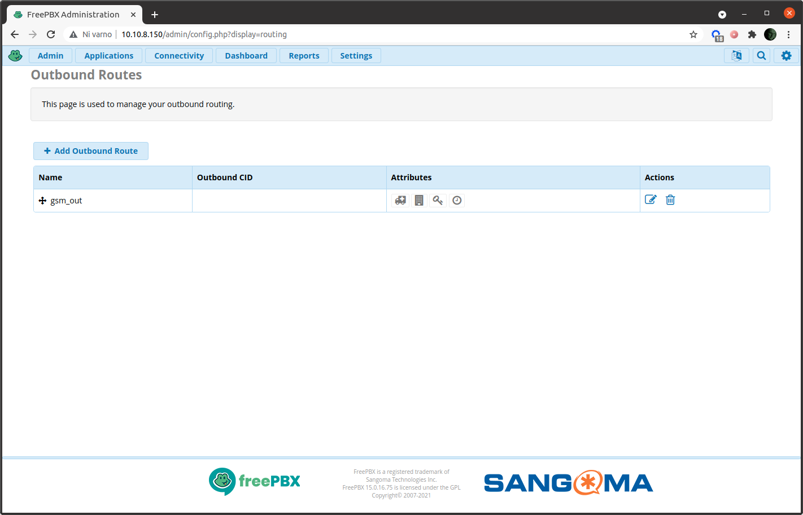

#### Setting up dial prefix for outgoing calls

If you want that for outside dialing (using your outbound route) user have to enter a specific number, for instance `0`, go to your outbound route setting and select `Dial Patterns`. Go to the field `prefix` and enter `0`.

So when some local number (*extension*) would like to call outside number `031987654`, it should then dial `0`, `031987654`. Without that, outside calling will not be possible.

### Set up extensions

Now we can setup our extensions. Extensions are local numbers, connected to our RasPBX system. In FreePBX click `Applications` → `Extensions`. Click on a button `Add Extension` and add new `SIP [chan_pjsip] extension`.

Here you need to configure:

- `User extension`: could be any number, I am using 4-digit local numbers and in my case I entered `1000`.
- `Display name`: obviously, this is a name of the user or device. I entered `Matej - racunalnik`, which meaning is not so obvious for non-speakers of Slovenian language, but simply means `Matej - computer`. Because, I am using this extension on my computer, right?
- Secret: this is a password for your extension (or your SIP account, if you prefer this way), and is auto generated, but you can change it whatever you like. For instance, I entered... well, I am not gonna tell you that. Because it is secret, right?

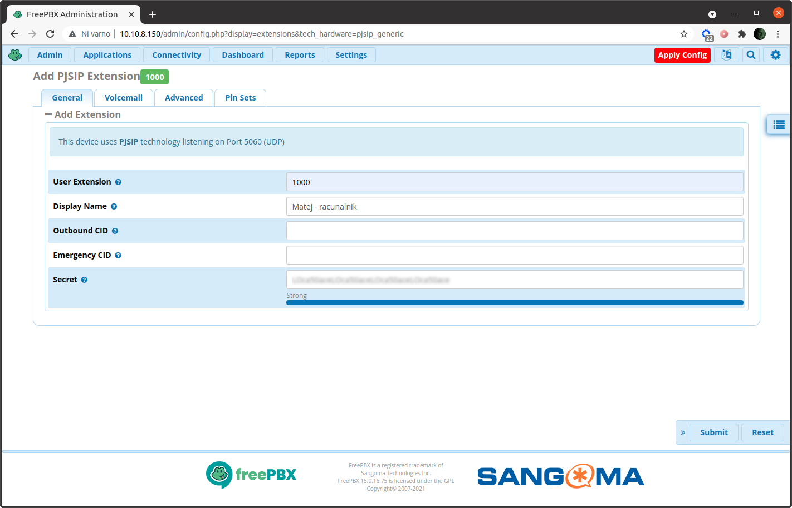

There are some other interesting things you can do. Under `Voicemail` you can enable voicemail. Some useful settings:

- Set `Voicemail Password` (digits only).
- `Disable (*) in Voicemail Menu`: set it to **no**, so you will be able to use voice menus.
- `Require From Same Extension`: set it to **yes**, so user will be able to access their voicemail only from their extensions.
- Set your `e-mail address` (`pager address` is for sending just a really short messages or e-mails).
- `Email Attachment`: set it to **yes**, which means voice messages will be sent to user by his e-mail.
- `Delete Voicemail`: set it to **yes**, which means voice messages will be deleted from the system after they are sent by e-mail.

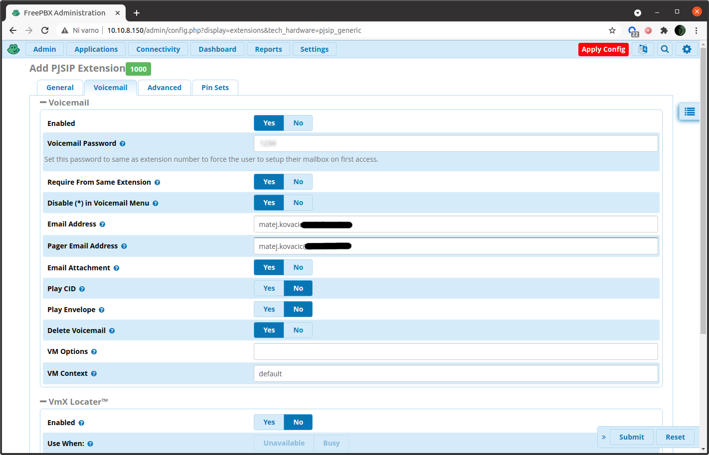

*Submit* changes and then *Apply config*. You can add several additional extensions to connect your friends and family on your RasPBX. However, under current setup all these extensions will be able to use your trunk for outgoing calls. But don't worry, we will take a look how to restrict them from calling outside.

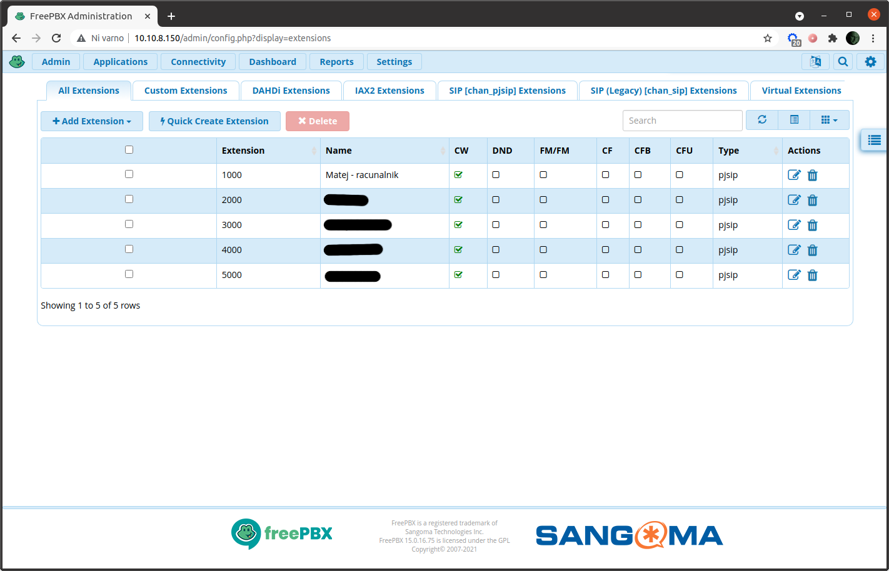

### Set up inbound routes

Finally, we can set up where (to which extensions) incoming calls are directed. In FreePBX click `Connectivity` → `Inbound routes`. Click the button `Inbound Route` and set:

- `Description`: enter the name of your inbound route, I used `gsm_in`.
- `Set destination` - `Select Extensions` and select your SIP extension. I selected `1000 - "Matej - racunalnik"`.

*Submit* changes and then *Apply config*. That is it! Well, not really. But we can do some testing.

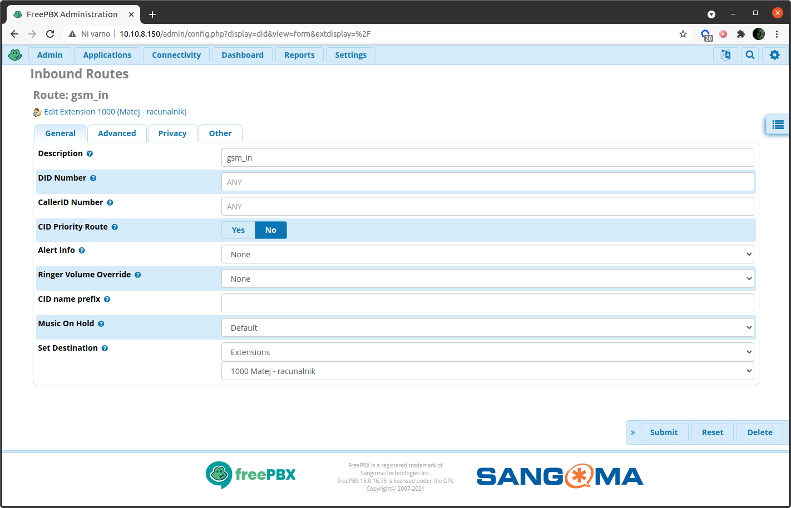

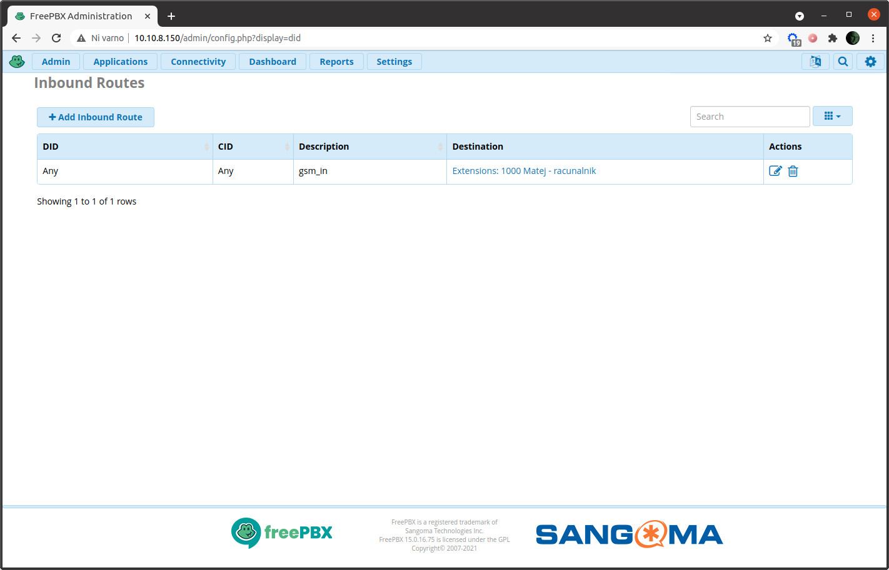

If we now call our RasPBX system (I mean the number on SIM card inserted in USB dongle) from the mobile or ordinary phone, we will get the voice message, that extension number 1000 is not available. This means our system is working, but because we did not configure any SIP client yet, so we are unable accept the call on our computer or smartphone.

### Additional SIP settings

Now we can configure some additional settings, including some **good security practices**. In FreePBX click `Settings` → `Asterisk SIP settings` and go to `General SIP Settings`. Here you have to set:

- `Allow SIP Guests`: set it to **no**, because this is a good security practice.
- Then you should enable additional codec `g729`, which we installed in terminal.
- and you can also enable video support if you like (however, this will be working only for internal calls).

Now you select `SIP Legacy Settings [chan_sip]` (`Settings` → `Asterisk SIP settings` and go to `SIP Legacy Settings [chan_sip]`. Go to `Other SIP Settings` and enter `alwaysauthreject`=`yes` (this is also a good security practice).

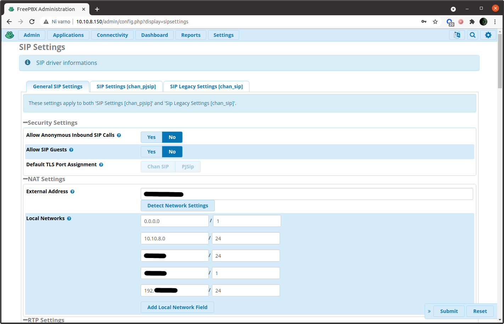

*Submit* changes and then *Apply config*.

### Enabling TCP instead of UDP

Many out of the box router features can unintentionally disrupt VoIP traffic. One of the features making problems is SIP ALG. ALG or Application Layer Gateway is designed to push specified kinds of traffic across your router's NAT and firewall. A SIP ALG is specifically designed to pass SIP traffic through your router's NAT/firewall to reach your phones. However, if SIP packets are already optimized to pass through NATs/firewalls without additional help, SIP ALG is causing problems. The reason is, that SIP ALG rewrites SIP packet headings, which can mangle the delivery process. This can make the device you're calling believe that your phone is not behind a NAT, when in fact it is. If an ALG disrupts a call, it can lead to incoming call failure, and phones that unregister themselves.

I had these problems, and they manifested in inability to receive incoming calls and that calls were disconnected after 30 seconds. Disabling SIP ALG on my router did not stop call quality problems from happening, so I decided for a little bit more drastic measures. Bigger problems sometimes *can* be solved with bigger hammer.

My solution was to disable UDP and enable TCP. For those who don't know what I am talking about - TCP and UDP are Internet protocols. TCP is a connection-oriented protocol, and UDP is a connectionless protocol. The main difference between TCP and UDP is speed. TCP is slower than UDP, however, retransmission of lost data packets is only possible with TCP.

In FreePBX click `Settings` → `Asterisk SIP settings` and go to `SIP Settings [chan_pjsip]`. Here you can disable UDP and enable TCP.

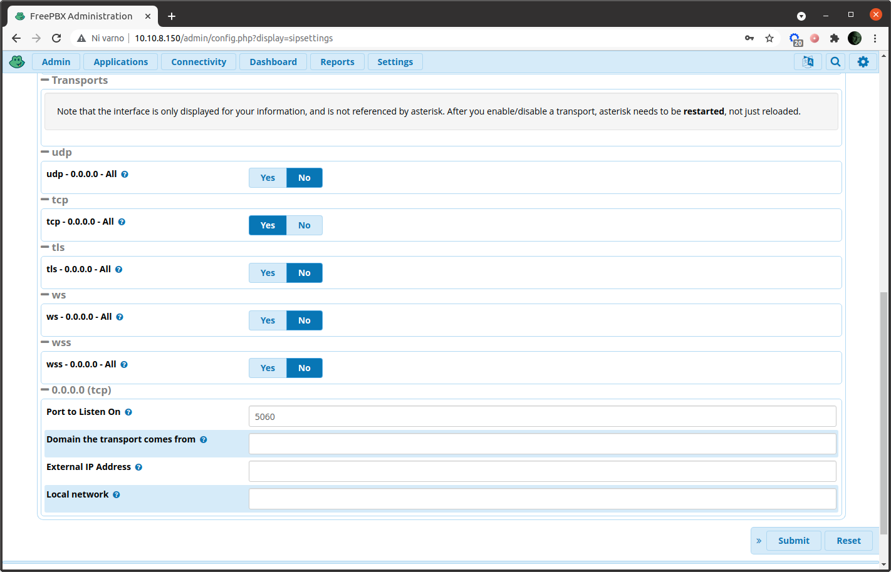

*Submit* changes and then *Apply config*.

## Setting up SIP clients

Now we can setup our SIP clients (sofphones). I am using several operating systems, namely: Ubuntu Linux, Windows and MacOS on computer and one Android phone and an iPhone. So I was looking for the *best client* for each of those systems, preferably opensource, but quickly realized there are a lot of products, and each of them has its own set of problems. Finally I ended up on Zoiper, which is not opensource but free version works quite well. Although, I am missing ZRTP feature, so I am really open on your suggestions what should I use/try for different operating systems (you can use Github issues for that).

As mentioned, there are several SIP clients, but basically, you neet to setup user ID or username (this is your extension number, for instance `1000`), domain (this is an IP address of your RasPBX device; it is also nice to add a port number, which is in our case 5060, so you would enter `10.10.6.150:5060`) and a password (which is a secret of your extension). Usually, you will need to select transport, which in our case is `TCP`.

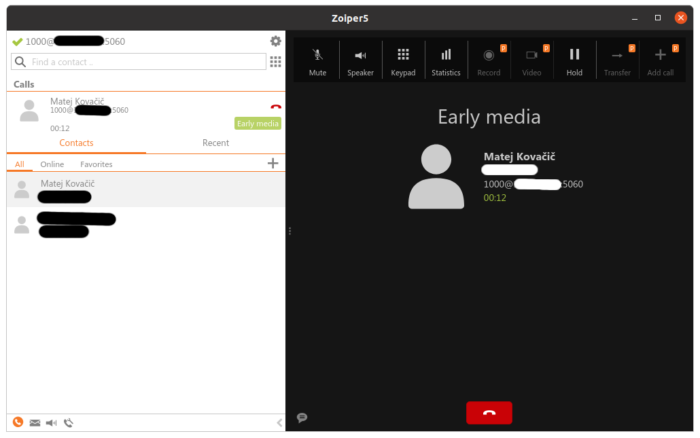

When your SIP client is successfully connected (in case you entered wrong password, `fail2ban` will block you for half an hour and you need to unban yourself), you can perform a test call out... and then of course a test call from the outside to your RasPBX. And you can also try internal calls between your extensions.

### Your voicemail configuration

Now you can configure your voicemail (if you enabled it it FreePBX). From your SIP client call `*97`, type your password and listen to the voice menu. Basically, you can press `0` and the `1` for recording your "*not available message*". When finished, press `#` and then `1` to accept and save the message. You can also record "*busy message*", etc.

Then you can disconnect your SIP client (that it will be unavailable), and try to call its extension. You should be able to hear "*not available message*" and to leave voice message. This message will be recorded and then sent to your e-mail where you can play it. How cool is that, ha?

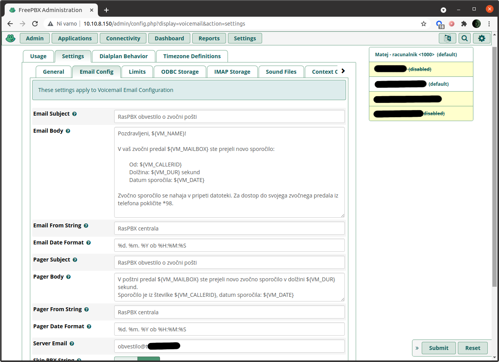

Anyway, you can go to `Settings` → `Voicemail Admin` → `Settings` → `Email Config` and change the content of the notification e-mail sent to user when voicemail is received. You should remove the reference to `http://AMPWEBADDRESS/ucp`, because *User Control Panel* module is not being used any more in FreePBX. And I personally think that it is easier sending voice messages as attachments to users.

### Voicemail Admin e-mail configuration

The e-mail configuration for Voicemail Admin could be found under `Settings` → `Voicemail Admin` → `Settings` → `Email Config`. Here you can edit the `from` field, `subject` and `body` of e-mail notification about new voicemail message. Also you should check the `Server e-mail` field and enter your notification e-mail address (in my case `obvestilo@xxxxx.si`).

Just a note - if you have any troubles with e-mail delivery, you should check `exim4` mail server logs on your RasPBX device. Just SSH to your RasPBX and list the content of a logfile with: `cat /var/log/exim4/mainlog`.

## Some other things to do

### Block extension to call outside

I promised I will show you how you can block a specific extension from calling outside. So let's take a look.

There are several ways how to do this, but we will done this by creating a specific outbound route for this extension only. In FreePBX click `Connectivity` → `Outbound routes` and click on a button `Add Outbound Route`. Define some things:

- `Route Name`: we will call this route `4000_no_out`, because we will block extension number `4000` from calling outside.
- `Dial Patterns`: here go to the field `match pattern` and enter `0[12345678]XXXXXXX`.
- `Dial Patterns`: here go to the field `CallerID` and enter the extension number you want to block, in our case `4000`.
- **Do not set** `Trunk Sequence for Matched Routes`.

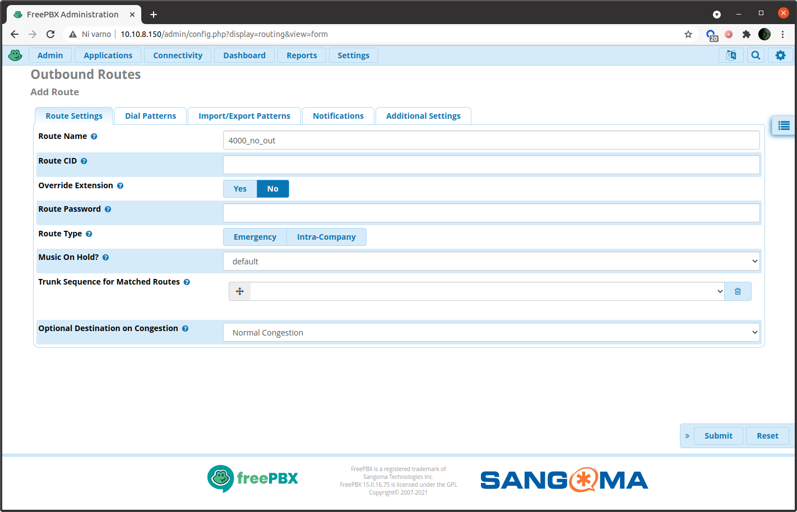


When you click *Submit* changes, you will be returned to a screen showing all outbound routes. Grab your newly created route from the bottom of the list and *drag it to the top of the list*. Then click *Apply config*.

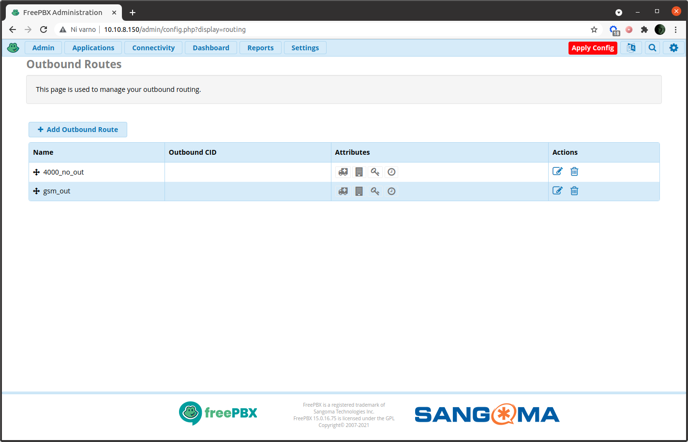

### Restrict extension to calling a specific number only

So, you want that a specific extension, let's say `3000` will be able to call out, but only one specific number (for instance `031987654`). Is it possible to do that?

Yes, it is, but it this is a tricky one. You need to set up two outbound routes and you have to keep in mind that outbound routes are top-down matching. That means first rule is checked first, then the second, etc.

So we will have the following algorithm:

- First rule: if extension `3000` calls outside number `031987654`, the call is allowed.
- If extension `3000` calls any other outside number, jump to the second rule.
- Second rule: if extension `3000` calls any outside number (not any other, but any!), call is not allowed. And this is end of the rules for extension `3000`.

So, we will set up the first outgoing connection, saying, that extension `3000` can call outside number `031987654`. In FreePBX click `Connectivity` → `Outbound routes` and click on a button `Add Outbound Route`. Now you should configure your outbound route:

- `Route Name`: `3000_to_my_mobile` (meaning this extension can call my personal mobile only).
- `Trunk Sequence for Matched Route`: from the drop down menu select `gsm_dongle0`.
- `Dial Patterns`: here go to the field `match pattern` and enter `031987654` (outside number that is allowed to be called).

Now we add another rule. In FreePBX click `Connectivity` → `Outbound routes` and click on a button `Add Outbound Route`. Define some things:

- `Route Name`: `3000_no_out`.
- `Dial Patterns`: here go to the field `match pattern` and enter `0[12345678]XXXXXXX`.
- `Dial Patterns`: here go to the field `CallerID` and enter the extension number you want to block, in our case `3000`.
- **Do not set** `Trunk Sequence for Matched Routes`.

Finally arrange your newly created routes in such a a way, that first rule will be `3000_to_my_mobile` and the second `3000_no_out`. Your default route `gsm_out` should be at the bottom of the list. Then click *Apply config*, and that is it.

This all sounds quite straightforward, but the problem is if you have many routes, the whole system becomes very confusing. One of the solutions is to use dial patterns in the Caller ID field. When setting up outbound route go to the `Dial Patterns` in the field `CallerID` and enter the dial pattern of extension number you want to block, for instance `3XXX`. That means that the outbound route will apply to all extensions from `3000` to `3999`. Then you can have the following number assigning scheme:

- 1XXX extensions are assigned to you and your friends,
- 3XXX extensions are assigned to people who like you (so they can call you), but you don't like them (and are not allowing them to call anyone else),
- 4XXX extensions are assigned to people you don't like at all, so they cannot call outside your system,
- you do not assign any numbers to people you really hate.

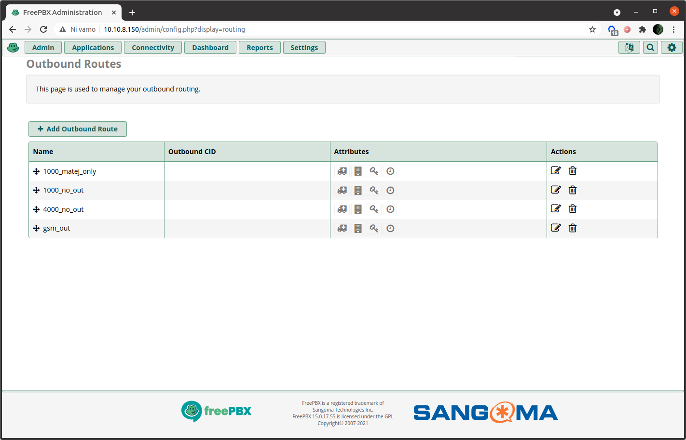

Or you can do something else, but you probably got the idea how to use these dial patterns, right?

## Updating the system

Your FreePBX system is configured for automatic updates (but not the RaspPBX operating system!), but you can manually check and update it.

In FreePBX click `Admin` → `Module Admin`, click `Check Online` and it will find modules that need to be updated. You should try updating several times, because sometimes updates get stalled.

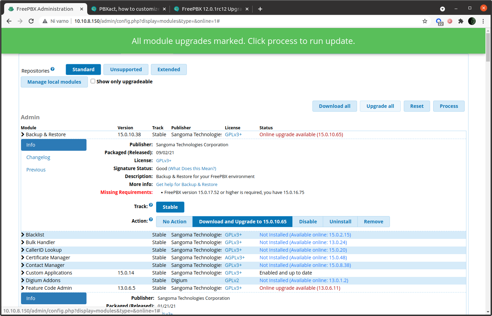

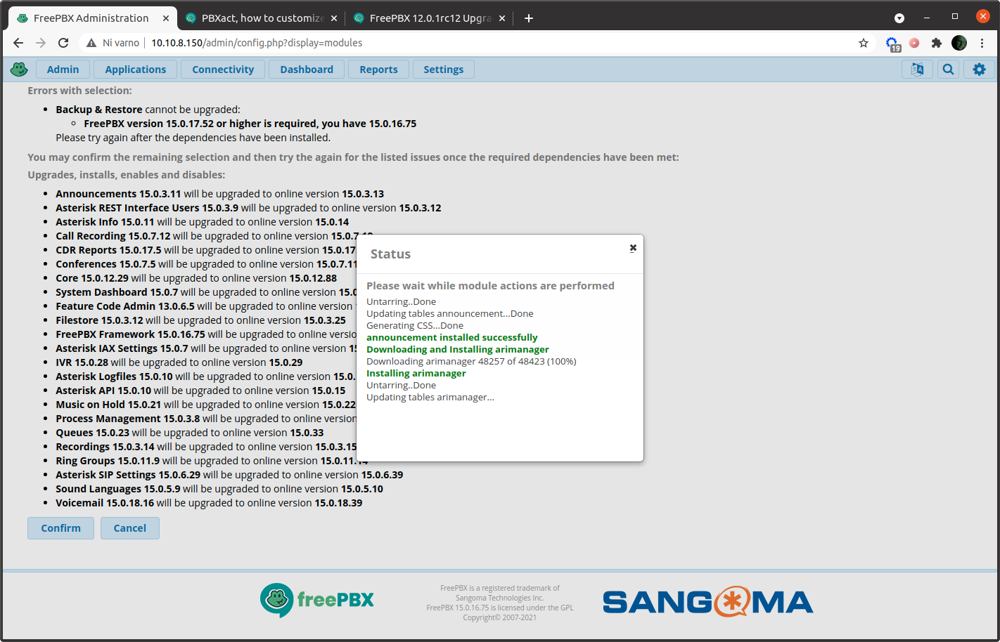

For updating operating system, you should SSH to your Raspberry and enter the command `raspbx-upgrade`.

## Backups

In FreePBX click `Settings` → `Filestore`. Select the `Local` tab and click `+Add Local Path`. Fill in a name for the path, a description, and the path to the backup folder. I have entered backup path `/var/spool/asterisk/backup`. When finished click *Submit* in the bottom right corner of the page.

In FreePBX now click `Admin` and select `Backup & Restore`. Then select `+Add Backup`. Under `Add Backup` enter the backup name and a description. Set e-mail for notification and under `Storage` click the drop-down menu and select the file storage location you created earlier.

Click *Submit* in the lower right corner of the page. On the main `Backup & Restore` page you can run backup manually. Of course, you can also schedule automatic backups.

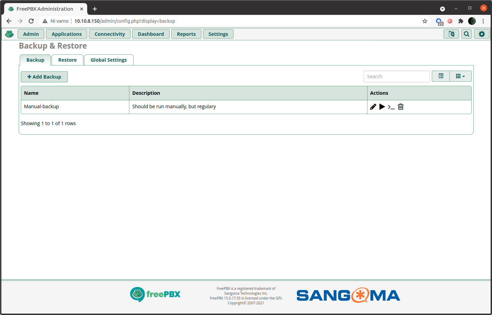

Backups are located in directory `/var/spool/asterisk/backup`. You can SSH into your RasPBX device and enter the command `ls -lha /var/spool/asterisk/backup` to see all the backups:

    total 32M
    drwxr-xr-x  3 asterisk asterisk 4,0K okt 29 22:21 .
    drwxrwxr-x 13 asterisk asterisk 4,0K okt 29 22:03 ..
    -rw-r--r--  1 asterisk asterisk  32M okt 29 22:21 20211029-222115-1635538875-15.0.17.55-77834617.tar.gz
    drwxr-xr-x  2 asterisk asterisk 4,0K okt 29 22:21 Manual-backup

It is good to copy those backups to off-site location, but you already know that.

## Some other cool things to do

### Testing

I have performed several tests, and system is working quite well. I have also tried a connection from Chicago, United States to Slovenia, Europe, and calls between extensions were working very well (clear sound). From Chicago, United States I have also tried to call outside using trunk `gsm_dongle0`, and the call was working, but the sound quality was not very good. However, I have quite bad reception of mobile signal in my appartment, so this could also be a problem. Definitively more tests would be needed, but I encourage you to share your experiences with me (use Github issues).

### Connecting the physical phone

Now that you have your very own PBX, you may start wondering, would it be possible to connect a physical phone to it? The answer is an absolute yes! You can buy a SIP desk phone, connect it to a network and configure it as an extension on your RasPBX system. There are several SIP phones available on the market, but I suggest you [to check the list of supported devices first](https://wiki.freepbx.org/display/FPG/EPM-Supported+Devices).

I decided to buy one of the [Aastra phones](https://wiki.freepbx.org/display/FOP/Aastra), namely [Aastra 6730i](https://wiki.freepbx.org/display/FPG/Supported+Devices-Aastra#SupportedDevices-Aastra-Aastra6730i&6731i), which is fully supported by FreePBX.

I managed to order it from a local shop and was lucky to get a big discount. So one sunny morning a postman rang on my door and couple of minutes later, I had my brand new *Aastra 6730i* unboxed on my table. Yupi!

#### Configuring and connecting VoIP phone to your local network

I connected the phone to my local network, checked the network (I have used `nmap`) and found that Aastra phone has local IP address `192.168.1.225` and that it has two TCP ports open - `443/TCP` which usually means that on a device is running HTTPS web server and `23/TCP`, which usually means device is accessible through `telnet` protocol. The latter sounds quite bad, because `telnet` does not offer encrypted connections and should not be used any more. Actually, `ssh` replaced `telnet` in 1995, which is like ancient history. However, when I tried to login to a phone with `telnet` command, connection has been established, but I got no response from a phone at all. So it seems that management is possible only through web interface after all.

Actually, there is another way, you can find out Aastra's IP address. It could be found out through phone. Just press the `Options key` on the phone and use scroll keys to go to `3 - Phone status` and then `IP&MAC Addresses`.

Next thing was to run my web browser and enter the IP of a Aastra phone on URL line: `https://192.168.1.225`. As expected, I have got several warnings regarding the bad HTTPS security, expired digital certificate (certificate has been issued in September 2006 and expired in September 2009), and so on. But this is not a problem, because we are in a local network where we can protect our VoIP phone with other measures.

Now, for logging into a phone you need to enter username and a password. Administrator's username is `admin` and password is `22222`. Unfortunately, this cannot be changed. When I realized this I just stayed there for a couple of seconds with my mouth wide open... but OK, let's make a call.

Through web interface I went to `Basic Settings` → `Preferences` and under `Ringtones` set `Tone Set` to `Europe`. This is not very important setting, but I just did that because settings are there to be changed, not left alone, right? Another thing was to set `Time Format` and `Date Format` under `Time and Date Setting` and checked that `NTP time servers` are enabled (they were).

Then it was the turn for the SIP account settings! In FreePBX I created new `SIP [chan_pjsip] extension` with the number `7000` and everything was ready to go.

Through web interface of the VoIP phone I went to `Advanced Settings` → `Global SIP` and under `Advanced SIP Settings` changed `Transport Protocol` to `TCP` and confirmed that `Local SIP UDP/TCP Port` in `5060`. I also changed `Codec Preference List` (I set `G.729` to the top), and then clicked `Save Settings`.

Then I went to `Advanced Settings` → `Line 1` and set the following:

| Option | Value |
| :----- | :---- |
|`Screen Name`|`Matej` (that's my name, obviously)|
|`Phone Number`|`7000`|
|`Caller ID`|`7000`|
|`Authentication Name`|`7000` (all these three are the extension number)|
|`Password`|I just entered my extension's password|
|`Proxy Server`|`192.168.1.150`|
|`Proxy Port`|`5060`|
|`Outbound Proxy Server`|`192.168.1.150`|
|`Outbound Proxy Port`|`5060`|
|`Registrar Server`|`192.168.1.150`|
|`Registrar Port`|`5060`|

The other settings were not changed. As you can see, I entered local IP address of my RasPBX `192.168.1.150` and port `5060` under *proxy server*, *outbound proxy server* and *registrar server*.

I also went to `Basic Settings` → `Preferences` and under `General` removed `Local Dial Plan` (it was set to `x+#|xx+*`), because I will be making dialling restrictions on a FreePBX.

After clicking `Save Settings` you need to reboot the phone, and true hackers prefer to do that remotely. So I went to `Operation` → `Reset` and under the `Phone` I clicked `Restart` button. A minute or so, and VoIP phone has been rebooted and successfully connected into my RasPBX!

When you log back into the phone, you can see that under `Status` → `System Information`. `SIP Status` is at the bottom of the page.

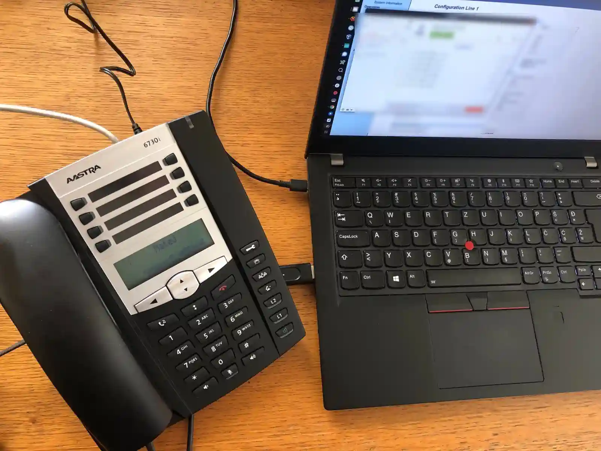

Now you can call out, you can accept calls, etc., and that everything looks just fine, but we need to take care of security first.

First we will get rid of SSL 3.0 HTTPS method. So I went to `Advanced Settings` → `Network` and under `HTTPS Settings`
you can set `HTTPS Client Method` to `TLS 1.0`. This is also not very good, because in year 2021 everything under TLS 1.2 is considered not be secure enough, but is way better than SSL 3.0. However, it doesn't really matter, because we cannot change the default admin password, but let's be strict on security, shall we?

Another thing is that firmware on the phone is a little old, so we should do some firmware update. Unfortunately, firmware for this phone cannot be found on an official Aastra website, but I have found it on [Softpedia](https://drivers.softpedia.com/get/VoIP-Voice-over-IP/Aastra/Aastra-6730i-SIP-Phone-Firmware-3312217.shtml). However, the firmware update procedure is not very easy, you need to put the `.st` file to your TFTP, FTP or HTTP server, enter the server's IP address and the name of the firmware file and then manually download and run a firmware update. I admit, I did not tried that yet, also because I am not sure how (if) the integrity of the firmware is being checked. If something goes wrong during the upgrade, you can easily brick your phone. And bricked phone is as good as... brick. Theoretically *unbricking* could be done by opening a phone, connecting the flash chip to the hardware programmer, but you need a special equipment, extended knowledge of the hardware, etc. Believe me, you don't want to try that. So for now, it will stay as it is.

#### Connecting VoIP phone to the VPN

This all sounds just fine, but the problem is, that if your phone is connected to your local network (the same network where your RasPBX is also connected), you are a little bit limited. Especially if you would like to use your phone at some distant location. As we all know, the maximum length of the Ethernet cable is limited to 100 meters - and that is not much of a distance.

However, this problem can and **will** be solved with VPN.

The idea is simple. You just need to connect your VoIP phone to your VPN network, set *proxy server*, *outbound proxy server* and *registrar server* to your RasPBX VPN IP, and everything should just start working.

Some VoIP phones have support for VPN, but not my Aastra 6730i. Besides, you may want to connect the phone to Wireguard or some other type of VPN network. So how to connect your *old tech* phone to a modern VPN network?

The answer is simple. With RaspberryPi.

##### RaspberryPi as a router for the wired network

I had a spare RaspberryPi 3 laying around and decided to transform it into wired router. So RaspberryPi will be connected to wired network, on it there will be a VPN client and VoIP phone will then be connected to RaspberryPi with Ethernet cable. In other words, RaspberryPi will be acting as a bridge to a VPN network for your VoIP phone.

Now, this idea looks fine, but RaspberryPi has only one Ethernet connection. That's why we need to buy USB to RJ45 adapter (it costs a few Euros). RaspberryPi has also a WiFi connection, it could be possible to connect it to a wireless network, but wireless connections are not so reliable as wired ones, so I decided to use the USB adapter.

As we now know the drill, let's go quickly through RaspberryPi installation. I copied RaspberryPi OS to an SD card with *RaspberryPi Imager* and before ejecting the card, I created a file named `ssh` on a `/boot` partition. Why? Because this enables SSH server on a RaspberryPi - and I want to work on these devices remotely, over the network. In Linux you just go to the `/boot` folder of the SD cart and use command `touch ssh`.

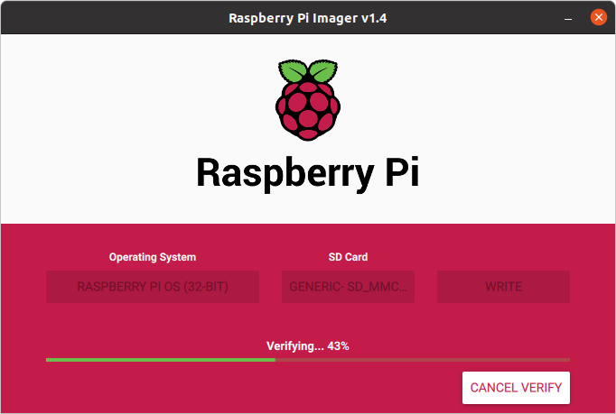

Then I logged in my freshly installed RaspberryPi with `ssh pi@192.168.1.228`. Default username is `pi` and the default password is `raspberry`.

A quick walk through:

- Change the password with `passwd` command.
- Update the system (`sudo apt update`, `sudo apt upgrade`) and remove unused packages (`sudo apt autoremove`).
- Run `sudo raspi-config` and under `System Options` set hostname (I changed it to `vpnbridge`), under `Localisation Options` set your time zone, keyboard and WLAN country. Finally, under `Advanced Options` select `Expand Filesystem`. After that RaspberryPi needs to be rebooted.
- Then I ran `sudo dpkg-reconfigure locales` because I am using Slovenian locales.
- I also installed `ntp` package (`fake-hwclock` was already installed) and set up NTP servers.
- Finally, I installed `wireguard` package and configured VPN client. Oh, and I took care of security settings.

Now we need to configure USB to Ethernet adapter. In our system is named `eth1` (we can check this with `ip a` command). Now, the tricky part. Debian based systems use a configuration file under `/etc/network/interfaces.d`. However, Raspbian moved away from that, so you need to edit `sudo nano /etc/dhcpcd.conf` - add these lines:

```
interface eth1
static ip_address=192.168.100.1/24
static routers=192.168.100.254
static domain_name_servers=8.8.8.8 1.1.1.1
```

If you use "old" Debian style network interfaces configuration, everyting would kind of a work, but you will experience some really weird network behaviour.

Anyway, this will tell the operating system to set static IP address to our `eth1` network interface (USB to RJ45 adapter) and this IP will be `192.168.100.1`. Of course, we should use different network range on `eth1` as it is used on `eth0`, that's why we used this specific network range. But depending on your network settings, you can use something else.

Now we need to install DHCP server:
`sudo apt install isc-dhcp-server`

And configure it by opening the configuration file with: `sudo nano /etc/dhcp/dhcpd.conf`. In the file you should find and uncomment authoritative; line, so it will look like this:

    authoritative;

Also, add the following lines to the configuration file:

    subnet 192.168.100.0 netmask 255.255.255.0 {
        range 192.168.100.60 192.168.100.100;
        option routers 192.168.100.1;
        option domain-name-servers 8.8.8.8;
        option domain-name "vpnbridge.local";
        option subnet-mask 255.255.255.0;
    }

Now you can save the file.

Then open another configuration file: `sudo nano /etc/default/isc-dhcp-server` and set the `INTERFACESv4` to `eth1`:

    INTERFACESv4="eth1"

All these settings will tell the DHCP server to listen to network interface `eth1`, and when new network device is connected, to assign it an IP address with DHCP in the range from `192.168.100.50` to `192.168.100.240`.

Now we can reboot the device: `sudo reboot`.

After the device boots up again, we can SSH to it. Device now has three network interfaces (actually more, but one is local host and one Wi-Fi interface):

| Interface | Description |
| --------- | ----------- |
| `eth0` | where RaspberryPi is connected to the internet (WAN) |
| `eth1` | we will connect VoIP phone here (LAN) |
| `wg0` | where RaspberryPi is connected to VPN network |

So let's connect the phone to USB to ethernet adapter.

When we do that, DHCP server listening on `eth1` will automatically assign a VoIP phone an IP address. We can check that with command: `sudo systemctl status isc-dhcp-server`

    ● isc-dhcp-server.service - LSB: DHCP server
       Loaded: loaded (/etc/init.d/isc-dhcp-server; generated)
       Active: active (running) since Tue 2021-11-09 20:18:12 CET; 26min ago
         Docs: man:systemd-sysv-generator(8)
      Process: 537 ExecStart=/etc/init.d/isc-dhcp-server start (code=exited, status=0/SUCCESS)
        Tasks: 1 (limit: 2059)
       CGroup: /system.slice/isc-dhcp-server.service
               └─585 /usr/sbin/dhcpd -4 -q -cf /etc/dhcp/dhcpd.conf eth1
    
    nov 09 20:42:40 vpnbridge dhcpd[585]: DHCPDISCOVER from 00:08:5d:30:a8:a7 (6730i00085D30A8A7) via eth1
    nov 09 20:42:40 vpnbridge dhcpd[585]: DHCPOFFER on 192.168.100.60 to 00:08:5d:30:a8:a7 (6730i00085D30A8A7) via eth1
    nov 09 20:42:45 vpnbridge dhcpd[585]: reuse_lease: lease age 46 (secs) under 25% threshold, reply with unaltered, existing lease for 192.168.100.60
    nov 09 20:42:45 vpnbridge dhcpd[585]: DHCPREQUEST for 192.168.100.60 (192.168.100.1) from 00:08:5d:30:a8:a7 (6730i00085D30A8A7) via eth1
    nov 09 20:42:45 vpnbridge dhcpd[585]: DHCPACK on 192.168.100.60 to 00:08:5d:30:a8:a7 (6730i00085D30A8A7) via eth1

As you can see from `DHCPACK` line, Aastra VoIP phone with MAC address `00:08:5d:30:a8:a7` and hostname `6730i00085D30A8A7` has IP address `192.168.100.60`.

So that is the IP address of our VoIP phone. (BTW, we can get these information also from file `/var/lib/dhcp/dhcpd.leases`).

Now, the problem is, that it is possible, that next time DHCP server will assign our device a different IP address. So we need to set up static IP. This is not hard, if we know what we are doing.

After we checked `DHCPACK` and found out the MAC address of our VoIP phone. Then we just need to open DHCP server configuration file with `sudo nano /etc/dhcp/dhcpd.conf` and add the following configuration to it:

    host aastraphone {
      hardware ethernet 00:08:5d:30:a8:a7;
      fixed-address 192.168.100.51;
    }

The configuration is quite straightforward, so it does not need additional explanation. Just keep in mind, that we set up static DHCP address for `192.168.100.51`, while range for dynamic DHCP addresses are defined from `192.168.100.60` to  `192.168.100.100`. So never mix up dynamic rang with static IP addresses. If you mix that up, you can get some warnings from your ISC DHCP server.

Oh, and don't forget so open firewall to that network, in order to pass DHCP traffic. Since this is a really specific network, we can open everthing: `sudo ufw allow from 192.168.100.0/24 to any`.

Finally we just restart DHCP server to see if everything is working well, and that is it: `sudo systemctl restart isc-dhcp-server.service`

Now our phone is connected to *vpnbridge* RaspberryPi device and has an IP address assigned, but it is not working. Why?

Because we need to set up routing. First step is to enable IPv4 forwarding so that all traffic from `eth1` could be forwarded to the internet or VPN. We enter the command: `sudo sysctl -w net.ipv4.ip_forward=1` and that is it. But we would like that IPv4 forwarding remains active after reboot, so we need to open the `sysctl.conf` file: `sudo nano /etc/sysctl.conf` and then uncomment the line to enable packet forwarding for IPv4:

    net.ipv4.ip_forward=1

Then we can reload sysctl changes: `sudo sysctl -p` and that is it. We can check that IPv4 forwarding is active by entering a command: `cat /proc/sys/net/ipv4/ip_forward` - it will print out `1` if IPv4 forwarding is active, and `0` if it is not.

Now we need to tell the operating system exactly which traffic should be forwarded and where exactly. We want that traffic from a VoIP phone will be routed directly to VPN, in other words, we want this: `eth1` → `wg0`. So we tell the machine to do this:

```sh
sudo iptables -t nat -A POSTROUTING -o wg0 -j MASQUERADE
sudo iptables -A FORWARD -i wg0 -o eth1 -m state --state RELATED,ESTABLISHED -j ACCEPT
sudo iptables -A FORWARD -i eth1 -o wg0 -j ACCEPT
```

Now our VoIP phone has a direct access to our VPN network! We also want that these rules are persistent (remain active after reboot), so we create a small script: `sudo nano /etc/network/iptablesphone.sh` with these lines in it:

```sh
# eth1 to VPN routing!
sudo iptables -t nat -A POSTROUTING -o wg0 -j MASQUERADE
sudo iptables -A FORWARD -i wg0 -o eth1 -m state --state RELATED,ESTABLISHED -j ACCEPT
sudo iptables -A FORWARD -i eth1 -o wg0 -j ACCEPT
```

Then we open the file: `sudo nano /etc/network/interfaces` and add these line to the bottom of it:

    up /etc/network/iptablesphone.sh

This will run the firewall script when the network interfaces are set up.

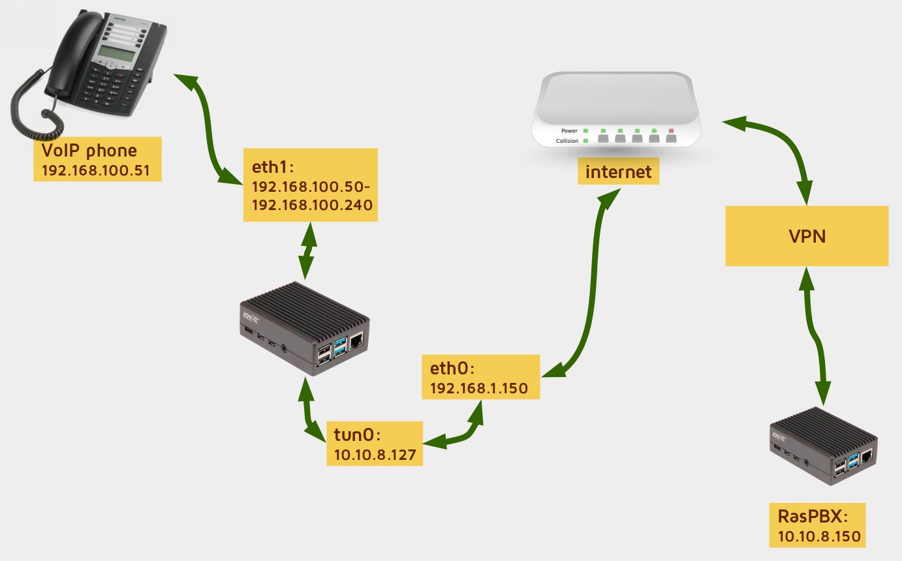

After reboot, any device connected on USB to Ethernet adapter will be assigned an IP address from a range `192.168.100.50` - `192.168.100.240` and will have a direct access to our VPN network.

##### Access to VoIP phone from the VPN network

Now the devices connected to RaspberryPi have the access to the VPN network, but we would like to have an access to the VoIP phone from VPN network too. Actually, we would like to have access to the web management interface of Aastra phone.

We will solve this with web proxy. First, we install `nginx` web server: `sudo apt install nginx`. Then open the file `sudo nano /etc/nginx/nginx.conf` and change (or add) the line:

```nginx
worker_processes 1;
```

Then we edit `sites-enabled` config file: `sudo nano /etc/nginx/sites-enabled/default`. It should contain the following text:

```nginx
# Redirection to Aastra phone
server {
    listen 443 default_server;

    root /var/www/html;
    index index.html index.htm;
    server_name _;

    ssl on;
    ssl_certificate /etc/ssl/certs/ssl-cert-snakeoil.pem;
    ssl_certificate_key /etc/ssl/private/ssl-cert-snakeoil.key;

    location / {
        proxy_set_header X-Forwarded-For $proxy_add_x_forwarded_for;
        proxy_set_header Host $http_host;
        proxy_set_header X-Forwarded-Proto https;
        proxy_redirect off;
        proxy_pass https://192.168.100.51;
        proxy_http_version 1.1;
    }
}
```

What will that do? A couple of very nice things, actually.

First, it will start a HTTPS web server listening on our RaspberryPi. That web server will be accessible on Raspberry's VPN IP address (in my case on `https://10.10.6.127`). We are using self-signed "snakeoil" certificates, but you could set up your own certificates and sign them with Let's Encrypt, if you want your phone to be accessible directly through internet (however, I would not recommend you that!). Then all the web traffic is redirected to IP address of a VoIP phone (`192.168.100.51`).

And probably the most cool thing is, that when you will connect to `https://10.10.6.127/`, your HTTPS connection will be established with modern encryption protocols (TLS 1.2 or more). Nginx will then establish different encrypted connection with VoIP phone, with TLS 1.0 or even SSL 3.0, but this connection will be then **re-encrypted for you** by Nginx, so you will be able to access VoIP phone with modern HTTPS encryption methods.

Actually, in `/etc/nginx/sites-enabled/default` configuration file you can add these lines before the `location`:

```nginx
ssl_protocols TLSv1.2 TLSv1.3;
ssl_prefer_server_ciphers on;
ssl_ciphers 'TLS13-CHACHA20-POLY1305-SHA256:TLS13-AES-256-GCM-SHA384:TLS13-AES-128-GCM-SHA256:ECDHE-ECDSA-AES256-GCM-SHA384:ECDHE-RSA-AES256-GCM-SHA384:ECDHE-ECDSA-CHACHA20-POLY1305:ECDHE-RSA-CHACHA20-POLY1305:ECDHE-ECDSA-AES128-GCM-SHA256:ECDHE-RSA-AES128-GCM-SHA256:ECDHE-ECDSA-AES256-SHA384:ECDHE-RSA-AES256-SHA384:ECDHE-ECDSA-AES128-SHA256:ECDHE-RSA-AES128-SHA256';
```

And now, you will be able to establish high quality encryption connection (TLS 1.3 or 1.2) with your RaspberryPi *vpnbridge*, and then Nginx will establish less secure connection with VoIP phone, which is located in separate network.

But first we need to test the Nginx configuration: `sudo nginx -t` - hopefully you will see that everything is OK:

    nginx: the configuration file /etc/nginx/nginx.conf syntax is ok
    nginx: configuration file /etc/nginx/nginx.conf test is successful

And finally, you can restart Nginx server: `sudo service nginx restart`. Now I was able to open my browser and connect to my Aastra VoIP phone through **vpnbridge** device: `https://10.10.6.127/`.

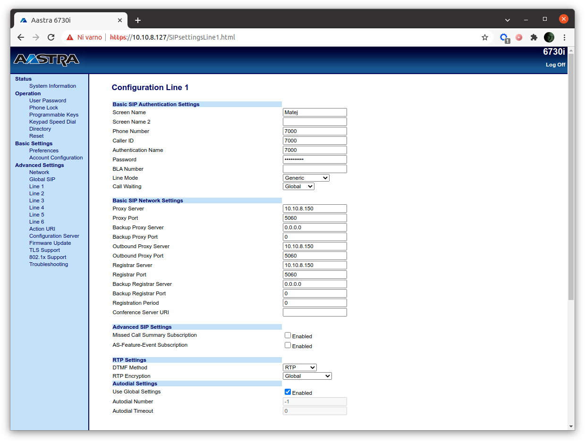

Finally, we will install firewall (`sudo apt install ufw`) and set it up:

- Set default rule-set (`sudo ufw default deny incoming` and `sudo ufw default allow outgoing`).
- Allow SSH connections from anywhere: `sudo ufw allow 22/tcp`.
- Allow web management of VoIP phone from my computer, **but only if it is connected to VPN** (my VPN IP is `10.10.6.10`): `sudo ufw allow from 10.10.6.10 to any port 443 proto tcp`.

When this is done, we activate the firewall with `sudo ufw enable`. Please note that this is a firewall running on a RaspberryPi *vpnbridge* device, so it is limiting access to *vpnbridge* device. But indirectly this firewall is also limiting access to VoIP phone connected to our *vpnbridge*.

This results in the following. VoIP phone is accessible from the VPN, even it does not have the ability to run VPN client. It is also protected with firewall and good HTTPS encryption (TLS 1.2 or more), even VoIP phone does not have the ability to run firewall and to support modern HTTPS protocols.

##### Change *unchangeable* default password

Now, you may wonder, is it possible to change *unchangeable* password for Aastra phone administration? In fact, it is. But let's look how to get rid of it first.

First we need to encode default Aastra's phone username and password. We can do this on a RaspberryPi by running a command `echo -n "admin:22222" | base64`. It will return this: `YWRtaW46MjIyMjI=`.

Now open `sites-enabled` configuration file by typing `sudo nano /etc/nginx/sites-enabled/default`. Go to the `location` section and add this after `proxy_pass` line:

```nginx
proxy_set_header Authorization "Basic YWRtaW46MjIyMjI=";
```

Save the file and restart Nginx: `sudo service nginx restart`. Now you will be able to access the Aastra's phone web management directly, without need to entering username and password.

Now we just need to add new username and password to Nginx proxy. Let's say our username will be `matej` and password `MySuperCoolPWD123!`.

So we enter this command: `sudo sh -c "echo -n 'matej:' >> /etc/nginx/.htpasswd"` to write our username in `.htpasswd` file. And then: `sudo sh -c "openssl passwd -apr1 >> /etc/nginx/.htpasswd"`. Now we will e asked for a password and that is it.

Authentication username and password are now stored in `/etc/nginx/.htpasswd`, which looks like this:

    matej:$apr1$cUzlGR14$WRgaPJ.0GAJeRgLN81vot.

There is also another cool thing. You can add more users (with different passwords) to this file, just repeat those two commands!

Anyway, we are not done yet. To enable authentication with `.htpasswd` file you need to open `sites-enabled` configuration file again (`sudo nano /etc/nginx/sites-enabled/default`) and add these two lines under `server` section:

```nginx
auth_basic "VoIP phone";
auth_basic_user_file /etc/nginx/.htpasswd;
```

Restart Nginx with `sudo service nginx restart` and you are done! Now your old tech VoIP phone is behind firewall, supports modern HTTPS protocols and you can change *unchangeable* passwords for accessing management interface too! Isn't that just great?

Ah, if you forgot the passwords or want to change something, you can always edit the file `/etc/nginx/.htpasswd`. Or just remove it and create it from scratch.

Anyway, if you are using VoIP phone over VPN network, you may experience larger network lag. I don't have such problems, but I have read that if your calls are cutting out, or the phone loses registration, you should enable or increase the frequency of SIP keep-alive settings. Go to `Advanced Settings` → `Line 1` and change `Registration Period` (under `Basic SIP Network Settings`) to a lower number.

##### Make your old VoIP phone wireless

Now, what if we want to make our old VoIP phone "wireless", i. e. that it will connect to network through WiFi and not through wired connection?

Usually, we would not want that, because WiFi networks are not reliable as wired ones. But in case you don't have the option to install the Ethernet cable, you can connect RaspberryPi to WiFi instead. However, to do this, we must first scan available WiFi networks.

We can issue the command `sudo iwlist wlan0 scan`, but we will get a lot of data we do not need, so we can just filter the printout and show just names of the available WiFi networks: `sudo iwlist wlan0 scan | grep ESSID`. We will get sometning like this:

    ESSID:"MyHome"
    ESSID:"DIRECT-14-HP DeskJet Plus 4100"
    ESSID:"Telelink"
    ESSID:"AndroidAP5ED8"

Now we can open `wpa_supplicant.conf` file: `sudo nano /etc/wpa_supplicant/wpa_supplicant.conf` and at the end of it add SSID of the network and the password:

    network={
       ssid="MyHome"
       psk="MySuperStrongPassword!"
    }

Save the file and after a minute or so, RaspberryPi will automatically connect to `MyHome` WiFi network. You can check this with `iwconfig wlan0` or `iwgetid` commands. If device will not connect to the WiFi network automatically, you will have to reboot it.

```
ifconfig wlan0
wlan0: flags=4163<UP,BROADCAST,RUNNING,MULTICAST>  mtu 1500
        inet 192.168.200.221  netmask 255.255.255.0  broadcast 192.168.200.255
        inet6 fe80::c582:9f73:aac0:5cc3  prefixlen 64  scopeid 0x20<link>
        ether b8:27:eb:a0:1c:b0  txqueuelen 1000  (Ethernet)
        RX packets 37  bytes 4284 (4.1 KiB)
        RX errors 0  dropped 0  overruns 0  frame 0
        TX packets 39  bytes 5962 (5.8 KiB)
        TX errors 0  dropped 0 overruns 0  carrier 0  collisions 0
```

And the best thing here is, that VPN will also be established automatically, so you do not need to change any configuration.

### Volume in voicemail messages

When using voicemail (these messages are sent to my e-mail), I noticed they voice files have quite low volume. However, this could be easily solved. Just go to `Settings` → `Voicemail Admin` → `Settings` → `General` and look for a field `Volume Gain`. This parameter allows you to specify how much gain to add to the message when sending a voicemail. There is also a note, that `sox` package must be installed on a system, but on RasPBX already is, so you do not need to worry about that.

I set this number to `7`, and voice messages are much louder now. the rule is: higher the number, higher the volume. Try different numbers (for instance `2` and `9`) and find the right balance for you.

### On VPN

I am now living in a different country and I am using RasPBX sucessfully for a couple of weeks. VPN connection is working surprisingly well, however, I set up Wireguard VPN, because is is much faster with much less overhead. So far, no big issues regarding this.

## And what can *you* do?

I hope you find this article interesting, and if you have a spare RaspberryPi laying around, you can try to set up RasPBX.


However, there are some things you, yes - **you** - can do.

If you are a web designer, you can put together some nice looking page for sending SMS messages (and USSD codes also).

If you are developer, you can try to fix receiving MMS messages, which does not work at all.

You can suggest me which SIP clients are nice looking and easy to use (and without nasty bugs). As I said, I prefer opensource, and those supporting SRTP, ZRTP and other security features. You can use Github issues for that.

There are probably many things that could be done with RasPBX, and I would like to hear your ideas, thoughts, experience and questions. I suggest you open Github issue and share that with me. Also, you can point me on my errors or if I wrote something stupid (which I probably did).

And finally, you can check out some of my lectures and projects, for instance:

- [Video demonstration of CallerID spoofing and live interception of VoIP communications](http://videolectures.net/single_kovacic_varnost_voip/).
- [GSM hacking and GSM security](http://videolectures.net/single_kovacic_phonebusters/) ([PDF slides](https://telefoncek.si/static/2014/01/The_Phonebusters_2014.pdf)).
- [All about VPN's](http://videolectures.net/water4cities_kovacic_virtual_private_networks/) ([PDF slides](https://telefoncek.si/predavanja/VPN_2021.pdf)).
- [Network forensic analysis of a mobile phone](http://videolectures.net/water4cities_kovacic_network_forensic_analysis/) ([PDF slides](https://telefoncek.si/predavanja/Network_forensic_analysis_of_a_mobile_phone_2021.pdf)).
- ...and [many more](https://telefoncek.si/predavanja/) (mostly in Slovenian language, however you can use Google translate).

*Stay tuned and keep hacking!*
