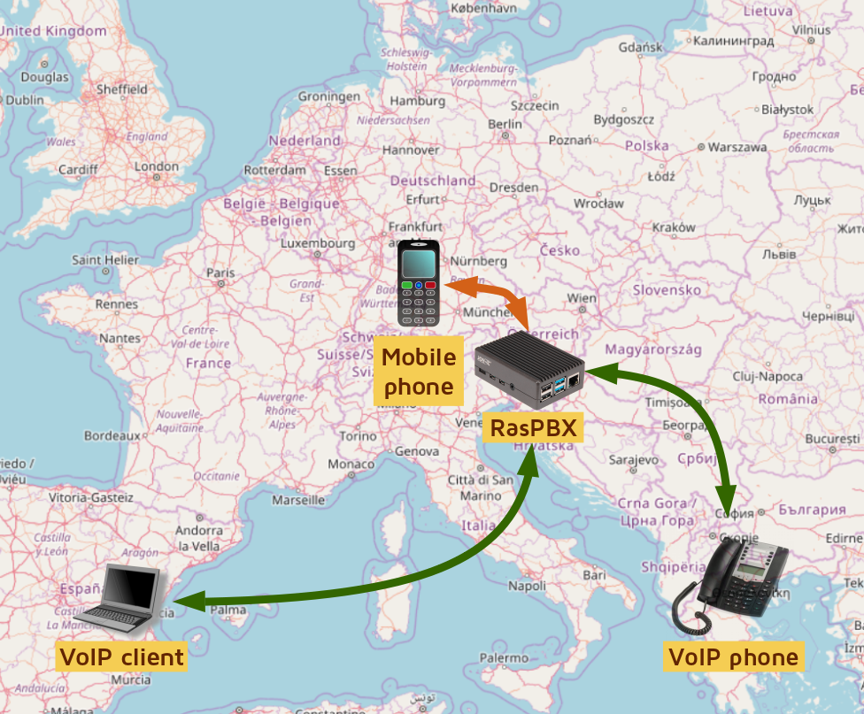
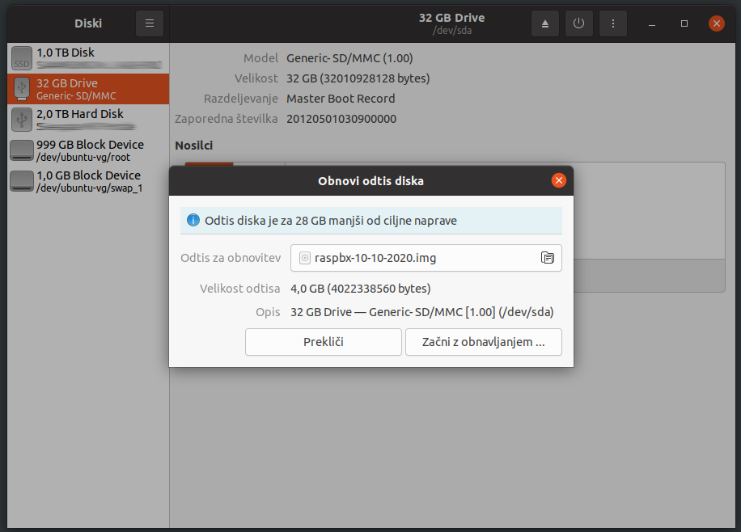
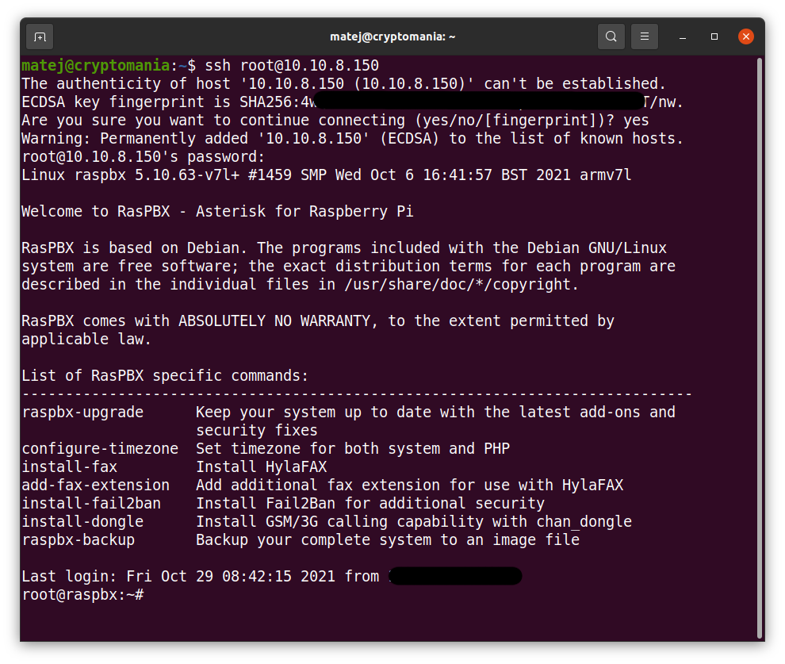
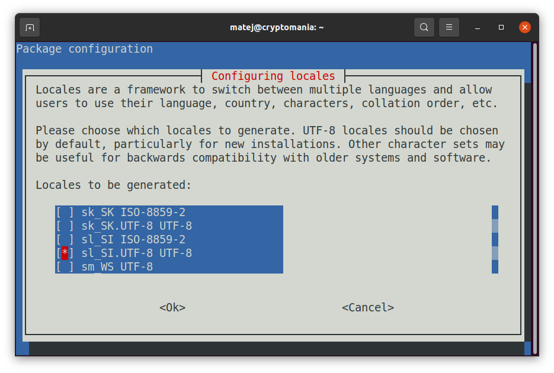
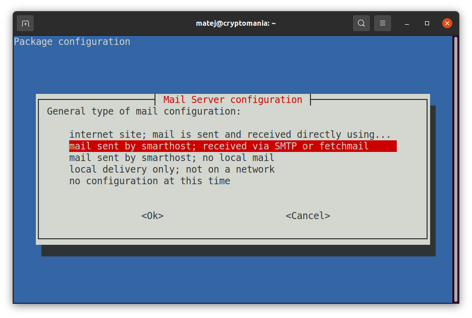
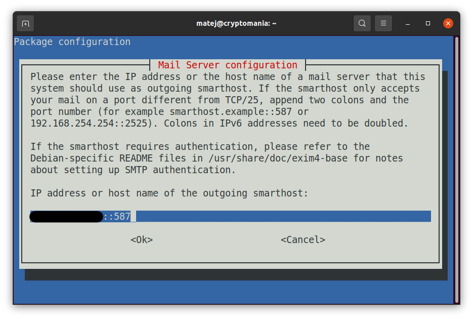

# Namestitev RasPBX
*Namestitev RasPBX za začetnike*

Pred nekaj leti sem naletel na zanimiv projekt nekoga, ki je [ustvaril GSM povezavo med dvema RasPBX strežnikoma](http://www.otubo.net/2015/06/gsm-bridge-between-two-raspbx -hosts.html), da je lahko brezplačno klical iz Brazilije v Nemčijo in obratno. Žal takrat za take projekte nisem imel dovolj časa, a povezava na spletno stran je ostala med zaznamki in čakala... do zdaj.

V današnjem prispevku si bomo ogledali kako namestimo telefonski strežnik [*Asterisk*](https://www.asterisk.org/) na mini računalnik [*RaspberryPi*](https://www.raspberrypi.org/) ter kako vse skupaj nastavimo, da omogoča klicanje iz računalnika ali pametnega telefona na običajne telefonske številke. Povedano drugače – ogledali si bomo, kako si postaviti lastno telefonsko centralo, ki jo lahko pospravimo v žep. No, pravzaprav ne povsem dobesedno, saj mora biti RaspberryPi povezan v omrežje, potrebujemo pa tudi napajanje. Sprehajanje s telefonsko centralo v žepu, povezano s kabli v omrežje in na napajalnik pa je precej... nepraktično, ampak saj razumemo poanto, kajne?

Prvo vprašanje, preden se lotimo takšnega projekta je seveda - zakaj? Poleg tega, da je tak projekt videti zares »kul« ter da vam je verjetno všeč hekanje in učenje novih stvari, lahko s takšnim projektom pokrijete kar nekaj zanimivih scenarijev. Na primer:
- Imate majhno podjetje in bi radi imeli svojo lastno telefonsko centralo z možnostjo klicanja na zunanje številke.
- Zaradi COVID-19 bi želeli, da bi vaši zaposleni lahko delali od doma in pri tem uporabljali službene telefone.
– Želite imeti možnost, da vaše stranke pokličejo na določeno telefonsko številko, kjer za podporo strankam uporabljate lasten avtomatiziran glasovni sistem.
- Radi bi imeli brezplačne telefonske (zvočne in video) klice prek interneta, vendar na lastni infrastrukturi.
- Živite v eni državi, vendar uporabljate mobilni telefon iz druge države. Gostovanje med tema dvema državama je drago, zato bi radi klice med tema dvema državama brezplačno preusmerjali preko interneta.
- Potujete v tujino in želite znižati stroške gostovanja, hkrati pa želite biti za klice in sporočila SMS dostopni na domači mobilni številki.
- Potujete v tujino, vendar želite, da vaš mobilni operater misli, da se nahajate doma (tj. skrijete podatke o lokaciji).

Meni osebno je najbolj zanimiv scenarij potovanja v države z visokimi stroški gostovanja, kjer pa bi rad imel možnost sprejemanja klicev in SMS sporočil na svojo domačo mobilno številko. Torej, če prejmem SMS sporočilo od svoje banke, želim, da se ta SMS dostavi na moj e-poštni naslov. Prav tako bi rad lahko pošiljal SMS sporočila svoji banki iz svoje slovenske mobilne številke. Rad bi imel možnost sprejemanja telefonskih klicev, in če nimam internetne povezave, bi rad imel možnost, da mi oseba, ki me kliče, pusti glasovno sporočilo, ki bo nato dostavljeno na moj e-poštni naslov. In seveda bi jih rad klical nazaj iz svoje slovenske številke.

Poglejmo si torej kako vse to dejansko naredimo. Natančneje, pogledali si bomo, kako namestiti operacijski sistem RasPBX na RaspberryPi, kako namestiti USB modem za povezavo v mobilno omrežje, kako ustvariti povezavo (tim. trunk) v mobilno omrežje, kako narediti, da vaše interne telefonske številke (tim. endpoints) lahko kličejo ven. Se sliši zapleteno? No, izkaže se je, da ni tako zelo.

Ampak najprej nekaj osnov . RaspberryPi, RasPBX, Asterisk, FreePBX, USB ključ, trunk povezava, interne telefonske številke... o čem točno je govora???

## Osnovni koncepti
Najprej zelo kratka razlaga osnovnih pojmov. **RaspberryPi** je majhen računalnik, ki je bil prvotno razvit za promocijo poučevanja računalništva v šolah. Vendar se je projekt razvil in danes je na voljo več modelov RaspberryPi z mnogimi moduli in dodatki. Najpomembneje pa je, da so računalniki RaspberryPi relativno poceni (stanejo med 40 in 100 EUR, odvisno od modela in dodatne opreme, ki jo želite kupiti) in so predvsem odlično orodje za učenje novih stvari. Vse to so razlogi, da bi vsak pravi heker - in tukaj uporabljamo izraz heker na pozitiven način, torej pod heker mislimo strokovnjaka za programiranje in reševanje težav z računalnikom - moral imeti vsaj eno (še raje pa več) teh naprav v svojem arzenalu.

Za zagon RasPBX potrebujete RaspberryPi 3 ali RaspberryPi 4, poleg tega pa potrebujete dovolj močan napajalnik (3A), smiselno pa je kupiti tudi ohišje za vaš RaspberryPi. Če napajalnik ni dovolj močan, RaspberryPi ne bo zmogel zagotoviti dovolj električne energije za GSM ključek, kar se bo manifestiralo v pogostih ponovnih zagonih tega mini računalnika. V tem primeru boste morali kupiti USB razdelilec z zunanjim napajanjem.

**RasPBX** je operacijski sistem za vaš RaspberryPi, ki temelji na Debian Linuxu, in ima integrirano programsko opremo Asterisk in FreePBX, tako da njuno ročno nameščanje ni potrebno. Operacijski sistem [RasPBX si lahko prenesete](http://www.raspberry-asterisk.org/downloads/) iz uradne spletne strani projekta. Za naš projekt smo uporabili različico 10-10-2020 (raspbx-10-10-2020.zip), ki vključuje Asterisk 16.13.0 in FreePBX 15.0.16.75. Za tiste, ki ste ste opazili besedo Linux - da, RasPBX je odprtokoden in popolnoma brezplačen operacijski sistem. Potrebno je samo, da si ga prenesete iz uradne spletne strani in že ste pripravljeni na delo.

**Asterisk** je programska izvedba telefonske centralne centrale (PBX). V bistvu gre za programsko opremo za prenos govora (in tudi videa) preko IP ter vzpostavljanje in nadzor telefonskih klicev med telekomunikacijskimi končnimi točkami (ki so lahko navadni, fizični telefoni ali tako imenovani programski telefoni – VoIP aplikacije na računalniku ali na mobilnem telefonu). Pravzaprav je Asterisk še veliko več od tega, a pomembno je vedeti, da je ta programska oprema odprtokodna in brezplačna (čeprav je na voljo tudi več plačljivih modulov, ki nam poenostavijo upravljanje telefonskega omrežja) in da to programsko opremo uporabljajo številna telekomunikacijska podjetja po svetu za zelo komercialne namene. Torej ne gre za nekakšen igračkast projekt. Gre za resen projekt, z veliko funkcionalnostmi, kar za vas pomeni ure in ure zabavnega učenja in ustvarjanja. Mimogrede, sem omenil, da je tudi Asterisk odprtokoden in brezplačen?

**FreePBX** je spletni odprtokodni grafični uporabniški vmesnik (GUI), ki upravlja Asterisk. In da, tudi ta aplikacija je odprtokodna in brezplačna.

**GSM USB ključek** v RasPBX je posebna USB naprava, pravzaprav USB modem, v katerega lahko vstavite SIM kartico in nato ta modem povežete z računalnikom (v našem primeru RaspberryPi) preko USB vmesnika. Na voljo je več USB modemov, vendar vsi ne delujejo z RasPBX. Združljivi USB modemi morajo biti odklenjeni in morajo imeti omogočeno tim. glasovno zmogljivost. Kompatibilni modem lahko izberete [iz seznama uradno podprtih](https://github.com/bg111/asterisk-chan-dongle/wiki/Requirements-and-Limitations). Stanejo okoli 20 EUR, lahko kupite tudi rabljenega, če pa ni odklenjen, boste morali uporabiti [DC Unlocker](https://www.dc-unlocker.com/downloads/DC_unlocker_software), kar pa vas bo stalo nekaj dodatnega denarja. (Mimogrede, DC Unlocker deluje samo v sistemu Windows). Sam sem uporabil **Huawei E1752C**, vi pa seveda lahko izberete kateregakoli drugega izmed podprtih modelov. Mimogrede, namesto USB ključa lahko nastavite RasPBX tako, da se v mobilno omrežje poveže z mobilnim telefonom prek povezave Bluetooth, klici pa gredo nato prek te povezave, vendar sam tega nisem preskusil.

Seveda boste potrebovali tudi kartico SIM in preden jo vstavite v USB modem, najprej na njej onemogočite PIN kodo. To lahko storite s svojim telefonom. Če slučajno ne veste kako, uporabite iskalnik. :)

V telekomunikacijah se izraz **trunk** uporablja za povezavo dveh sistemov. Preprosto povedano, *trunk* je povezava vašega telefonskega sistema (PBX) z drugim telefonskim sistemom. Preko te povezave nato lahko usmerjate odhodne in dohodne klice.

**Interna telefonska številka** (v angleščini se uporablja izraz *endpoint*), je telefonska številka znotraj vaše telefonske centrale, ki jo uporabljajo programski telefoni (odjemalci VoIP) in fizični telefoni. Interno lahko uporabite katero koli številčenje, sam sem se odločil za štirimestne interne številke  (*1000*, *2000*, *3000*, itd.).

Dovolj govorjenja, čas je, da se lotimo izvedbe projekta!

## Kaj bomo potrebovali
Kot smo že omenili, bomo potrebovali:
- RaspberryPi 3 ali RaspberryPi 4 (preizkusil sem oba, vendar je RPi4 veliko zmogljivejši in zmore obdelati do 200 sočasnih telefonskih klicev (dejansko, [brez heca](https://www.youtube.com/watch?v=dVGf3HrKZl4)). Predlagam, da kupite RPi4 s 4 ali 8 GB RAM-a);
- napajalnik za RaspberryPi (3A ali več), ohišje za RaspberryPi in SD kartico (8 GB je minimalno, predlagam pa nakup nekoliko bolj kvalitetne 32 GB kartice);
- združljiv GSM USB ključek (npr. Huawei E1752C);
- RasPBX, ki ga lahko brezplačno [prenesete z uradne spletne strani projekta](http://www.raspberry-asterisk.org/downloads/) (uporabil sem različico 10-10-2020);
- internetno povezavo.

Pogledali si bomo tudi kako svojo telefonsko centralo postavimo znotraj omrežja VPN. O tem kako postaviti svoje lastno omrežje na OpenVPN tehnologiji ter kako implementirati ustrezne varnostne izboljšave (zlasti na področju kriptografije), tokrat ne bo govora, predpostavka pa je da VPN omrežje že imamo oziroma, da telefonsko centralo postavljamo v lokalnem omrežju.

*Pa začnimo.*

## Namestitev operacijskega sistema
Najprej si bomo ogledali namestitev osnovnega sistema. Ker je le-ta Linux, seveda pomaga, če poznate vsaj nekaj osnov dela v Linuxu. Če pa se z Linuxom še niste srečali, pa brez panike – ostanite odprtega duha in sledite navodilom za namestitev. Predpostavljam sicer, da veste, kako uporabljati terminal in kako se prijaviti v oddaljeni sistem Linux s pomočjo SSH. Namig: v operacijskem sistemu Windows lahko uporabite PuTTY ali vgrajenega odjemalca SSH iz ukaznega poziva Windows.

**Nastavitev nekaterih stvari (kot so povezave SSH) se v Linux in Windows sistemih nekoliko razlikujejo. Vendar se s tem ne rabite preveč obremenjevati - vedno namreč lahko uporabite svoj najljubši spletni iskalnik in se naučite nekaj novega. (Ali morda lahko začnete uporabljati Linux?)**

### Zapis RasPBX operacijskega sistema na kartico SD

Ko prenesete datoteko RasPBX *raspbx-10-10-2020.zip*, jo odpakirajte in zapišite datoteko .IMG na kartico SD. Za to v Ubuntu Linux lahko uporabite orodje **Diski**, če pa uporabljate druge operacijske sisteme, pa z uporabo spletnega iskalnika poiščite, katera orodja lahko uporabite za to.

Nato v RaspberryPi vstavite kartico SD. SIM kartico vstavite v GSM USB ključek in ga priključite na RaspberryPi. Priključite še omrežni kabel ... In končno - priključite RaspberryPi na napajanje.

### Prijava v RasPBX

Po zagonu naprave RaspberryPi moramo ugotoviti njen IP naslov. Za to obstaja več načinov, pravi heker pa bo seveda uporabil orodje **nmap**.

V terminal torej vpišemo `nmap 192.168.1.0/24` (vpišemo omrežni naslov omrežja, v katerega je povezan naš RaspberryPi, v mojem primeru je bilo to `192.168.1.0/24`) in poiščemo napravo, ki je v omrežju videti takole:

    Nmap scan report for 192.168.1.150
    Host is up (0.0091s latency).
    Not shown: 994 closed ports
    PORT     STATE SERVICE
    22/tcp   open  ssh
    53/tcp   open  domain
    80/tcp   open  http
    139/tcp  open  netbios-ssn
    445/tcp  open  microsoft-ds
    8088/tcp open  radan-http

Zdaj se lahko z RasPBX napravo povežemo prek SSH. Uporabniško ime je **root** in privzeto geslo je **raspberry**: `ssh root@192.168.1.150`. Potrditi bomo morali še identiteto ključa SSH RaspberryPi:

    The authenticity of host '192.168.1.150 (192.168.1.150)' can't be established.
    ECDSA key fingerprint is SHA256:vtE5/xxxxxxxxxxxxxxxxxxACyoanxxxxxxxxxxxmDQ.
    Are you sure you want to continue connecting (yes/no/[fingerprint])? yes
    Warning: Permanently added '192.168.1.150' (ECDSA) to the list of known hosts.

...in po uspešni prijavi lahko vidimo pozdravni zaslon na naši RasPBX napravi:

    Linux raspbx 5.4.51-v7l+ #1333 SMP Mon Aug 10 16:51:40 BST 2020 armv7l
    
    Welcome to RasPBX - Asterisk for Raspberry Pi
    
    RasPBX is based on Debian. The programs included with the Debian GNU/Linux
    system are free software; the exact distribution terms for each program are
    described in the individual files in /usr/share/doc//copyright.
    
    RasPBX comes with ABSOLUTELY NO WARRANTY, to the extent permitted by 
    applicable law.
    
    List of RasPBX specific commands:
    ----------------------------------------------------------------------------- 
    raspbx-upgrade      Keep your system up to date with the latest add-ons and
                        security fixes
    configure-timezone  Set timezone for both system and PHP
    install-fax         Install HylaFAX                          
    add-fax-extension   Add additional fax extension for use with HylaFAX
    install-fail2ban    Install Fail2Ban for additional security
    install-dongle      Install GSM/3G calling capability with chan_dongle
    raspbx-backup       Backup your complete system to an image file

### Kaj postoriti po prvi prijavi?

Najprej spremenite geslo z ukazom `passwd`.

Nato ustvarite nove gostiteljske ključe SSH (da bodo unikatni za vašo napravo): `regen-hostkeys.`

Nato konfigurirajte svoj časovni pas: `configure-timezone`. Ker živim v Sloveniji, Evropa, sem ga seveda nastavil na 'Evropa/Ljubljana'.

Nato morate znova konfigurirati področne nastavitve: `dpkg-reconfigure locales`. V našem primeru bomo dodali podporo za slovenske lokalne nastavitve (`sl_SI.UTF-8 UTF-8`), za privzete pa izberemo `en_GB.UTF-8`.

Sledijo varnostne posodobitve. Za to lahko uporabimo ukaz `raspbx-upgrade`, vendar nam bo zagon tega ukaza vrnil napako. Sporočilo o napaki pravi, da je med preverjanjem podpisa prišlo do napake, in sicer zaradi pretečenega ključa GPG, uporabljenega za digitalno podpisovanje nekaterih paketov RaspPBX:

    The following signatures were invalid: EXPKEYSIG B188E2B695BD4743 DEB.SURY.ORG Automatic Signing Key <deb@sury.org>
    Reading package lists... Done
    E: Repository 'http://raspbian.raspberrypi.org/raspbian buster InRelease' changed its 'Suite' value from 'stable' to 'oldstable'

Zato moramo prenesti in namestiti nov podpisni ključ z ukazom: `wget -O /etc/apt/trusted.gpg.d/php.gpg https://packages.sury.org/php/apt.gpg`.

Zdaj lahko posodabljamo skladišča programskih paketov z ukazom `apt update`. Videli bomo še nekaj opozoril, ki pa bodo izginila, ko bomo namestili vse nadgradnje sistema:

    E: Repository 'https://packages.sury.org/php buster InRelease' changed its 'Suite' value from '' to 'buster'
    N: This must be accepted explicitly before updates for this repository can be applied. See apt-secure(8) manpage for details.
    Do you want to accept these changes and continue updating from this repository? [y/N] y

Tukaj odgovorimo z Da (vnesimo y in pritisnemo Enter).

    Get:5 https://packages.sury.org/php buster/main armhf Packages [328 kB]       
    E: Repository 'http://raspbian.raspberrypi.org/raspbian buster InRelease' changed its 'Suite' value from 'stable' to 'oldstable'
    N: This must be accepted explicitly before updates for this repository can be applied. See apt-secure(8) manpage for details.
    Do you want to accept these changes and continue updating from this repository? [y/N] y

Tudi tukaj odgovorimo z Da (vnesimo y in pritisnemo Enter).

Nato lahko vso programsko opremo nadgradimo z ukazom `apt upgrade` in na koncu odstranimo neuporabljene programske pakete z `apt autoremove`.

Od zdaj lahko varno uporabljamo `raspbx-upgrade`, ki je v bistvu le skripta, ki izvaja ukaze za posodobitev in nadgradnjo v enem samem koraku.

Končno lahko zaženemo `raspi-config`, da razširimo datotečni sistem na celotno kartico SD. Žal nam bo `raspi-config` postavil kakšno neumno vprašanje, na primer, da ne more identificirati privzetega uporabnika, vendar v tem primeru samo pritisnemo Enter in to je to. Nato izberemo možnost `Advanced Options` in končno `Expand Filesystem`.

Ko bo vse to narejeno, nas bo sistem pozval, da ga ponovno zaženemo, kar seveda z veseljem storimo.

Osnovna konfiguracija operacijskega sistema je zdaj končana.

## Namestitev in konfiguracija PBX

Po ponovnem zagonu je potrebno najprej odstraniti identiteto starega ključa SSH RasPBX naprave. Ta identiteta mora biti seveda odstranjena na računalniku iz katerega se povezujemo na RasPBX. Zakaj? Zato, ker smo v prejšnji SSH seji izvedli ukaz `regen-hostkeys` za ustvarjanje novih gostiteljskih ključev SSH in imamo sedaj na RasPBX strežniku nove SSH ključe.
 
Če se na RasPBX povezujemo iz Linux sistema, to naredimo z ukazom: `ssh-keygen -f "/home/matej/.ssh/known_hosts" -R "192.168.1.150"`. Tisti, ki uporabljate sisteme Windows, pa sami ugotovite kako in kaj.

Zdaj lahko vzpostavimo SSH povezavo z našim RasPBX strežnikom: `ssh root@192.168.1.150`.

### Nastavitev e-poštnega sistema

Najprej bomo na RasPBX napravi vzpostavili sistem elektronske pošte, ki sistemskemu administratorju in uporabnikom lahko pošilja sporočila po e-pošti. Ker RasPBX uporablja poštni strežnik *exim*, vpišemo naslednji ukaz: `dpkg-reconfigure exim4-config`.

Sistem nas sedaj vodi skozi različne nastavitve. Na prvi konfiguracijski strani moramo izbrati "*mail sent by smarthost; received via SMTP or fetchmail*".

Na naslednjih straneh lahko obdržimo privzete vrednosti s pritiskom na tipko Enter. To počnemo, dokler ne pridemo do strani, ki se začne z "*Please enter the IP address or the host name of a mail server...*". Tukaj moramo vnesti ime gostitelja SMTP našega ponudnika e-pošte. Ker uporabljam tudi svoj lastni poštni strežnik, sem vnesel nastavitve svojega poštnega strežnika, lahko pa uporabite tudi GMail ali katerega drugega poštnega ponudnika (po možnosti takega, ki ni v lasti velikih zlobnih tehnoloških podjetij).

Pri tem pa je potreben majhen trik: vnesti je potrebno FQDN ime in vrata vašega poštnega strežnika, to dvoje pa mora biti razmejeno z dvojnim dvopičjem. Na primer: `mail.example.com::587` - upoštevajte dvojno dvopičje (`::`) med FQDN in vrati. Oh, in za *nehekerje*, ki ne vedo, kaj pomeni FQDN - to pomeni *fully qualified domain name*, gre za ime domene, ki določa natančno lokacijo vašega poštnega strežnika v drevesni strukturi domenskega sistema.

Za preostanek konfiguracije lahko še naprej sprejemamo privzete vrednosti.

V primeru, da ste se pri vnosu zatipkali ali ste celo pozabili nastaviti strežnik svojega ponudnika e-pošte (*kot se je zgodilo meni...*), samo znova zaženite ukaz `dpkg-reconfigure exim4-config`.

Nato je potrebno urediti datoteko `/etc/exim4/passwd.client`. Sam uporabljam urejevalnik besedil *nano*, vi pa lahko uporabite svoj najljubši urejevalnik besedil. Za tiste, ki ne poznajo Linuxa, ko v urejevalniku *nano* končamo z urejanjem besedilne datoteke, pritisnemo `ctrl-x` in *nano* vas bo vprašal, ali želimo shraniti spremembe ("*Save modified buffer?*"), na kar seveda odgovorimo z ** y** (Da). Nato nas bo *nano* vprašal, v katero datoteko želimo shraniti spremembe, in tukaj samo pritisnemo Enter, kar pomeni, da shranimo spremembe v trenutno odprto datoteko, in to je to.

Torej vtipkamo ukaz: `nano /etc/exim4/passwd.client`

...in na dnu datoteke dodamo nastavitve za svoj e-poštni račun v naslednji obliki:

    SMTP_HOSTNAME:USERNAME:PASSWORD

V mojem primeru sem torej vnesel:

    mail.xxxxx.si:obvestilo@xxxxx.si:XXXYYYXXX

Sam sem uporabil e-naslov `obvestilo@...,` , ker,... no, ker mi bo RasPBX pošiljal obvestila, kajne?

Upoštevajte, da je v večini primerov ime gostitelja SMTP (SMTP hostname), uporabljeno v tej konfiguracijski datoteki, identično imenu gostitelja, ki se uporablja kot gostitelj v konfiguraciji exim4 (tim. exim4 smarthost). Če e-pošta ne deluje, pa je potrebno vpisati reverzni DNS vpis IP naslova vašega ponudnika SMTP storitve.

Poleg tega nekateri ponudniki e-pošte zahtevajo, da uporabite naslove pošiljatelja, ki so enaki enemu od javnih e-poštnih naslovov vašega računa. V tem primeru uredite datoteko `/etc/email-addresses` z ukazom:

    nano /etc/email-addresses

Na dnu te datoteke dodajte:

    root: obvestilo@xxxxx.si
    asterisk: obvestilo@xxxxx.si

S tem nastavite, da bo vaš e-poštni naslov nastavljen kot naslov pošiljatelja za vso odhodno e-pošto.

Nastavitve so sedaj zaključene, vse skupaj je potrebno le še aktivirati, kar naredimo z ukazom: `update-exim4.conf`.

Zdaj lahko preizkusimo, ali pošiljanje e-pošte deluje. Vnesemo ukaz: `send_test_email matej.kovacic@xxxxx.si`, zadržimo dih in ... testno e-sporočilo bi moralo prispeti v vaš poštni nabiralnik.

Če vse deluje kot je treba, boste prejeli e-poštno sporočilo z vsebino "*This is a test. If you can read this, email delivery from your Raspberry Pi works.*". Zdaj si lahko privoščite skodelico kave. Ali pa kozarec piva, kar vam je ljubše. Nato pa je čas za naslednji korak.

### Nastavite odjemalca VPN

Kot sem že omenil, bomo naš RasPBX postavili v omrežje VPN. S tem bodo RasPBX telefonska centrala ter VoIP odjemalci (fizični telefoni in VoIP programski telefoni) zaprti v omrežju VPN, tako da bo komunikacija med njimi potekala samo znotraj zavarovanega omrežja. To je še posebej pomembno, če ne nastavite šifriranja TLS in ne implementirate šifrirnih protokolov SRTP in/ali ZRTP. Poleg višje stopnje varnosti, pa načeloma tudi velja, da je naprave, zaprte v omrežju VPN, lažje upravljati.

Se je pa ob tem treba zavedati, da je zgolj uporaba VPN-ja za šifriranje VoIP podatkov nekoliko problematična. Raziskave so namreč pokazale, da lahko uporaba VBR kodekov (tim. kodeki, ki uporabljajo spremenljivo bitno hitrost) predstavlja varnostno tveganje. Zakaj?

Če pri uporabi SRTP šifriranja uporabimo kodeke s spremenljivo bitno hitrostjo (VBR), je dolžina stisnjenih podatkovnih paketov odvisna od značilnosti govornega signala. Z drugimi besedami, različni zvoki so kodirani na različne načine, in te majhne razlike v velikostih paketov je mogoče uporabiti za rekonstrukcijo ("dešifriranje") šifriranih podatkov. To se morda sliši zelo akademsko, toda [raziskovalci so pokazali] (https://www.cs.jhu.edu/~fabian/papers/oakland08.pdf), da je v določenih okoliščinah posamezne fraze v glasovnem klicu mogoče prepoznati kljub šifriranju. (Na kratko, raziskovalci so pokazali, da se lahko dolžine šifriranih VoIP paketov uporabijo za identifikacijo vnaprej posnetih besednih zvez, izgovorjenih v klicu.) Torej, če nameravate s svojim RasPBX narediti nekaj zares neumnega (kar pomeni: nezakonitega), takoj prenehajte razmišljati o tem in se raje lotite česa bolj koristnega.

Načeloma pa zamejitev VoIP komunikacije v šifrirano VPN omrežje ni slaba ideja in negativni vpliv uporabe VBR kodekov v VPN omrežju bi moral biti minimalen.

Kakorkoli že, poglejmo si, kako RasPBX kar najenostavneje povezati v omrežje OpenVPN. Kot že omenjeno, predpostavljam, da OpenVPN strežnik že imate, zato si bomo pogledali samo kako namestiti in konfigurirati OpenVPN odjemalca.

To je pravzaprav zelo enostavno. Preprosto namestimo paket *openvpn* z ukazom `apt install openvpn` in nato skopirajmo vsebino konfiguracije OpenVPN v konfiguracijsko datoteko:

    nano /etc/openvpn/myVPN_TCP.conf

Ko je konfiguracija shranjena v navedeni datoteki, lahko OpenVPN odjemalca zaženemo z ukazom: `sudo systemctl start openvpn@myVPN_TCP.service`.

Ko je povezava OpenVPN vzpostavljena, lahko preverimo, ali deluje, tako da vnesemo: `sudo systemctl status openvpn@myVPN_TCP.service`. Ker seveda želimo, da se povezava OpenVPN samodejno vzpostavi tudi po ponovnem zagonu vaše RasPBX naprave, moramo reči: `sudo systemctl enable openvpn@myVPN_TCP.service`.

Morda se sprašujete, zakaj *myVPN_TCP*? To je pravzaprav samo ime konfiguracijske datoteke oziroma VPN povezave. Uporabimo lahko kakršnokoli poimenovanje, da bo le konsistentno.

### Nastavite NTP

Naslednja pomembna stvar je čas. Točen čas je pomemben za delovanje VPN-ja, pa tudi za druge storitve. Tudi Asterisk se zažene šele, ko je čas pravilno nastavljen. RaspberryPi na žalost nima notranje strojne ure, jo pa lahko kupite kot poseben strojni dodatek. Vsekakor pa je na napravi dobro imeti točen (sinhroniziran) čas. Zato se ob zagonu sistema trenutni čas pridobi prek strežnikov NTP.

Problem je, če internetna povezava ni stalno prisotna ali če sploh ni prisotna. To namreč lahko povzroči težave s časovno sinhronizacijo. Če se internetna povezava pozneje vzpostavi, lahko sistem doživi velik časovni skok. Če se Asterisk najprej zažene z napačnim časom in je čas pravilno nastavljen pozneje, je zvok pri klicih lahko resno popačen. Tudi v nastavitvah brez internetne povezave se Asterisk privzeto ne zažene.

In tega si res ne želimo, kajne?

Da bi premagali to težavo, moramo namestiti paket `fake-hwclock`, ki sistemski čas ob zaustavitvi sistema shrani na notranji pomnilnik, ob ponovnem zagonu pa v primeru izpada internetne povezave čas nastavi na zadnji znani čas. Poleg tega bomo namestili in nastavili tudi sistem za stalno časovno sinhronizacijo našega sistema s časovnimi strežniki.

Torej najprej rečemo: `apt install fake-hwclock`. In potem: `apt install ntp`. Nato pa uredimo konfiguracijsko datoteko NTP z ukazom `nano /etc/ntp.conf`, in sicer na koncu datoteke dodamo:

    strežnik goodtime.ijs.si iburst
    strežnik ntp1.arnes.si iburst
    strežnik ntp2.arnes.si iburst

Predlagam, da dodate svoje NTP strežnike svojega internetnega operaterja oziroma svoje države, sam pač uporabljam slovenske NTP strežnike.

Nato lahko znova zaženemo storitev NTP: `service ntp restart`. Sedaj lahko preverimo, ali časovna sinhronizacija deluje, tako da vtipkamo ukaza `ntpq -c lpeer` in `ntpq -p | egrep "^\*|jitter"` (slednji nam bo prikazal morebitno časovno odstopanje našega sistema). In ker želimo, da se NTP samodejno zažene ob ponovnem zagonu, vnesemo ukaz `service ntp enable`. Točen datum in uro na našem sistemu lahko preverimo tako, da vnesemo ukaz `date`.

## Varnost sistema

Preden se zares lotimo namestitve telefonskega dela sistema, moramo poskrbeti še za varnost naše RasPBX naprave. V zvezi z varnostjo je potrebno nastaviti kar nekaj stvari, tudi v tim. telefonskem delu, a za zdaj bomo poskrbeli le za nekaj osnovnih varnostnih nastavitev povezanih s SSH in požarnim zidom. Pri vsem skupaj pa upoštevajte, da je varnostne premisleke in mehanizme pomembno razumeti vsaj v osnovi, sicer se vam hitro zgodi, da naredite napako ali se celo zaklenete iz svojega lastnega sistema.
 
### Varen SSH

Kar zadeva varnost SSH, obstaja več dobrih praks, na našem sistemu pa bomo implementirali naslednje:
- onemogočili bomo prazna gesla;
- onemogočili bomo datoteke .rhosts (tim. preverjanje);
- določili bomo podprte algoritme HostKey, razpoložljive algoritme KEX (Key Exchange), dovoljene šifrirne algoritme in razpoložljive algoritme MAC (message authentication code);
- nastavili bomo prijavo s ključem SSH namesto gesla.

**Onemogočanje praznih gesel**: če želite izrecno onemogočiti oddaljeno prijavo iz računov s praznimi gesli, odprite konfiguracijsko datoteko SSHd: `nano /etc/ssh/sshd_config` in dodajte/omogočite naslednjo vrstico:

    PermitEmptyPasswords no

Onemogočanje datotek .rhosts: če želite preprečiti branje uporabnikovih datotek `~/.rhosts` in `~/.shosts`, odprite konfiguracijsko datoteko SSHd: `nano /etc/ssh/sshd_config` in dodajte/omogočite naslednjo vrstico:

    IgnoreRhosts yes

V isti datoteki **nastavite podprte algoritme HostKey po želenem vrstnem redu**:

    HostKey /etc/ssh/ssh_host_ed25519_key
    HostKey /etc/ssh/ssh_host_rsa_key
    HostKey /etc/ssh/ssh_host_ecdsa_key

Nato **določite razpoložljive algoritme KEX (Key Exchange)**:

    KexAlgorithms curve25519-sha256@libssh.org,ecdh-sha2-nistp521,ecdh-sha2-nistp384,ecdh-sha2-nistp256,diffie-hellman-group-exchange-sha256
 
Določite **dovoljene šifrirne algoritme**:

    Ciphers chacha20-poly1305@openssh.com,aes256-gcm@openssh.com,aes128-gcm@openssh.com,aes256-ctr,aes192-ctr,aes128-ctr
 
Določite **razpoložljive MAC (message authentication code) algoritme**:

    MACs hmac-sha2-512-etm@openssh.com,hmac-sha2-256-etm@openssh.com,umac-128-etm@openssh.com,hmac-sha2-512,hmac-sha2-256,umac-128@openssh.com

#### Prijavite se s ključem SSH

Sedaj bomo nastavili **prijavo s ključem SSH**, prijavo z geslom pa onemogočili. Uporaba ključev SSH za overjanje uporabnika je namreč zelo dober način za zaščito RasPBX naprave, saj se bo lahko v vaš sistem lahko prijavil samo nekdo z zasebnim ključem SSH. Preverjanje pristnosti z geslom sicer pomeni, da se uporabnik ob prijavi identificira z vnosom gesla, ljudje pa običajno ne uporabljajo dolgih gesel, ker si jih je težko zapomniti. Prav tako ljudje gesla pogosto reciklirajo gesla, kar pomeni, da uporabljajo enako ali podobno geslo za različne sisteme.

Po drugi strani pa avtentikacija s ključi SSH pomeni, da za preverjanje pristnosti uporabljate kriptografijo z javnim ključem. Ker je standardni ključ SSH običajno dolg 2048 znakov, je napadalcem zato na vaš sistem veliko težje izvesti tim. napad s surovo silo.

Prvi korak je torej ustvarjanje para ključev SSH. Upoštevajte, da zasebni ključ SSH ostane na vašem računalniku (računalniku iz katerega se povezujete na RasPBX), medtem ko boste javni ključ SSH skopirali v sistem RasPBX (kamor se boste povezovali).

**Upoštevajte tudi, da se ključi SSH generirajo na VAŠEM računalniku, ne v sistemu RasPBX (saj vam to omogoča, da se vaš sistem prijavi na RasPBX sistem)!**

Pa začnimo. V Linuxu je ustvarjanje para ključev SSH precej preprosto. V mojem Ubuntu sistemu samo zaženem ukaz `ssh-keygen` in sledim navodilom. V sistemih Windows je nekoliko bolj zapleteno, vendar ne boste preveč trpeli. Odprite svoj najljubši iskalnik in ugotovite kako in kaj (namig: *generiranje ključev SSH s PuTTY*).

Nato morate prekopirati vaš javni ključ SSH na napravo RasPBX. Spet, v svojem Linuxu sem vtipkal ukaz: `ssh-copy-id root@192.168.1.150` in sledil navodilom:

    /usr/bin/ssh-copy-id: INFO: attempting to log in with the new key(s), to filter out any that are already installed
    /usr/bin/ssh-copy-id: INFO: 5 key(s) remain to be installed -- if you are prompted now it is to install the new keys
    root@192.168.1.150's password: 
    
    Number of key(s) added: 5
    
    Now try logging into the machine, with:   "ssh 'root@192.168.1.150'"
    and check to make sure that only the key(s) you wanted were added.

V operacijskem sistemu Windows pa... no, saj že veste, kaj vam je storiti.

Po tem se poskusite prijaviti v vašo RasPBX napravo z vašim SSH ključem – toliko, da preverite če vse deluje kot je treba. Če niste naredili nobene napake, bi morala prijava potekati nemoteno.

In zdaj zadnji korak - popolnoma onemogočite preverjanje pristnosti z geslom **v sistemu RasPBX**, tako da se bodo lahko v vaš RasPBX prijavili samo uporabniki s ključi SSH. Torej, **na vašem RasPBX** zaženite ukaz: `nano /etc/ssh/sshd_config` in spremenite naslednje vrednosti, kot je opisano:

    ChallengeResponseAuthentication no
    PasswordAuthentication no
    UsePAM no

Ko končate, preizkusite konfiguracijo SSH z ukazom: `sshd -t` ali celo zaženite kakšen bolj razširjen test: `sshd -T`.

Če je vse v redu, morate znova zagnati SSH z ukazom: `systemctl restart ssh`.

Zdaj lahko preverite, ali vse deluje kot je treba. Najprej se odjavite, nato pa se poskusite znova prijaviti. Če ste uspeli priti v sistem je vse v redu. Če pa ne ... no, potem ste v manjših težavah. A vendar ni to nič, česar pravi heker ne bi mogel rešiti. Preprosto priključite monitor in tipkovnico na vašo RasPBX napravo in popravite, kar ste naredili narobe.

### Onemogočanje (*root*) uporabnika

Dobra varnostna praksa je tudi onemogočanje korenskega (*root*) uporabnika in še posebej onemogočanje SSH za korenskega (*root*) uporabnika.

Za to moramo ustvariti novega uporabnika, recimo *matej*. Vpišemo ukaz: `adduser matej` in odgovorimo na nekaj vprašanj:

    Adding user 'matej' ...
    Adding new group 'matej' (1001) ...
    Adding new user 'matej' (1001) with group 'matej' ...
    Creating home directory '/home/matej' ...
    Copying files from '/etc/skel' ...
    New password: 
    Retype new password: 
    passwd: password updated successfully
    Changing the user information for matej
    Enter the new value, or press ENTER for the default
        Full Name []: Matej Kovacic
        Room Number []: 
        Work Phone []: 
        Home Phone []: 
        Other []: 
    Is the information correct? [Y/n] 

Nato dodamo tega uporabnika v skupino *sudo*: `usermod -aG sudo matej`. *Sudo* je program, ki uporabnikom Linuxa omogoča izvajanje programov z varnostnimi privilegiji drugega uporabnika, privzeto gre za uporabnika s skrbniškimi privilegiji (*root* ali *admin*, če želite).

Zdaj se poskušamo prijaviti v sistem kot *matej*: `su - matej`. Seveda lahko preverimo, katero je dejansko uporabniško ime trenutnega uporabnika, tako da vpišemo ukaz `whoami`. Videli bomo, da je naše uporabniško ime `matej` (kar je pričakovano).

Če pa rečemo: `sudo whoami`, nas bo sistem najprej vprašal za naše geslo, nato pa bomo videli bomo, da nas bo prepoznal kot uporabnika `root`.

Zdaj moramo seveda prekopirati naše ključe SSH h uporabniku *matej*. Najprej pridobimo skrbniške privilegije s `sudo su` in nato odpremo konfiguracijsko datoteko SSH: `nano /etc/ssh/sshd_config` in spremenimo naslednje vrednosti, kot je opisano:

    ChallengeResponseAuthentication yes
    PasswordAuthentication yes
    UsePAM yes

Nato znova zaženemo SSH: `systemctl restart ssh` in iz **našega računalnika** kopiramo naš javni ključ SSH h uporabniku *matej* **na RasPBX** (**ne** na *root*!): `ssh-copy -id matej@192.168.1.150`.

Preverimo, ali se lahko uspešno povežemo na RasPBX preko SSH, nato pa gremo nazaj na konfiguracijo OpenSSH (`nano /etc/ssh/sshd_config`) in nastavitve spremenimo nazaj:

    ChallengeResponseAuthentication no
    PasswordAuthentication no
    UsePAM no

Preden konfiguracijsko datoteko zapremo, bomo onemogočili še prijavo za root uporabnika. To lahko storimo tako, da spremenimo spremenljivko "PermitRootLogin" v vrednost "n0":

     PermitRootLogin no

Shranimo datoteko, znova zaženimo SSH (`systemctl restart ssh`) in to je to.

### Namestitev sistema za preprečevanje vdorov

Sedaj sledi namestitev `fail2ban`, ki je v osnovi programsko ogrodje za preprečevanje vdorov, ki ščiti računalniške strežnike pred napadi s tim. grobo silo. Poenostavljeno povedano – če se nekdo poskuša večkrat prijaviti v vaš sistem z ugibanjem pravilnega gesla, bo `fail2ban` to zaznal in za nekaj časa blokiral njegov IP naslov.

Dejanska aplikacija se nahaja v `/usr/bin/install-fail2ban` in tam lahko vidimo, da če se IP ne uspe prijaviti v naš sistem 3-krat zapored (`maxretry = 3`), je dostop za ta IP naslov blokiran za pol ure ("bantime = 1800"). Če bo kakšen neumen heker poskušal uganiti pravilno geslo, bo lahko izvedel samo tri ugibanja, nato pa bo za 30 minut zaklenjen iz našega sistema, preden bo lahko spet poskusil trikrat. Kar pomeni, da bo lahko izvedel največ 144 ugibanj na dan. to pa je zanj že kar omejujoče.

Zatorej nasvet: uporabite dolga in zapletena gesla. In redno preverjajte varnostne dnevniške zapise. Dnevniški Asterisk se nahajajo v datoteki `/var/log/asterisk/security_log`. Za preverjanje lahko uporabite `cat`, `grep` in druga odlična orodja, ki jih premore Linux.

Seveda se vsi ti nasveti slišijo zelo lepo, toda v realnosti *nihče*, dejansko prav **nihče** dnevniških zapisov dejansko ne preverja. Čeprav bi jih morali. Zato je nujno, da nastavite, da `fail2ban` pomembna obvestila pošilja na vaš e-poštni naslov. Navodilo "redno preverjajte dnevniške zapise" bo tako pomenilo "*preberite (in razumite) vašo e-pošto*". Kar je veliko bolj preprosteje.

Torej, namestimo orodje `fail2ban`. Zadeva je preprosta. Samo vnesite ukaz `install-fail2ban` in odgovorite na vprašanja. Ker bi želeli, da vam sistem pošilja obvestila na vaš e-poštni naslov, ga le vnesite, ko vas vpraša po njem. Ko vas namestitvena aplikacija na koncu vpraša, ali naj namestitveni prepiše datoteko `/etc/fail2ban/filter.d/asterisk.conf`, lahko mirno rečete **y** (da).

Obstaja še nekaj drugih stvari, ki jih morate storiti za zaščito vašega sistema Asterisk, vendar se bomo k temu vrnili malo kasneje. Najpomembneje pa je vedeti, da ta opisana konfiguracija `fail2ban` deluje **samo**, če imate nastavitev, da gostom SIP ne dovolite, da se povežejo z vašim sistemom Asterisk! To bomo konfigurirali pozneje.

#### Kako odblokirati IP naslov

Torej, nastavili ste `fail2ban`, vse deluje v redu, vendar ste naredili napako in vnesli napačno geslo v enega od vaših VoIP odjemalcev. VoIP odjemalec se poskuša prijaviti v vaš sistem in po treh neuspešnih poskusih prejmete e-pošto, ki vas obvešča, da je bil ta IP ravnokar blokiran: "*The IP 10.10.8.9 has just been banned by Fail2Ban after 3 attempts against Asterisk.*".

Prva stvar, ki jo lahko storite, je, da počakate pol ure. Vedno je čas za dobro kavo, zato si jo le skuhajte jo popijte *počasi ter z užitkom*.

Če pa se vam malo mudi, lahko blokirani IP *odblokirate*. Najprej lahko preverite stanje `fail2ban` tako, da vnesete `fail2ban-client status`:

    Status
    |- Number of jail:	2
    `- Jail list:	asterisk, sshd

Vidimo lahko, da imamo dve ječi v katere `fail2ban` zaklepa poredne uporabnike. Enase imenuje *asterisk* in druga *sshd*. Torej preverimo ječo *asterisk*. Ukaz `fail2ban-client status asterisk` vam bo pokazal, kateri IP je zaprt v tem zaporu:

    Status for the jail: asterisk
    |- Filter
    |  |- Currently failed:	0
    |  |- Total failed:	3
    |  `- File list:	/var/log/asterisk/security_log
    `- Actions
       |- Currently banned:	1
       |- Total banned:	1
       `- Banned IP list:	10.10.8.9

Zdaj lahko ta naslov IP ročno odblokirate: `fail2ban-client set asterisk unbanip 10.10.8.9`. No, hudobne in nagajive IP naslove, ki *še niso v ječi*, pa lahko tja zaprete z ukazom: `fail2ban-client set asterisk banip 10.10.8.9`.

### Namestitev požarnega zidu

Zadnji korak pri zagotavljanju osnovne varnosti pa bo namestitev požarnega zidu. Namestili bomo `ufw`, kar je okrajšava za *nezapleten požarni zid*. Ključna beseda tukaj je "*nezapleteno*". Če niste seznanjeni z upravljanjem omrežij v Linux, se vam bo aplikacija `ufw` zdela precej zapletena. Vendar pa je izraz *nezapleten* potrebno razumeti relativno - oglejte si recimo kakšno drugo orodje za požarni zid v okolju Linux, na primer `iptables`, in hitro boste videli, da je `ufw` v resnici - nezapleten.

Torej, namestimo `ufw` in sicer tako, da vnesemo ukaz: `apt install ufw`.

Zdaj je čas, da določimo nekaj pravil. Najprej bomo zavrnili vse dohodne povezave in dovolili vse odhodne povezave:

    ufw default deny incoming
    ufw default allow outgoing

Samo malo, kaj pa je sedaj to?? Kako bomo potem lahko sploh uporabljali sistem, če dohodne omrežne povezave niso dovoljene???

Brez panike! To je le splošno pravilo, kasneje pa bomo definirali posebna pravila, ki uporabnikom omogočajo povezavo z našo RasPBX centralo. Pravzaprav to naredimo kar takoj. Moja pravila so torej naslednja:
- dovoli vse povezave iz omrežja VPN (tako da se bodo VoIP odjemalci lahko povezali z mojim sistemom samo iz VPN);
- iz drugih omrežij (vključno z mojim lokalnim omrežjem) dovoli samo SSH povezave s sistemom (to mi bo omogočilo osnovno upravljanje sistema iz lokalnega omrežja, če VPN izpade);
- spletni vmesnik je na voljo samo iz VPN-ja z določenega naslova IP (nepooblaščeni uporabniki VPN-ja se ne bodo mogli prijaviti v spletni vmesnik in upravljati sistema).

A najprej si oglejmo nastavitve mojega omrežja.

Moje lokalno omrežje je v območju 192.168.1.0/24, kar pomeni, da lahko uporabljam naslove IP od 192.168.1.1 do 192.168.1.254 (192.168.1.0 je ID omrežja in 192.168.1.255 je tim. oddajni naslov). Moja RasPBX naprava ima lokalni IP 192.168.1.150.

Uporabljam pa tudi VPN (v območju 10.10.8.0/24), moja naprava RasPBX pa ima naslov IP v VPN omrežju 10.10.8.150. V mojem omrežju VPN je več drugih naprav in želim, da bo spletno upravljanje RasPBX dostopno iz IP naslova 10.10.8.10.

Če sedaj to prevedemo v jezik, ki ga razume požarni zid, bodo nastavitve naslednje:
- najprej bomo **dovolili povezave SSH od koder koli** (SSH deluje na TCP vratih 22): `ufw allow 22/tcp`;
- potem bomo **dovolili spletno upravljanje iz mojega računalnika, vendar le, če je povezan z VPN** (moj VPN IP je 10.10.8.10): `ufw allow from 10.10.8.10 to any port 80 proto tcp`;
- potem bomo **blokirali povezave s spletnim vmesnikom za vse ostale**: `ufw deny to any port 80 proto tcp`;
- na koncu pa bomo **dovolili vse (druge) povezave iz omrežja VPN**: `ufw allow from 10.10.8.0/24 to any`.

Ko vnesemo vse te ukaze, lahko požarni zid ufw aktiviramo tako, da vnesemo `ufw enable`. Prav tako lahko izpišemo pravila požarnega zidu: `ufw status numbered`. Pravila, ki jih ne želimo več, pa izbrišemo z `ufw delete [številka pravila]`. Primer za mojo napravo:

         To                         Action      From
         --                         ------      ----
    [ 1] 22/tcp                     ALLOW IN    Anywhere                  
    [ 2] 80/tcp                     ALLOW IN    10.10.8.10                 
    [ 3] 80/tcp                     DENY IN     Anywhere                  
    [ 4] Anywhere                   ALLOW IN    10.10.8.0/24              
    [ 5] 22/tcp (v6)                ALLOW IN    Anywhere (v6)             
    [ 6] 80/tcp (v6)                DENY IN     Anywhere (v6)  

Uporabna ukaza sta tudi `ufw disable` in `ufw reset`, za več pa si oglejte dokumentacijo UFW.

Zdaj smo končali. Za konec seveda preverite, ali vse deluje tako kot mora. Se pravi, popolnoma se odjavite in se skušajte na RasPBX ponovno prijaviti iz svojega lokalnega omrežja (`ssh root@192.168.1.150`) in prek VPN-ja (`ssh root@10.10.8.150`). Če vse deluje, je vaš sistem že kar dobro zavarovan in čas je za naslednji korak. A pred tem si privoščite skodelico kave – pošteno ste si jo prislužili.
