# Namestitev RasPBX

*Namestitev RasPBX za začetnike.*

- [Osnovni koncepti](#osnovni-koncepti)
- [Kaj bomo potrebovali](#kaj-bomo-potrebovali)
- [Namestitev operacijskega sistema](#namestitev-operacijskega-sistema)
  - [Zapis RasPBX operacijskega sistema na kartico SD](#zapis-raspbx-operacijskega-sistema-na-kartico-sd)
  - [Prijava v RasPBX](#prijava-v-raspbx)
  - [Kaj postoriti po prvi prijavi?](#kaj-postoriti-po-prvi-prijavi)
- [Namestitev in konfiguracija PBX](#namestitev-in-konfiguracija-pbx)
  - [Nastavitev e-poštnega sistema](#nastavitev-e-poštnega-sistema)
  - [Nastavite odjemalca VPN](#nastavite-odjemalca-vpn)
  - [Nastavite NTP](#nastavite-ntp)
- [Varnost sistema](#varnost-sistema)
  - [Varen SSH](#varen-ssh)
    - [Prijavite se s ključem SSH](#prijavite-se-s-ključem-ssh)
  - [Onemogočanje (*root*) uporabnika](#onemogočanje-root-uporabnika)
  - [Namestitev sistema za preprečevanje vdorov](#namestitev-sistema-za-preprečevanje-vdorov)
    - [Kako odblokirati IP naslov](#kako-odblokirati-ip-naslov)
  - [Namestitev požarnega zidu](#namestitev-požarnega-zidu)
- [Namestitev USB modema](#namestitev-usb-modema)
  - [Konfiguracija USB modema](#konfiguracija-usb-modema)
  - [Svoboda kliče](#svoboda-kliče)
  - [Namestitev spletnega vmesnika za USSD](#namestitev-spletnega-vmesnika-za-ussd)
  - [Namestitev dodatnega kodeka](#namestitev-dodatnega-kodeka)
- [FreePBX konfiguracija](#freepbx-konfiguracija)
  - [Nastavitev trunk povezave](#nastavitev-trunk-povezave)
  - [Nastavljanje izhodnih povezav](#nastavljanje-izhodnih-povezav)
    - [Nastavitev klicnih predpon za odhodne klice](#nastavitev-klicnih-predpon-za-odhodne-klice)
  - [Nastavitev internih telefonskih številk](#nastavitev-internih-telefonskih-številk)
  - [Nastavljanje dohodnih povezav](#nastavljanje-dohodnih-povezav)
  - [Dodatne SIP nastavitve](#dodatne-sip-nastavitve)
  - [Omogočanje TCP namesto UDP](#omogočanje-tcp-namesto-udp)
- [Nastavljanje SIP odjemalcev](#nastavljanje-sip-odjemalcev)
  - [Nastavitve glasovne pošte](#nastavitve-glasovne-pošte)
  - [Nastavitve e-pošte skrbnika glasovne pošte](#nastavitve-e-pošte-skrbnika-glasovne-pošte)
- [Še nekaj drugih malenkosti](#še-nekaj-drugih-malenkosti)
  - [Blokada odhodnih klicev](#blokada-odhodnih-klicev)
  - [Omejevanje interne številko na klicanje samo določene zunanje številke](#omejevanje-interne-številko-na-klicanje-samo-določene-zunanje-številke)
- [Posodabljanje sistema](#posodabljanje-sistema)
- [Varnostne kopije](#varnostne-kopije)
- [Kaj še lahko naredimo s takim sistemom?](#kaj-še-lahko-naredimo-s-takim-sistemom)
  - [Testiranje](#testiranje)
  - [Povezava fizičnega telefona](#povezava-fizičnega-telefona)
    - [Konfiguriranje in povezava VoIP telefona v lokalno omrežje](#konfiguriranje-in-povezava-voip-telefona-v-lokalno-omrežje)
    - [Povezovanje VoIP telefona prekp VPN](#povezovanje-voip-telefona-prekp-vpn)
      - [RaspberryPi kot usmerjevalnik za žično omrežje](#raspberrypi-kot-usmerjevalnik-za-žično-omrežje)
      - [Dostop do VoIP telefona iz omrežja VPN](#dostop-do-voip-telefona-iz-omrežja-vpn)
      - [Spreminjanje *nespremenljivega* privzetega gesla](#spreminjanje-nespremenljivega-privzetega-gesla)
      - [Pa naredimo svoj stari VoIP telefon še brezžičen](#pa-naredimo-svoj-stari-voip-telefon-še-brezžičen)
  - [Glasnost sporočil glasovne pošte](#glasnost-sporočil-glasovne-pošte)
- [Kaj pa lahko naredite *vi*?](#kaj-pa-lahko-naredite-vi)

Pred nekaj leti sem naletel na zanimiv projekt nekoga, ki je [ustvaril GSM povezavo med dvema RasPBX strežnikoma](http://www.otubo.net/2015/06/gsm-bridge-between-two-raspbx-hosts.html), da je lahko brezplačno klical iz Brazilije v Nemčijo in obratno. Žal takrat za take projekte nisem imel dovolj časa, a povezava na spletno stran je ostala med zaznamki in čakala... do zdaj.

V današnjem prispevku si bomo ogledali kako namestimo telefonski strežnik [*Asterisk*](https://www.asterisk.org/) na mini računalnik [*RaspberryPi*](https://www.raspberrypi.org/) ter kako vse skupaj nastavimo, da omogoča klicanje iz računalnika ali pametnega telefona na običajne telefonske številke. Povedano drugače – ogledali si bomo, kako si postaviti lastno telefonsko centralo, ki jo lahko pospravimo v žep. No, pravzaprav ne povsem dobesedno, saj mora biti RaspberryPi povezan v omrežje, potrebujemo pa tudi napajanje. Sprehajanje s telefonsko centralo v žepu, povezano s kabli v omrežje in na napajalnik pa je precej... nepraktično, ampak saj razumemo poanto, kajne?

Prvo vprašanje, preden se lotimo takšnega projekta je seveda - zakaj? Poleg tega, da je tak projekt videti zares »kul« ter da vam je verjetno všeč hekanje in učenje novih stvari, lahko s takšnim projektom pokrijete kar nekaj zanimivih scenarijev. Na primer:

- Imate majhno podjetje in bi radi imeli svojo lastno telefonsko centralo z možnostjo klicanja na zunanje številke.
- Zaradi COVID-19 bi želeli, da bi vaši zaposleni lahko delali od doma in pri tem uporabljali službene telefone.
– Želite imeti možnost, da vaše stranke pokličejo na določeno telefonsko številko, kjer za podporo strankam uporabljate lasten avtomatiziran glasovni sistem.
- Radi bi imeli brezplačne telefonske (zvočne in video) klice prek interneta, vendar na lastni infrastrukturi.
- Živite v eni državi, vendar uporabljate mobilni telefon iz druge države. Gostovanje med tema dvema državama je drago, zato bi radi klice med tema dvema državama brezplačno preusmerjali preko interneta.
- Potujete v tujino in želite znižati stroške gostovanja, hkrati pa želite biti za klice in sporočila SMS dostopni na domači mobilni številki.
- Potujete v tujino, vendar želite, da vaš mobilni operater misli, da se nahajate doma (tj. skrijete podatke o lokaciji).

Meni osebno je najbolj zanimiv scenarij potovanja v države z visokimi stroški gostovanja, kjer pa bi rad imel možnost sprejemanja klicev in SMS sporočil na svojo domačo mobilno številko. Torej, če prejmem SMS sporočilo od svoje banke, želim, da se ta SMS dostavi na moj e-poštni naslov. Prav tako bi rad lahko pošiljal SMS sporočila svoji banki iz svoje slovenske mobilne številke. Rad bi imel možnost sprejemanja telefonskih klicev, in če nimam internetne povezave, bi rad imel možnost, da mi oseba, ki me kliče, pusti glasovno sporočilo, ki bo nato dostavljeno na moj e-poštni naslov. In seveda bi jih rad klical nazaj iz svoje slovenske številke.


Poglejmo si torej kako vse to dejansko naredimo. Natančneje, pogledali si bomo, kako namestiti operacijski sistem RasPBX na RaspberryPi, kako namestiti USB modem za povezavo v mobilno omrežje, kako ustvariti povezavo (tim. trunk) v mobilno omrežje, kako narediti, da vaše interne telefonske številke (tim. endpoints) lahko kličejo ven. Se sliši zapleteno? No, izkaže se je, da ni tako zelo.

Ampak najprej nekaj osnov . RaspberryPi, RasPBX, Asterisk, FreePBX, USB ključ, trunk povezava, interne telefonske številke... o čem točno je govora???

## Osnovni koncepti

Najprej zelo kratka razlaga osnovnih pojmov. **RaspberryPi** je majhen računalnik, ki je bil prvotno razvit za promocijo poučevanja računalništva v šolah. Vendar se je projekt razvil in danes je na voljo več modelov RaspberryPi z mnogimi moduli in dodatki. Najpomembneje pa je, da so računalniki RaspberryPi relativno poceni (stanejo med 40 in 100 EUR, odvisno od modela in dodatne opreme, ki jo želite kupiti) in so predvsem odlično orodje za učenje novih stvari. Vse to so razlogi, da bi vsak pravi heker - in tukaj uporabljamo izraz heker na pozitiven način, torej pod heker mislimo strokovnjaka za programiranje in reševanje težav z računalnikom - moral imeti vsaj eno (še raje pa več) teh naprav v svojem arzenalu.

Za zagon RasPBX potrebujete RaspberryPi 3 ali RaspberryPi 4, poleg tega pa potrebujete dovolj močan napajalnik (3A), smiselno pa je kupiti tudi ohišje za vaš RaspberryPi. Če napajalnik ni dovolj močan, RaspberryPi ne bo zmogel zagotoviti dovolj električne energije za GSM ključek, kar se bo manifestiralo v pogostih ponovnih zagonih tega mini računalnika. V tem primeru boste morali kupiti USB razdelilec z zunanjim napajanjem.

**RasPBX** je operacijski sistem za vaš RaspberryPi, ki temelji na Debian Linuxu, in ima integrirano programsko opremo Asterisk in FreePBX, tako da njuno ročno nameščanje ni potrebno. Operacijski sistem [RasPBX si lahko prenesete](http://www.raspberry-asterisk.org/downloads/) iz uradne spletne strani projekta. Za naš projekt smo uporabili različico 10-10-2020 (raspbx-10-10-2020.zip), ki vključuje Asterisk 16.13.0 in FreePBX 15.0.16.75. Za tiste, ki ste ste opazili besedo Linux - da, RasPBX je odprtokoden in popolnoma brezplačen operacijski sistem. Potrebno je samo, da si ga prenesete iz uradne spletne strani in že ste pripravljeni na delo.

**Asterisk** je programska izvedba telefonske centralne centrale (PBX). V bistvu gre za programsko opremo za prenos govora (in tudi videa) preko IP ter vzpostavljanje in nadzor telefonskih klicev med telekomunikacijskimi končnimi točkami (ki so lahko navadni, fizični telefoni ali tako imenovani programski telefoni – VoIP aplikacije na računalniku ali na mobilnem telefonu). Pravzaprav je Asterisk še veliko več od tega, a pomembno je vedeti, da je ta programska oprema odprtokodna in brezplačna (čeprav je na voljo tudi več plačljivih modulov, ki nam poenostavijo upravljanje telefonskega omrežja) in da to programsko opremo uporabljajo številna telekomunikacijska podjetja po svetu za zelo komercialne namene. Torej ne gre za nekakšen igračkast projekt. Gre za resen projekt, z veliko funkcionalnostmi, kar za vas pomeni ure in ure zabavnega učenja in ustvarjanja. Mimogrede, sem omenil, da je tudi Asterisk odprtokoden in brezplačen?

**FreePBX** je spletni odprtokodni grafični uporabniški vmesnik (GUI), ki upravlja Asterisk. In da, tudi ta aplikacija je odprtokodna in brezplačna.

**GSM USB ključek** v RasPBX je posebna USB naprava, pravzaprav USB modem, v katerega lahko vstavite SIM kartico in nato ta modem povežete z računalnikom (v našem primeru RaspberryPi) preko USB vmesnika. Na voljo je več USB modemov, vendar vsi ne delujejo z RasPBX. Združljivi USB modemi morajo biti odklenjeni in morajo imeti omogočeno tim. glasovno zmogljivost. Kompatibilni modem lahko izberete [iz seznama uradno podprtih](https://github.com/bg111/asterisk-chan-dongle/wiki/Requirements-and-Limitations). Stanejo okoli 20 EUR, lahko kupite tudi rabljenega, če pa ni odklenjen, boste morali uporabiti [DC Unlocker](https://www.dc-unlocker.com/downloads/DC_unlocker_software), kar pa vas bo stalo nekaj dodatnega denarja. (Mimogrede, DC Unlocker deluje samo v sistemu Windows). Sam sem uporabil **Huawei E1752C**, vi pa seveda lahko izberete kateregakoli drugega izmed podprtih modelov. Mimogrede, namesto USB ključa lahko nastavite RasPBX tako, da se v mobilno omrežje poveže z mobilnim telefonom prek povezave Bluetooth, klici pa gredo nato prek te povezave, vendar sam tega nisem preskusil.

Seveda boste potrebovali tudi kartico SIM in preden jo vstavite v USB modem, najprej na njej onemogočite PIN kodo. To lahko storite s svojim telefonom. Če slučajno ne veste kako, uporabite iskalnik. :)

V telekomunikacijah se izraz **trunk** uporablja za povezavo dveh sistemov. Preprosto povedano, *trunk* je povezava vašega telefonskega sistema (PBX) z drugim telefonskim sistemom. Preko te povezave nato lahko usmerjate odhodne in dohodne klice.

**Interna telefonska številka** (v angleščini se uporablja izraz *endpoint*), je telefonska številka znotraj vaše telefonske centrale, ki jo uporabljajo programski telefoni (odjemalci VoIP) in fizični telefoni. Interno lahko uporabite katero koli številčenje, sam sem se odločil za štirimestne interne številke  (*1000*, *2000*, *3000*, itd.).

Dovolj govorjenja, čas je, da se lotimo izvedbe projekta!

## Kaj bomo potrebovali

Kot smo že omenili, bomo potrebovali:

- RaspberryPi 3 ali RaspberryPi 4 (preizkusil sem oba, vendar je RPi4 veliko zmogljivejši in zmore obdelati do 200 sočasnih telefonskih klicev (dejansko, [brez heca](https://www.youtube.com/watch?v=dVGf3HrKZl4)). Predlagam, da kupite RPi4 s 4 ali 8 GB RAM-a);
- napajalnik za RaspberryPi (3A ali več), ohišje za RaspberryPi in SD kartico (8 GB je minimalno, predlagam pa nakup nekoliko bolj kvalitetne 32 GB kartice);
- združljiv GSM USB ključek (npr. Huawei E1752C);
- RasPBX, ki ga lahko brezplačno [prenesete z uradne spletne strani projekta](http://www.raspberry-asterisk.org/downloads/) (uporabil sem različico 10-10-2020);
- internetno povezavo.

Pogledali si bomo tudi kako svojo telefonsko centralo postavimo znotraj omrežja VPN. O tem kako postaviti svoje lastno omrežje na OpenVPN tehnologiji ter kako implementirati ustrezne varnostne izboljšave (zlasti na področju kriptografije), tokrat ne bo govora, predpostavka pa je da VPN omrežje že imamo oziroma, da telefonsko centralo postavljamo v lokalnem omrežju.

*Pa začnimo.*

## Namestitev operacijskega sistema

Najprej si bomo ogledali namestitev osnovnega sistema. Ker je le-ta Linux, seveda pomaga, če poznate vsaj nekaj osnov dela v Linuxu. Če pa se z Linuxom še niste srečali, pa brez panike – ostanite odprtega duha in sledite navodilom za namestitev. Predpostavljam sicer, da veste, kako uporabljati terminal in kako se prijaviti v oddaljeni sistem Linux s pomočjo SSH. Namig: v operacijskem sistemu Windows lahko uporabite PuTTY ali vgrajenega odjemalca SSH iz ukaznega poziva Windows.

> [!NOTE]
> Nastavitev nekaterih stvari (kot so povezave SSH) se v Linux in Windows sistemih nekoliko razlikujejo. Vendar se s tem ne rabite preveč obremenjevati - vedno namreč lahko uporabite svoj najljubši spletni iskalnik in se naučite nekaj novega. (Ali morda lahko začnete uporabljati Linux?)

### Zapis RasPBX operacijskega sistema na kartico SD

Ko prenesete datoteko RasPBX *raspbx-10-10-2020.zip*, jo odpakirajte in zapišite datoteko .IMG na kartico SD. Za to v Ubuntu Linux lahko uporabite orodje **Diski**, če pa uporabljate druge operacijske sisteme, pa z uporabo spletnega iskalnika poiščite, katera orodja lahko uporabite za to.


Nato v RaspberryPi vstavite kartico SD. SIM kartico vstavite v GSM USB ključek in ga priključite na RaspberryPi. Priključite še omrežni kabel ... In končno - priključite RaspberryPi na napajanje.

### Prijava v RasPBX

Po zagonu naprave RaspberryPi moramo ugotoviti njen IP naslov. Za to obstaja več načinov, pravi heker pa bo seveda uporabil orodje **nmap**.

V terminal torej vpišemo `nmap 192.168.1.0/24` (vpišemo omrežni naslov omrežja, v katerega je povezan naš RaspberryPi, v mojem primeru je bilo to `192.168.1.0/24`) in poiščemo napravo, ki je v omrežju videti takole:

    Nmap scan report for 192.168.1.150
    Host is up (0.0091s latency).
    Not shown: 994 closed ports
    PORT     STATE SERVICE
    22/tcp   open  ssh
    53/tcp   open  domain
    80/tcp   open  http
    139/tcp  open  netbios-ssn
    445/tcp  open  microsoft-ds
    8088/tcp open  radan-http

Zdaj se lahko z RasPBX napravo povežemo prek SSH. Uporabniško ime je **root** in privzeto geslo je **raspberry**: `ssh root@192.168.1.150`. Potrditi bomo morali še identiteto ključa SSH RaspberryPi:

    The authenticity of host '192.168.1.150 (192.168.1.150)' can't be established.
    ECDSA key fingerprint is SHA256:vtE5/xxxxxxxxxxxxxxxxxxACyoanxxxxxxxxxxxmDQ.
    Are you sure you want to continue connecting (yes/no/[fingerprint])? yes
    Warning: Permanently added '192.168.1.150' (ECDSA) to the list of known hosts.

...in po uspešni prijavi lahko vidimo pozdravni zaslon na naši RasPBX napravi:

    Linux raspbx 5.4.51-v7l+ #1333 SMP Mon Aug 10 16:51:40 BST 2020 armv7l
    
    Welcome to RasPBX - Asterisk for Raspberry Pi
    
    RasPBX is based on Debian. The programs included with the Debian GNU/Linux
    system are free software; the exact distribution terms for each program are
    described in the individual files in /usr/share/doc//copyright.
    
    RasPBX comes with ABSOLUTELY NO WARRANTY, to the extent permitted by 
    applicable law.
    
    List of RasPBX specific commands:
    ----------------------------------------------------------------------------- 
    raspbx-upgrade      Keep your system up to date with the latest add-ons and
                        security fixes
    configure-timezone  Set timezone for both system and PHP
    install-fax         Install HylaFAX                          
    add-fax-extension   Add additional fax extension for use with HylaFAX
    install-fail2ban    Install Fail2Ban for additional security
    install-dongle      Install GSM/3G calling capability with chan_dongle
    raspbx-backup       Backup your complete system to an image file


### Kaj postoriti po prvi prijavi?

Najprej spremenite geslo z ukazom `passwd`.

Nato ustvarite nove gostiteljske ključe SSH (da bodo unikatni za vašo napravo): `regen-hostkeys.`

Nato konfigurirajte svoj časovni pas: `configure-timezone`. Ker živim v Sloveniji, Evropa, sem ga seveda nastavil na 'Evropa/Ljubljana'.


Nato morate znova konfigurirati področne nastavitve: `dpkg-reconfigure locales`. V našem primeru bomo dodali podporo za slovenske lokalne nastavitve (`sl_SI.UTF-8 UTF-8`), za privzete pa izberemo `en_GB.UTF-8`.

Sledijo varnostne posodobitve. Za to lahko uporabimo ukaz `raspbx-upgrade`, vendar nam bo zagon tega ukaza vrnil napako. Sporočilo o napaki pravi, da je med preverjanjem podpisa prišlo do napake, in sicer zaradi pretečenega ključa GPG, uporabljenega za digitalno podpisovanje nekaterih paketov RaspPBX:

    The following signatures were invalid: EXPKEYSIG B188E2B695BD4743 DEB.SURY.ORG Automatic Signing Key <deb@sury.org>
    Reading package lists... Done
    E: Repository 'http://raspbian.raspberrypi.org/raspbian buster InRelease' changed its 'Suite' value from 'stable' to 'oldstable'

Zato moramo prenesti in namestiti nov podpisni ključ z ukazom: `wget -O /etc/apt/trusted.gpg.d/php.gpg https://packages.sury.org/php/apt.gpg`.

Zdaj lahko posodabljamo skladišča programskih paketov z ukazom `apt update`. Videli bomo še nekaj opozoril, ki pa bodo izginila, ko bomo namestili vse nadgradnje sistema:

    E: Repository 'https://packages.sury.org/php buster InRelease' changed its 'Suite' value from '' to 'buster'
    N: This must be accepted explicitly before updates for this repository can be applied. See apt-secure(8) manpage for details.
    Do you want to accept these changes and continue updating from this repository? [y/N] y

Tukaj odgovorimo z Da (vnesimo y in pritisnemo Enter).

    Get:5 https://packages.sury.org/php buster/main armhf Packages [328 kB]       
    E: Repository 'http://raspbian.raspberrypi.org/raspbian buster InRelease' changed its 'Suite' value from 'stable' to 'oldstable'
    N: This must be accepted explicitly before updates for this repository can be applied. See apt-secure(8) manpage for details.
    Do you want to accept these changes and continue updating from this repository? [y/N] y

Tudi tukaj odgovorimo z Da (vnesimo y in pritisnemo Enter).

Nato lahko vso programsko opremo nadgradimo z ukazom `apt upgrade` in na koncu odstranimo neuporabljene programske pakete z `apt autoremove`.

Od zdaj lahko varno uporabljamo `raspbx-upgrade`, ki je v bistvu le skripta, ki izvaja ukaze za posodobitev in nadgradnjo v enem samem koraku.

Končno lahko zaženemo `raspi-config`, da razširimo datotečni sistem na celotno kartico SD. Žal nam bo `raspi-config` postavil kakšno neumno vprašanje, na primer, da ne more identificirati privzetega uporabnika, vendar v tem primeru samo pritisnemo Enter in to je to. Nato izberemo možnost `Advanced Options` in končno `Expand Filesystem`.

Ko bo vse to narejeno, nas bo sistem pozval, da ga ponovno zaženemo, kar seveda z veseljem storimo.

Osnovna konfiguracija operacijskega sistema je zdaj končana.

## Namestitev in konfiguracija PBX

Po ponovnem zagonu je potrebno najprej odstraniti identiteto starega ključa SSH RasPBX naprave. Ta identiteta mora biti seveda odstranjena na računalniku iz katerega se povezujemo na RasPBX. Zakaj? Zato, ker smo v prejšnji SSH seji izvedli ukaz `regen-hostkeys` za ustvarjanje novih gostiteljskih ključev SSH in imamo sedaj na RasPBX strežniku nove SSH ključe.

Če se na RasPBX povezujemo iz Linux sistema, to naredimo z ukazom: `ssh-keygen -f "/home/matej/.ssh/known_hosts" -R "192.168.1.150"`. Tisti, ki uporabljate sisteme Windows, pa sami ugotovite kako in kaj.

Zdaj lahko vzpostavimo SSH povezavo z našim RasPBX strežnikom: `ssh root@192.168.1.150`.

### Nastavitev e-poštnega sistema

Najprej bomo na RasPBX napravi vzpostavili sistem elektronske pošte, ki sistemskemu administratorju in uporabnikom lahko pošilja sporočila po e-pošti. Ker RasPBX uporablja poštni strežnik *exim*, vpišemo naslednji ukaz: `dpkg-reconfigure exim4-config`.

Sistem nas sedaj vodi skozi različne nastavitve. Na prvi konfiguracijski strani moramo izbrati "*mail sent by smarthost; received via SMTP or fetchmail*".


Na naslednjih straneh lahko obdržimo privzete vrednosti s pritiskom na tipko Enter. To počnemo, dokler ne pridemo do strani, ki se začne z "*Please enter the IP address or the host name of a mail server...*". Tukaj moramo vnesti ime gostitelja SMTP našega ponudnika e-pošte. Ker uporabljam tudi svoj lastni poštni strežnik, sem vnesel nastavitve svojega poštnega strežnika, lahko pa uporabite tudi GMail ali katerega drugega poštnega ponudnika (po možnosti takega, ki ni v lasti velikih zlobnih tehnoloških podjetij).


Pri tem pa je potreben majhen trik: vnesti je potrebno FQDN ime in vrata vašega poštnega strežnika, to dvoje pa mora biti razmejeno z dvojnim dvopičjem. Na primer: `mail.example.com::587` - upoštevajte dvojno dvopičje (`::`) med FQDN in vrati. Oh, in za *nehekerje*, ki ne vedo, kaj pomeni FQDN - to pomeni *fully qualified domain name*, gre za ime domene, ki določa natančno lokacijo vašega poštnega strežnika v drevesni strukturi domenskega sistema.

Za preostanek konfiguracije lahko še naprej sprejemamo privzete vrednosti.

V primeru, da ste se pri vnosu zatipkali ali ste celo pozabili nastaviti strežnik svojega ponudnika e-pošte (*kot se je zgodilo meni...*), samo znova zaženite ukaz `dpkg-reconfigure exim4-config`.

Nato je potrebno urediti datoteko `/etc/exim4/passwd.client`. Sam uporabljam urejevalnik besedil *nano*, vi pa lahko uporabite svoj najljubši urejevalnik besedil. Za tiste, ki ne poznajo Linuxa, ko v urejevalniku *nano* končamo z urejanjem besedilne datoteke, pritisnemo `ctrl-x` in *nano* vas bo vprašal, ali želimo shraniti spremembe ("*Save modified buffer?*"), na kar seveda odgovorimo z **y** (Da). Nato nas bo *nano* vprašal, v katero datoteko želimo shraniti spremembe, in tukaj samo pritisnemo Enter, kar pomeni, da shranimo spremembe v trenutno odprto datoteko, in to je to.

Torej vtipkamo ukaz: `nano /etc/exim4/passwd.client`

...in na dnu datoteke dodamo nastavitve za svoj e-poštni račun v naslednji obliki:

    SMTP_HOSTNAME:USERNAME:PASSWORD

V mojem primeru sem torej vnesel:

    mail.xxxxx.si:obvestilo@xxxxx.si:XXXYYYXXX

Sam sem uporabil e-naslov `obvestilo@...,` , ker,... no, ker mi bo RasPBX pošiljal obvestila, kajne?

Upoštevajte, da je v večini primerov ime gostitelja SMTP (SMTP hostname), uporabljeno v tej konfiguracijski datoteki, identično imenu gostitelja, ki se uporablja kot gostitelj v konfiguraciji exim4 (tim. exim4 smarthost). Če e-pošta ne deluje, pa je potrebno vpisati reverzni DNS vpis IP naslova vašega ponudnika SMTP storitve.

Poleg tega nekateri ponudniki e-pošte zahtevajo, da uporabite naslove pošiljatelja, ki so enaki enemu od javnih e-poštnih naslovov vašega računa. V tem primeru uredite datoteko `/etc/email-addresses` z ukazom:

    nano /etc/email-addresses

Na dnu te datoteke dodajte:

    root: obvestilo@xxxxx.si
    asterisk: obvestilo@xxxxx.si

S tem nastavite, da bo vaš e-poštni naslov nastavljen kot naslov pošiljatelja za vso odhodno e-pošto.

Nastavitve so sedaj zaključene, vse skupaj je potrebno le še aktivirati, kar naredimo z ukazom: `update-exim4.conf`.

Zdaj lahko preizkusimo, ali pošiljanje e-pošte deluje. Vnesemo ukaz: `send_test_email matej.kovacic@xxxxx.si`, zadržimo dih in ... testno e-sporočilo bi moralo prispeti v vaš poštni nabiralnik.

Če vse deluje kot je treba, boste prejeli e-poštno sporočilo z vsebino "*This is a test. If you can read this, email delivery from your Raspberry Pi works.*". Zdaj si lahko privoščite skodelico kave. Ali pa kozarec piva, kar vam je ljubše. Nato pa je čas za naslednji korak.

### Nastavite odjemalca VPN

Kot sem že omenil, bomo naš RasPBX postavili v omrežje VPN. S tem bodo RasPBX telefonska centrala ter VoIP odjemalci (fizični telefoni in VoIP programski telefoni) zaprti v omrežju VPN, tako da bo komunikacija med njimi potekala samo znotraj zavarovanega omrežja. To je še posebej pomembno, če ne nastavite šifriranja TLS in ne implementirate šifrirnih protokolov SRTP in/ali ZRTP. Poleg višje stopnje varnosti, pa načeloma tudi velja, da je naprave, zaprte v omrežju VPN, lažje upravljati.

Se je pa ob tem treba zavedati, da je zgolj uporaba VPN-ja za šifriranje VoIP podatkov nekoliko problematična. Raziskave so namreč pokazale, da lahko uporaba VBR kodekov (tim. kodeki, ki uporabljajo spremenljivo bitno hitrost) predstavlja varnostno tveganje. Zakaj?

Če pri uporabi SRTP šifriranja uporabimo kodeke s spremenljivo bitno hitrostjo (VBR), je dolžina stisnjenih podatkovnih paketov odvisna od značilnosti govornega signala. Z drugimi besedami, različni zvoki so kodirani na različne načine, in te majhne razlike v velikostih paketov je mogoče uporabiti za rekonstrukcijo ("dešifriranje") šifriranih podatkov. To se morda sliši zelo akademsko, toda [raziskovalci so pokazali](https://www.cs.jhu.edu/~fabian/papers/oakland08.pdf), da je v določenih okoliščinah posamezne fraze v glasovnem klicu mogoče prepoznati kljub šifriranju. (Na kratko, raziskovalci so pokazali, da se lahko dolžine šifriranih VoIP paketov uporabijo za identifikacijo vnaprej posnetih besednih zvez, izgovorjenih v klicu.) Torej, če nameravate s svojim RasPBX narediti nekaj zares neumnega (kar pomeni: nezakonitega), takoj prenehajte razmišljati o tem in se raje lotite česa bolj koristnega.

Načeloma pa zamejitev VoIP komunikacije v šifrirano VPN omrežje ni slaba ideja in negativni vpliv uporabe VBR kodekov v VPN omrežju bi moral biti minimalen.

Kakorkoli že, poglejmo si, kako RasPBX kar najenostavneje povezati v omrežje OpenVPN. Kot že omenjeno, predpostavljam, da OpenVPN strežnik že imate, zato si bomo pogledali samo kako namestiti in konfigurirati OpenVPN odjemalca.

To je pravzaprav zelo enostavno. Preprosto namestimo paket *openvpn* z ukazom `apt install openvpn` in nato skopirajmo vsebino konfiguracije OpenVPN v konfiguracijsko datoteko:

    nano /etc/openvpn/myVPN_TCP.conf

Ko je konfiguracija shranjena v navedeni datoteki, lahko OpenVPN odjemalca zaženemo z ukazom: `sudo systemctl start openvpn@myVPN_TCP.service`.

Ko je povezava OpenVPN vzpostavljena, lahko preverimo, ali deluje, tako da vnesemo: `sudo systemctl status openvpn@myVPN_TCP.service`. Ker seveda želimo, da se povezava OpenVPN samodejno vzpostavi tudi po ponovnem zagonu vaše RasPBX naprave, moramo reči: `sudo systemctl enable openvpn@myVPN_TCP.service`.

Morda se sprašujete, zakaj *myVPN_TCP*? To je pravzaprav samo ime konfiguracijske datoteke oziroma VPN povezave. Uporabimo lahko kakršnokoli poimenovanje, da bo le konsistentno.

### Nastavite NTP

Naslednja pomembna stvar je čas. Točen čas je pomemben za delovanje VPN-ja, pa tudi za druge storitve. Tudi Asterisk se zažene šele, ko je čas pravilno nastavljen. RaspberryPi na žalost nima notranje strojne ure, jo pa lahko kupite kot poseben strojni dodatek. Vsekakor pa je na napravi dobro imeti točen (sinhroniziran) čas. Zato se ob zagonu sistema trenutni čas pridobi prek strežnikov NTP.

Problem je, če internetna povezava ni stalno prisotna ali če sploh ni prisotna. To namreč lahko povzroči težave s časovno sinhronizacijo. Če se internetna povezava pozneje vzpostavi, lahko sistem doživi velik časovni skok. Če se Asterisk najprej zažene z napačnim časom in je čas pravilno nastavljen pozneje, je zvok pri klicih lahko resno popačen. Tudi v nastavitvah brez internetne povezave se Asterisk privzeto ne zažene.

In tega si res ne želimo, kajne?

Da bi premagali to težavo, moramo namestiti paket `fake-hwclock`, ki sistemski čas ob zaustavitvi sistema shrani na notranji pomnilnik, ob ponovnem zagonu pa v primeru izpada internetne povezave čas nastavi na zadnji znani čas. Poleg tega bomo namestili in nastavili tudi sistem za stalno časovno sinhronizacijo našega sistema s časovnimi strežniki.

Torej najprej rečemo: `apt install fake-hwclock`. In potem: `apt install ntp`. Nato pa uredimo konfiguracijsko datoteko NTP z ukazom `nano /etc/ntp.conf`, in sicer na koncu datoteke dodamo:

    strežnik goodtime.ijs.si iburst
    strežnik ntp1.arnes.si iburst
    strežnik ntp2.arnes.si iburst

Predlagam, da dodate svoje NTP strežnike svojega internetnega operaterja oziroma svoje države, sam pač uporabljam slovenske NTP strežnike.

Nato lahko znova zaženemo storitev NTP: `service ntp restart`. Sedaj lahko preverimo, ali časovna sinhronizacija deluje, tako da vtipkamo ukaza `ntpq -c lpeer` in `ntpq -p | egrep "^\*|jitter"` (slednji nam bo prikazal morebitno časovno odstopanje našega sistema). In ker želimo, da se NTP samodejno zažene ob ponovnem zagonu, vnesemo ukaz `service ntp enable`. Točen datum in uro na našem sistemu lahko preverimo tako, da vnesemo ukaz `date`.

## Varnost sistema

Preden se zares lotimo namestitve telefonskega dela sistema, moramo poskrbeti še za varnost naše RasPBX naprave. V zvezi z varnostjo je potrebno nastaviti kar nekaj stvari, tudi v tim. telefonskem delu, a za zdaj bomo poskrbeli le za nekaj osnovnih varnostnih nastavitev povezanih s SSH in požarnim zidom. Pri vsem skupaj pa upoštevajte, da je varnostne premisleke in mehanizme pomembno razumeti vsaj v osnovi, sicer se vam hitro zgodi, da naredite napako ali se celo zaklenete iz svojega lastnega sistema.

### Varen SSH

Kar zadeva varnost SSH, obstaja več dobrih praks, na našem sistemu pa bomo implementirali naslednje:

- onemogočili bomo prazna gesla;
- onemogočili bomo datoteke .rhosts (tim. preverjanje);
- določili bomo podprte algoritme HostKey, razpoložljive algoritme KEX (Key Exchange), dovoljene šifrirne algoritme in razpoložljive algoritme MAC (message authentication code);
- nastavili bomo prijavo s ključem SSH namesto gesla.

**Onemogočanje praznih gesel**: če želite izrecno onemogočiti oddaljeno prijavo iz računov s praznimi gesli, odprite konfiguracijsko datoteko SSHd: `nano /etc/ssh/sshd_config` in dodajte/omogočite naslednjo vrstico:

```ssh-config
PermitEmptyPasswords no
```

Onemogočanje datotek .rhosts: če želite preprečiti branje uporabnikovih datotek `~/.rhosts` in `~/.shosts`, odprite konfiguracijsko datoteko SSHd: `nano /etc/ssh/sshd_config` in dodajte/omogočite naslednjo vrstico:

```ssh-config
IgnoreRhosts yes
```

V isti datoteki **nastavite podprte algoritme HostKey po želenem vrstnem redu**:

```ssh-config
HostKey /etc/ssh/ssh_host_ed25519_key
HostKey /etc/ssh/ssh_host_rsa_key
HostKey /etc/ssh/ssh_host_ecdsa_key
```

Nato **določite razpoložljive algoritme KEX (Key Exchange)**:

```ssh-config
KexAlgorithms curve25519-sha256@libssh.org,ecdh-sha2-nistp521,ecdh-sha2-nistp384,ecdh-sha2-nistp256,diffie-hellman-group-exchange-sha256
```

Določite **dovoljene šifrirne algoritme**:

```ssh-config
Ciphers chacha20-poly1305@openssh.com,aes256-gcm@openssh.com,aes128-gcm@openssh.com,aes256-ctr,aes192-ctr,aes128-ctr
```

Določite **razpoložljive MAC (message authentication code) algoritme**:

```ssh-config
MACs hmac-sha2-512-etm@openssh.com,hmac-sha2-256-etm@openssh.com,umac-128-etm@openssh.com,hmac-sha2-512,hmac-sha2-256,umac-128@openssh.com
```

#### Prijavite se s ključem SSH

Sedaj bomo nastavili **prijavo s ključem SSH**, prijavo z geslom pa onemogočili. Uporaba ključev SSH za overjanje uporabnika je namreč zelo dober način za zaščito RasPBX naprave, saj se bo lahko v vaš sistem lahko prijavil samo nekdo z zasebnim ključem SSH. Preverjanje pristnosti z geslom sicer pomeni, da se uporabnik ob prijavi identificira z vnosom gesla, ljudje pa običajno ne uporabljajo dolgih gesel, ker si jih je težko zapomniti. Prav tako ljudje gesla pogosto reciklirajo gesla, kar pomeni, da uporabljajo enako ali podobno geslo za različne sisteme.

Po drugi strani pa avtentikacija s ključi SSH pomeni, da za preverjanje pristnosti uporabljate kriptografijo z javnim ključem. Ker je standardni ključ SSH običajno dolg 2048 znakov, je napadalcem zato na vaš sistem veliko težje izvesti tim. napad s surovo silo.

Prvi korak je torej ustvarjanje para ključev SSH. Upoštevajte, da zasebni ključ SSH ostane na vašem računalniku (računalniku iz katerega se povezujete na RasPBX), medtem ko boste javni ključ SSH skopirali v sistem RasPBX (kamor se boste povezovali).

**Upoštevajte tudi, da se ključi SSH generirajo na VAŠEM računalniku, ne v sistemu RasPBX (saj vam to omogoča, da se vaš sistem prijavi na RasPBX sistem)!**

Pa začnimo. V Linuxu je ustvarjanje para ključev SSH precej preprosto. V mojem Ubuntu sistemu samo zaženem ukaz `ssh-keygen` in sledim navodilom. V sistemih Windows je nekoliko bolj zapleteno, vendar ne boste preveč trpeli. Odprite svoj najljubši iskalnik in ugotovite kako in kaj (namig: *generiranje ključev SSH s PuTTY*).

Nato morate prekopirati vaš javni ključ SSH na napravo RasPBX. Spet, v svojem Linuxu sem vtipkal ukaz: `ssh-copy-id root@192.168.1.150` in sledil navodilom:

    /usr/bin/ssh-copy-id: INFO: attempting to log in with the new key(s), to filter out any that are already installed
    /usr/bin/ssh-copy-id: INFO: 5 key(s) remain to be installed -- if you are prompted now it is to install the new keys
    root@192.168.1.150's password: 
    
    Number of key(s) added: 5
    
    Now try logging into the machine, with:   "ssh 'root@192.168.1.150'"
    and check to make sure that only the key(s) you wanted were added.

V operacijskem sistemu Windows pa... no, saj že veste, kaj vam je storiti.

Po tem se poskusite prijaviti v vašo RasPBX napravo z vašim SSH ključem – toliko, da preverite če vse deluje kot je treba. Če niste naredili nobene napake, bi morala prijava potekati nemoteno.

In zdaj zadnji korak - popolnoma onemogočite preverjanje pristnosti z geslom **v sistemu RasPBX**, tako da se bodo lahko v vaš RasPBX prijavili samo uporabniki s ključi SSH. Torej, **na vašem RasPBX** zaženite ukaz: `nano /etc/ssh/sshd_config` in spremenite naslednje vrednosti, kot je opisano:

```ssh-config
ChallengeResponseAuthentication no
PasswordAuthentication no
UsePAM no
```

Ko končate, preizkusite konfiguracijo SSH z ukazom: `sshd -t` ali celo zaženite kakšen bolj razširjen test: `sshd -T`.

Če je vse v redu, morate znova zagnati SSH z ukazom: `systemctl restart ssh`.

Zdaj lahko preverite, ali vse deluje kot je treba. Najprej se odjavite, nato pa se poskusite znova prijaviti. Če ste uspeli priti v sistem je vse v redu. Če pa ne ... no, potem ste v manjših težavah. A vendar ni to nič, česar pravi heker ne bi mogel rešiti. Preprosto priključite monitor in tipkovnico na vašo RasPBX napravo in popravite, kar ste naredili narobe.

### Onemogočanje (*root*) uporabnika

Dobra varnostna praksa je tudi onemogočanje korenskega (*root*) uporabnika in še posebej onemogočanje SSH za korenskega (*root*) uporabnika.

Za to moramo ustvariti novega uporabnika, recimo *matej*. Vpišemo ukaz: `adduser matej` in odgovorimo na nekaj vprašanj:

    Adding user 'matej' ...
    Adding new group 'matej' (1001) ...
    Adding new user 'matej' (1001) with group 'matej' ...
    Creating home directory '/home/matej' ...
    Copying files from '/etc/skel' ...
    New password: 
    Retype new password: 
    passwd: password updated successfully
    Changing the user information for matej
    Enter the new value, or press ENTER for the default
        Full Name []: Matej Kovacic
        Room Number []: 
        Work Phone []: 
        Home Phone []: 
        Other []: 
    Is the information correct? [Y/n] 

Nato dodamo tega uporabnika v skupino *sudo*: `usermod -aG sudo matej`. *Sudo* je program, ki uporabnikom Linuxa omogoča izvajanje programov z varnostnimi privilegiji drugega uporabnika, privzeto gre za uporabnika s skrbniškimi privilegiji (*root* ali *admin*, če želite).

Zdaj se poskušamo prijaviti v sistem kot *matej*: `su - matej`. Seveda lahko preverimo, katero je dejansko uporabniško ime trenutnega uporabnika, tako da vpišemo ukaz `whoami`. Videli bomo, da je naše uporabniško ime `matej` (kar je pričakovano).

Če pa rečemo: `sudo whoami`, nas bo sistem najprej vprašal za naše geslo, nato pa bomo videli bomo, da nas bo prepoznal kot uporabnika `root`.

Zdaj moramo seveda prekopirati naše ključe SSH h uporabniku *matej*. Najprej pridobimo skrbniške privilegije s `sudo su` in nato odpremo konfiguracijsko datoteko SSH: `nano /etc/ssh/sshd_config` in spremenimo naslednje vrednosti, kot je opisano:

```ssh-config
ChallengeResponseAuthentication yes
PasswordAuthentication yes
UsePAM yes
```

Nato znova zaženemo SSH: `systemctl restart ssh` in iz **našega računalnika** kopiramo naš javni ključ SSH h uporabniku *matej* **na RasPBX** (**ne** na *root*!): `ssh-copy -id matej@192.168.1.150`.

Preverimo, ali se lahko uspešno povežemo na RasPBX preko SSH, nato pa gremo nazaj na konfiguracijo OpenSSH (`nano /etc/ssh/sshd_config`) in nastavitve spremenimo nazaj:

```ssh-config
ChallengeResponseAuthentication no
PasswordAuthentication no
UsePAM no
```

Preden konfiguracijsko datoteko zapremo, bomo onemogočili še prijavo za root uporabnika. To lahko storimo tako, da spremenimo spremenljivko `PermitRootLogin` v vrednost `n0`:

```ssh-config
PermitRootLogin no
```

Shranimo datoteko, znova zaženimo SSH (`systemctl restart ssh`) in to je to.

### Namestitev sistema za preprečevanje vdorov

Sedaj sledi namestitev `fail2ban`, ki je v osnovi programsko ogrodje za preprečevanje vdorov, ki ščiti računalniške strežnike pred napadi s tim. grobo silo. Poenostavljeno povedano – če se nekdo poskuša večkrat prijaviti v vaš sistem z ugibanjem pravilnega gesla, bo `fail2ban` to zaznal in za nekaj časa blokiral njegov IP naslov.

Dejanska aplikacija se nahaja v `/usr/bin/install-fail2ban` in tam lahko vidimo, da če se IP ne uspe prijaviti v naš sistem 3-krat zapored (`maxretry = 3`), je dostop za ta IP naslov blokiran za pol ure ("bantime = 1800"). Če bo kakšen neumen heker poskušal uganiti pravilno geslo, bo lahko izvedel samo tri ugibanja, nato pa bo za 30 minut zaklenjen iz našega sistema, preden bo lahko spet poskusil trikrat. Kar pomeni, da bo lahko izvedel največ 144 ugibanj na dan. to pa je zanj že kar omejujoče.

Zatorej nasvet: uporabite dolga in zapletena gesla. In redno preverjajte varnostne dnevniške zapise. Dnevniški Asterisk se nahajajo v datoteki `/var/log/asterisk/security_log`. Za preverjanje lahko uporabite `cat`, `grep` in druga odlična orodja, ki jih premore Linux.

Seveda se vsi ti nasveti slišijo zelo lepo, toda v realnosti *nihče*, dejansko prav **nihče** dnevniških zapisov dejansko ne preverja. Čeprav bi jih morali. Zato je nujno, da nastavite, da `fail2ban` pomembna obvestila pošilja na vaš e-poštni naslov. Navodilo "redno preverjajte dnevniške zapise" bo tako pomenilo "*preberite (in razumite) vašo e-pošto*". Kar je veliko bolj preprosteje.

Torej, namestimo orodje `fail2ban`. Zadeva je preprosta. Samo vnesite ukaz `install-fail2ban` in odgovorite na vprašanja. Ker bi želeli, da vam sistem pošilja obvestila na vaš e-poštni naslov, ga le vnesite, ko vas vpraša po njem. Ko vas namestitvena aplikacija na koncu vpraša, ali naj namestitveni prepiše datoteko `/etc/fail2ban/filter.d/asterisk.conf`, lahko mirno rečete **y** (da).

Obstaja še nekaj drugih stvari, ki jih morate storiti za zaščito vašega sistema Asterisk, vendar se bomo k temu vrnili malo kasneje. Najpomembneje pa je vedeti, da ta opisana konfiguracija `fail2ban` deluje **samo**, če imate nastavitev, da gostom SIP ne dovolite, da se povežejo z vašim sistemom Asterisk! To bomo konfigurirali pozneje.

#### Kako odblokirati IP naslov

Torej, nastavili ste `fail2ban`, vse deluje v redu, vendar ste naredili napako in vnesli napačno geslo v enega od vaših VoIP odjemalcev. VoIP odjemalec se poskuša prijaviti v vaš sistem in po treh neuspešnih poskusih prejmete e-pošto, ki vas obvešča, da je bil ta IP ravnokar blokiran: "*The IP 10.10.8.9 has just been banned by Fail2Ban after 3 attempts against Asterisk.*".

Prva stvar, ki jo lahko storite, je, da počakate pol ure. Vedno je čas za dobro kavo, zato si jo le skuhajte jo popijte *počasi ter z užitkom*.

Če pa se vam malo mudi, lahko blokirani IP *odblokirate*. Najprej lahko preverite stanje `fail2ban` tako, da vnesete `fail2ban-client status`:

    Status
    |- Number of jail: 2
    `- Jail list: asterisk, sshd

Vidimo lahko, da imamo dve ječi v katere `fail2ban` zaklepa poredne uporabnike. Enase imenuje *asterisk* in druga *sshd*. Torej preverimo ječo *asterisk*. Ukaz `fail2ban-client status asterisk` vam bo pokazal, kateri IP je zaprt v tem zaporu:

    Status for the jail: asterisk
    |- Filter
    |  |- Currently failed: 0
    |  |- Total failed: 3
    |  `- File list: /var/log/asterisk/security_log
    `- Actions
       |- Currently banned: 1
       |- Total banned: 1
       `- Banned IP list: 10.10.8.9

Zdaj lahko ta naslov IP ročno odblokirate: `fail2ban-client set asterisk unbanip 10.10.8.9`. No, hudobne in nagajive IP naslove, ki *še niso v ječi*, pa lahko tja zaprete z ukazom: `fail2ban-client set asterisk banip 10.10.8.9`.

### Namestitev požarnega zidu

Zadnji korak pri zagotavljanju osnovne varnosti pa bo namestitev požarnega zidu. Namestili bomo `ufw`, kar je okrajšava za *nezapleten požarni zid*. Ključna beseda tukaj je "*nezapleteno*". Če niste seznanjeni z upravljanjem omrežij v Linux, se vam bo aplikacija `ufw` zdela precej zapletena. Vendar pa je izraz *nezapleten* potrebno razumeti relativno - oglejte si recimo kakšno drugo orodje za požarni zid v okolju Linux, na primer `iptables`, in hitro boste videli, da je `ufw` v resnici - nezapleten.

Torej, namestimo `ufw` in sicer tako, da vnesemo ukaz: `apt install ufw`.

Zdaj je čas, da določimo nekaj pravil. Najprej bomo zavrnili vse dohodne povezave in dovolili vse odhodne povezave:

```sh
ufw default deny incoming
ufw default allow outgoing
```

Samo malo, kaj pa je sedaj to?? Kako bomo potem lahko sploh uporabljali sistem, če dohodne omrežne povezave niso dovoljene???

Brez panike! To je le splošno pravilo, kasneje pa bomo definirali posebna pravila, ki uporabnikom omogočajo povezavo z našo RasPBX centralo. Pravzaprav to naredimo kar takoj. Moja pravila so torej naslednja:

- dovoli vse povezave iz omrežja VPN (tako da se bodo VoIP odjemalci lahko povezali z mojim sistemom samo iz VPN);
- iz drugih omrežij (vključno z mojim lokalnim omrežjem) dovoli samo SSH povezave s sistemom (to mi bo omogočilo osnovno upravljanje sistema iz lokalnega omrežja, če VPN izpade);
- spletni vmesnik je na voljo samo iz VPN-ja z določenega naslova IP (nepooblaščeni uporabniki VPN-ja se ne bodo mogli prijaviti v spletni vmesnik in upravljati sistema).

A najprej si oglejmo nastavitve mojega omrežja.

Moje lokalno omrežje je v območju 192.168.1.0/24, kar pomeni, da lahko uporabljam naslove IP od 192.168.1.1 do 192.168.1.254 (192.168.1.0 je ID omrežja in 192.168.1.255 je tim. oddajni naslov). Moja RasPBX naprava ima lokalni IP 192.168.1.150.

Uporabljam pa tudi VPN (v območju 10.10.8.0/24), moja naprava RasPBX pa ima naslov IP v VPN omrežju 10.10.8.150. V mojem omrežju VPN je več drugih naprav in želim, da bo spletno upravljanje RasPBX dostopno iz IP naslova 10.10.8.10.

Če sedaj to prevedemo v jezik, ki ga razume požarni zid, bodo nastavitve naslednje:

- najprej bomo **dovolili povezave SSH od koder koli** (SSH deluje na TCP vratih 22): `ufw allow 22/tcp`;
- potem bomo **dovolili spletno upravljanje iz mojega računalnika, vendar le, če je povezan z VPN** (moj VPN IP je 10.10.8.10): `ufw allow from 10.10.8.10 to any port 80 proto tcp`;
- potem bomo **blokirali povezave s spletnim vmesnikom za vse ostale**: `ufw deny to any port 80 proto tcp`;
- na koncu pa bomo **dovolili vse (druge) povezave iz omrežja VPN**: `ufw allow from 10.10.8.0/24 to any`.

Ko vnesemo vse te ukaze, lahko požarni zid ufw aktiviramo tako, da vnesemo `ufw enable`. Prav tako lahko izpišemo pravila požarnega zidu: `ufw status numbered`. Pravila, ki jih ne želimo več, pa izbrišemo z `ufw delete [številka pravila]`. Primer za mojo napravo:

         To                         Action      From
         --                         ------      ----
    [ 1] 22/tcp                     ALLOW IN    Anywhere                  
    [ 2] 80/tcp                     ALLOW IN    10.10.8.10                 
    [ 3] 80/tcp                     DENY IN     Anywhere                  
    [ 4] Anywhere                   ALLOW IN    10.10.8.0/24              
    [ 5] 22/tcp (v6)                ALLOW IN    Anywhere (v6)             
    [ 6] 80/tcp (v6)                DENY IN     Anywhere (v6)  

Uporabna ukaza sta tudi `ufw disable` in `ufw reset`, za več pa si oglejte dokumentacijo UFW.

Zdaj smo končali. Za konec seveda preverite, ali vse deluje tako kot mora. Se pravi, popolnoma se odjavite in se skušajte na RasPBX ponovno prijaviti iz svojega lokalnega omrežja (`ssh root@192.168.1.150`) in prek VPN-ja (`ssh root@10.10.8.150`). Če vse deluje, je vaš sistem že kar dobro zavarovan in čas je za naslednji korak. A pred tem si privoščite skodelico kave – pošteno ste si jo prislužili.

## Namestitev USB modema

In sedaj končno prihaja prava stvar. Razlog, zakaj ste se vztrajali pri prebiranju dosedanjih nebuloz. Izpolnitev vaših želja. Končno si bomo pogledali kako na sistem namestimo USB modem (v angleščini se uporablja izraz *USB dongle*, gre pa za USB GSM modem) in kako lahko z njegovo pomočjo kličemo ven.

Na hitro še preverite ali imate SIM kartico z deaktivirano PIN številko, ali imat epri sebi enega izmed podprtih USB modemov z najnovejšo strojno programsko opremo in omogočeno glasovno zmogljivostjo. Potem pa lahko končno zaženete ta želeni ukaz: `install-dongle`.

Najprej morate vnesti telefonsko številko vaše SIM kartice (tiste, ki je vstavljena v USB ključ). Predpostavimo, da je ta +38641234567 (svoje telefonske številke vam seveda ne mislim izdati). Vnesemo torej »+38641234567«.

Kot ste opazili, morate telefonsko številko vnesti v skladu z mednarodnim standardom E.164 za zapis telefonske številke. V mojem primeru je 386 koda države za Slovenijo, 41 je območna koda in 234567 je telefonska številka. Več o [telefonskih številkah v Sloveniji si lahko preberete na Wikipediji](https://en.wikipedia.org/wiki/Telephone_numbers_in_Slovenia).

Nato morate vnesti e-poštni naslov za pošiljanje dohodnih SMS sporočil (tukaj sem, jasno, vpisal svoj e-poštni naslov), telefonsko številko, na katero naj bodo posredovana dohodna SMS sporočila (to sem pustil prazno, ker ne želim uporabljati posredovanja SMS-ov), na koncu pa me je aplikacija vprašala, ali želim na RasPBX napravo namestiti spletno stran za pošiljanje SMS-ov s preko USB modema. Seveda želim, kako neumno vprašanje, zato sem hitro rekel `y` (*Da*) in nato vnesel še geslo za SMS stran, ki se glasi `mojesupervarnogeslo`. Ne, hecam se, svojih gesel seveda ne bom delil z vami.

Če ste slučajno pozabili geslo za dostop do spletnega vmesnika za pošiljanje SMS sporočil, pa samo odprite ukazno vrstico in vpišite ukaz: `echo -n "myNEWpassword" | sha1sum`. Ukaz vam bo izračunal SHA1 kontrolno vsoto gesla, ki je v našem primeru naslednja: `72358c1e53720d0b9d6bcd377516fdcc96ecb931`. Zdaj odprite datoteko SMS spletnega vmesnika: `sudo nano /var/www/html/sms/index.php` in to kontrolno vsoto dodajte v spremenljivko `$password`:

```php
$password = '72358c1e53720d0b9d6bcd377516fdcc96ecb931'; 
```

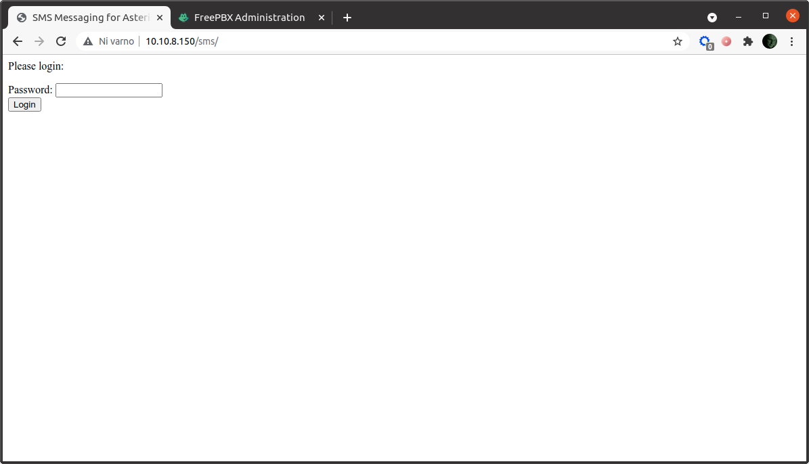

Mimogrede, še krajša opazka glede spletnega vmesnika za pošiljanje SMS sporočil. Če imate vsaj malo občutka za spletno oblikovanje, je ta vmesnik prava žalitev za vaše oči. Vseeno pa to ni problem, saj lahko izgled vmesnika spremenite sami. Datoteke HTML se nahajajo v `/var/www/html/sms` in jih lahko prosto urejate. Če boste pripravili kakšen zanimiv dizajn vmesnika za pošiljanje SMS poročil, vam bom zelo hvaležen, če ga boste delili z mano.


No, pravzaprav sem to naredil kar sam. Na hitro pripravil [malenkost lepši vmesnik za pošiljanje SMS sporočil](send-sms.php). Datoteko preimenujte v `index.php` in jo prekopirajte v mapo `/var/www/html/sms`. Ker je bila skripta precej na hitro popravljena, pa ne priporočam poganjanja HTML validatorja...


Zdaj lahko USB modem vstavite v vaš RaspberryPi. Če je bil slučajno že prej priključen (niste mogli počakati, ha!), pa ga izvlecite ven ter ga ponovno priključite. Nekateri starejši GSM modemi sicer zahtevajo ponovni zagon celotnega računalnika RaspberryPi in v tem primeru boste v ukazno vrstico morali vnesti ukaz `reboot`.

### Konfiguracija USB modema

Ko se s SSH znova povežete na RasPBX, lahko preverite, ali v sistemu vidite USB GSM ključek. Vnesite ukaz `ls -l /dev/ttyUSB0*` in dobili boste približno takle izpis:

    crw-rw-rw- 1 root dialout 188, 0 okt 29 15:27 /dev/ttyUSB0

Now show dongle devices through Asterisk management console: `asterisk -rx 'dongle show devices'`. You will see something like this:
Zdaj si lahko v upravljalni konzoli Asterisk ogledate še ali je ključek prepoznal tudi Asterisk sistem: `asterisk -rx 'dongle show devices'`. Videli boste nekaj takega:

    ID           Group State      RSSI Mode Submode Provider Name  Model      Firmware          IMEI             IMSI             Number        
    dongle0      0     Free       21   3    3       BOB            E1752      11.126.03.01.314  xxxxxxxxxxxxxxx  2934xxxxxxxxxxx  Unknown       

Vidite lahko, da imate vstavljen en GSM USB modem (imenovan *dongle0*), izpiše pa se tudi več zanimivih informacij o tem ključu, kot na primer IMEI, IMSI vaše kartice SIM itd. *State: Free* pomeni, da je ključ USB pripravljen za sprejemanje klicev. In če se sprašujete, ali *dongle0* pomeni, da bi lahko obstajal tudi *dongle1* itd., je odgovor pritrdilen, na RaspberryPi lahko povežete več ključev (vendar upoštevajte, da boste potem potrebovali več električne energije za napajanje).

Zdaj lahko pogledate še več informacij o vašem ključku (*dongle0*). Vnesite ukaz `asterisk -rx 'dongle show device state dongle0'` in dobili boste veliko zanimivih informacij:

    -------------- Status -------------
      Device                  : dongle0
      State                   : Free
      Audio                   : /dev/ttyUSB1
      Data                    : /dev/ttyUSB2
      Voice                   : Yes
      SMS                     : Yes
      Manufacturer            : huawei
      Model                   : E1752
      Firmware                : 11.126.03.01.314
      IMEI                    : xxxxxxxxxxxxxxx
      IMSI                    : 2934xxxxxxxxxxx
      GSM Registration Status : Registered, home network
      RSSI                    : 21, -71 dBm
      Mode                    : GSM/GPRS
      Submode                 : EDGE
      Provider Name           : BOB
      Location area code      : xxx
      Cell ID                 : xxx
      Subscriber Number       : Unknown
      SMS Service Center      : +38640441000
      Use UCS-2 encoding      : Yes
      USSD use 7 bit encoding : Yes
      USSD use UCS-2 decoding : No
      Tasks in queue          : 0
      Commands in queue       : 0
      Call Waiting            : Disabled
      Current device state    : start
      Desired device state    : start
      When change state       : now
      Calls/Channels          : 0
        Active                : 0
        Held                  : 0
        Dialing               : 0
        Alerting              : 0
        Incoming              : 0
        Waiting               : 0
        Releasing             : 0
        Initializing          : 0

Ker seveda želim ohraniti svojo zasebnost, so podatki o mojem IMEI, IMSI, LAC kodi in ID bazne postaje zabrisani.

Sedaj lahko končno konfiguriramo naš ključ za klice in SMS sporočila. Odprite konfiguracijsko datoteko: `nano /etc/asterisk/dongle.conf` in poiščite `[dongle0]`. Videli boste vrstice *audio* in *data*, nato pa dodajte svoje vrstice *exten*, *imei* in *imsi*, kot je prikazano v naslednjem primeru:

```ini
[dongle0]
audio=/dev/ttyUSB1              ; tty port for audio connection;        no default value
data=/dev/ttyUSB2               ; tty port for AT commands;             no default value
exten=+38641234567;
imei=xxxxxxxxxxxxxxx;
imsi=2934xxxxxxxxxxx;
```

Shranite in zaprite datoteko ter se prijavite neposredno v upravljalno konzolo Asterisk: `asterisk -rvvv`. Nato vnesite ukaz `dongle reload now`:

    raspbx*CLI> dongle reload now
    [2021-10-29 17:23:11] NOTICE[1421]: chan_dongle.c:429 do_monitor_phone: [dongle0] stopping by restart request
        -- [dongle0] Dongle has disconnected
        -- [dongle0] Trying to connect on /dev/ttyUSB2...
        -- [dongle0] Dongle has connected, initializing...
        -- [dongle0] Dongle initialized and ready

### Svoboda kliče

Kot lahko vidite, je USB ključek zdaj pripravljen. Najprej preverimo, ali lahko pošljemo SMS sporočilo. V upravljalni konzoli Asterisk vnesite `dongle sms dongle0 +38640XXXXXX Test!`. To bo na moj osebni mobilni telefon (*+38640XXXXXX*) poslalo SMS sporočilo z besedilom `Test!`.

Odhodni klic pa lahko sprožimo z ukazom `channel originate dongle/dongle0/+38640XXXXXX application MusicOnHold`. V upravljalni konzoli Asterisk se bo izpisalo nekaj takega:

    -- Called dongle0/+38640XXXXXX
    -- Dongle/dongle0-0100000000 is making progress
    -- Dongle/dongle0-0100000000 answered
    -- Started music on hold, class 'default', on channel 'Dongle/dongle0-0100000000'
    -- Stopped music on hold on Dongle/dongle0-0100000000

Klicani telefon bo začel zvoniti in če dvignete, boste slišali glasbo.

Zdaj lahko zaprete upravljalno konzolo Asterisk tako, da vnesete `exit` in poskusite poslati SMS še prek spletne strani. V brskalniku odprite spletno stran `/sms` na vaši napravi RasPBX (v mojem primeru `http://10.10.8.150/sms/`) in pošljite SMS sporočilo. Če se spomnite, smo postavili požarni zid, tako da je spletna stran za pošiljanje SMS sporočil na voljo samo iz dovoljenih naslovov IP.

In da ne pozabimo. Če pošljete SMS nazaj na vaš GSM USB ključek, ga bo RasPBX takoj poslal na vaš e-poštni naslov. To pa ni kar tako, kajne?

Žal pa **prejemanje MMS sporočil ne deluje** (pošiljanje pa tudi ne). Ko vam bo nekdo poslal MMS sporočilo, ne boste prejeli niti številke pošiljatelja, pač pa le sporočilo, da ste prejeli SMS s številke `MMSC` s prazno vsebino. Če ima kdo od bralcev idejo, kako rešiti ta problem, ste seveda toplo dobrodošli, da to idejo ali celo konkretno rešitev delite z nami.

Kakorkoli že, e-poštna sporočila v katerih dobivate prejete SMS-e izgledajo obupno slabo. To lahko popravite tako, da spremenite kodo v konfiguracijski datoteki. To storite takole: `nano /etc/asterisk/extensions_custom.conf` in dodate nekaj takega:

```ini
[from-trunk-dongle]
exten => sms,1,Verbose(Incoming SMS from ${CALLERID(num)} ${BASE64_DECODE(${SMS_BASE64})})
exten => sms,n,System(echo "To: matej.kovacic@xxxxx.si\nSubject: Incoming SMS from ${CALLERID(num)}\n\nHi,\n\non a nice day of ${STRFTIME(${EPOCH},,%d. %m. %Y at %H:%M:%S)} you have received SMS from number ${CALLERID(num)}.\n\nSMS content:\n " > /tmp/sms.txt)
exten => sms,n,Set(FILE(/tmp/sms.txt,,,a)=${BASE64_DECODE(${SMS_BASE64})})
exten => sms,n,System(sendmail -t < /tmp/sms.txt)
exten => sms,n,Hangup()
exten => _.,1,Set(CALLERID(name)=${CALLERID(num)})
exten => _.,n,Goto(from-trunk,${EXTEN},1)
```

Pazite le, da vnesete pravilen e-poštni naslov.

### Namestitev spletnega vmesnika za USSD

*Unstructured Supplementary Service Data* (USSD), včasih imenovani tudi *quick codes* ali *feature codes*, je komunikacijski protokol, ki ga mobilni telefoni GSM uporabljajo za komunikacijo z računalniki operaterja mobilnega omrežja. USSD se lahko uporablja za brskanje po WAP, predplačniško storitev povratnega klica, storitve mobilnega plačevanja, različne lokacijske storitve ali kot del konfiguracije telefona v omrežju. Sporočila USSD so dolga do 182 alfanumeričnih znakov, vendar za razliko od sporočil SMS sporočila USSD med samo sejo ustvarijo povezavo v realnem času. Povezava ostane odprta, kar omogoča dvosmerno izmenjavo podatkov.

Sam sicer USSD storitev ne uporabljam, če pa te storitve potrebujete, samo vnesite ukaz `apt install ussd-webpage`, nato pa z brskalnikom odprite `/ussd` podstran na vaši RasPBX napravi (v mojem primeru `http://10.10. 8.150/ussd/`).

### Namestitev dodatnega kodeka

Čisto za konec boste morda boste želeli namestiti še dodatni glasovni kodek G.729, ki je licenciran in ga je zato treba ročno namestiti v vaš sistem. G.729 uporablja kompresijo, zato porablja manj pasovne širine za ceno enake kakovosti zvoka. Ponuja zelo dober kompromis med pasovno širino in kakovostjo in zanj velja, da je za večino klicev zelo dobra izbira. Standardni klici s kodekom npr. G.711 zahtevajo 64 kbit/s na klic, kodek G.729 pa stisne glas na 8 kbit/s (pri čemer se kvaliteta ne poslabša zelo bistveno), kar vam omogoča do osemkrat večjo zmogljivost na isti povezavi. To je idealno za uporabo, če je vaša pasovna širina omejena. Kodek lahko namestite tako, da vnesete `apt install asterisk16-codecg729`.

In to je zaenkrat to. Konzolo lahko zaenkrat pustite ob strani, nadaljnja konfiguracija bo potekala preko spletnega vmesnika.

## FreePBX konfiguracija

Zdaj pa se začne prava zabava. Odprite spletni brskalnik in vnesite naslov IP vaše RasPBX. V mojem primeru `http://10.10.8.150`.


Ko se poskušamo prvič prijaviti v spletni vmesnik FreePBX, se izvedejo začetne nastavitve sistema. Najprej moramo nastaviti privzeti jezik. Toplo vam priporočam, da izberete angleščino, saj sta tako dokumentacija, kot pomoč na forumih večinoma v angleščini. Prav tako boste morali nastaviti svoj časovni pas ter seveda uporabniško ime in geslo. In ne pozabite na e-naslov za e-pošto z obvestili. Prav tako vam močno priporočam, da omogočite samodejne posodobitve.


Po uspešni prijavi na nadzorno ploščo moramo klikniti na "Apply config" s čimer aktiviramo spremembe, ki smo jih naredili. Zdaj je naš sistem pripravljen za nadaljnje delo.

### Nastavitev trunk povezave

Kot smo pojasnili, se trunk povezave uporabljajo za povezavo dveh telefonskih sistemov (izmenjavo prometa med njima). Z našo trunk povezavo bomo naš sistem RasPBX preko USB modema povezali z mobilnim operaterjem. Iz te povezave bomo kasneje usmerjali odhodne in dohodne klice med našim telefonskim sistemom in javnim telefonskim omrežjem.

Najprej moramo seveda ustvariti novo trunk povezavo za naš GSM ključek. V spletnem vmesniku FreePBX izberite `Connectivity` → `Trunks` → `Add Custom Trunk` in nastavite naslednje vrednosti:

- `General` - `Trunk Name`: vnesite ime trunk povezave, sam sem uporabil `gsm_dongle0`.
- `General` - `Outbound CallerID`: vnesite telefonsko številko vaše SIM kartice, ki je vstavljena v USB modem. Številka naj bo v E.164 zapisu. Sam sem vnesel `+38640XXXXXX` (no, v resnici nisem vnesel X-ov, ker pač ne želim razkriti svoje telefonske številko, ampak saj razumete bistvo, kajne?).
- `Dialed Number Manipulation Rules`: tukaj izberite polje `match pattern` in vnesite `XXXXXXXXX` (ja, tukaj je pa treba vnesti X-e).
- `Custom Settings` - `Custom Dial String`: `dongle/dongle0/$OUTNUM$`.


Kliknite na *Submit changes* (gumb spodaj desno) in nato *Apply config* (zgoraj desno).

Preden nadaljujemo, pa je potrebna kratka razlaga glede pravil za tim. manipulacijo klicanih številk (`Dialed Number Manipulation Rules`). V mojem primeru sem vnesel `XXXXXXXXX`. Kaj pomenijo ti znaki?

Med nastavitvami trunk povezave lahko nastavite pravila za manipulacijo klicane številke, torej pravila, ki določijo kaj se s številko zgodi, ko jo pošljete iz trunk povezave v drugo telefonsko omrežje. S temi pravili lahko klicani številki, preden jo posredujete trunk povezavi, dodate predpone itd. Če na primer uporabnik pokliče številko *123456*, lahko pred to številko dodate *041*, tako da bo klicana številka v resnici *041123456*. Če pa ne velja nobeno pravilo, se številka ne spremeni. V našem primeru za klicane številke sicer ne bomo uporabljali nobenih posebnih pravil, vendar pa zahtevamo, da so klicane številke dolge 9 števk, zato smo uporabili vzorec `XXXXXXXXX`.

Če pa bi želeli pred številko dodati predpono, pa izberete `Dialed Number Manipulation Rules` in v polje `prepend`, vnesete številko, ki bo dodana pred vsako klicano številko na tej trunk povezavi. Če na primer vnesete `#31#`, bo to na dani trunk povezavi skrilo ID klicatelja (omenjena koda se v Evropi uporablja za skrivanje klicne identitete).

Ampak kaj pa pomenijo ti X-i? To so vzorci, ki se uporabljajo za "razlago" oblike števila:

- **X** se ujema s katero koli številko od 0-9.
- **Z** se ujema s katero koli številko od 1 do 9.
- **N** se ujema s katero koli številko od 2 do 9.
- **[1237-9]** se ujema s katero koli številko v oklepaju (v našem primeru se ujema s številkami: 1,2,3,7,8,9).
- **.** pika se ujema z eno ali več klicanimi številkami.

Torej pravilo "XXXXXXXXX" preprosto pomeni, da lahko preko dane trunk povezave pokličete katero koli 9-mestno dolgo številko od 000000000 do 999999999.

Zdaj ste verjetno pomislili, da lahko s temi pravili nastavimo omejitev katere številke lahko kličejo uporabniki našega telefonskega sistema.

Imate prav. To je mogoče narediti, vendar bomo to naredili v nastavitvah odhodnih povezav. In ravno to je tema našega naslednjega podpoglavja.

### Nastavljanje izhodnih povezav

Tim. izhodne povezave (*outbound routes*) se uporabljajo za to, da vaš RasPBX sistem ve, katere številke lahko kličejo vaši uporabniki (oz. vaše interne telefonske številke) in na katero trunk povezavo naj se posredujejo posamezni odhodni klici. Tukaj lahko nastavite številke, ki jih uporabniki ne morejo klicati, npr. številke za klic v sili (tega v tem vodiču sicer ne bomo obravnavali) in pot za običajne klice. Nastavimo pa lahko tudi posebno poti za mednarodne klice ali klice v različna omrežja (nekateri operaterji na primer ponujajo neomejene brezplačne klice znotraj svojega omrežja) – vsaka od teh poti lahko poteka po svoji trunk povezavi.

Poglejmo si torej kako nastaviti izhodno povezavo, preko katere boste lahko s pomočjo GSM modema klicali ven iz vašega RasPBX sistema. V FreePBX klinite `Connectivity` → `Outbound routes` in nato gumb `Add Outbound Route`. Sedaj nastavite svojo izhodno povezavo:

- `Route Name`: vnesite ime izhodne povezave, sam sem uporabil `gsm_out`.
- `Trunk Sequence for Matched Route`: iz menija izberite `gsm_dongle0` (to je ime trunk povezave, ki smo jo nastavili v prejšnjem koraku).
- `Dial Patterns`: tukaj izberite polje `match pattern` in vnesite `0[12345678]XXXXXXX`.

Ta vzorec bo uporabnika omejil, da bo lahko klical samo 9-mestne številke, ki se začnejo z 0 in jim sledi druga števka, ki pa je lahko katera koli, razen 0 ali 9. Vseh ostalih sedem števk je lahko kar koli od 0 do 9.

Kaj pomeni to pravilo? Na kratko: ne dovolimo mednarodnih klicev ter dovolimo samo klicanje v lokalna omrežja od 01 do 08 Omrežje 090 ni dovoljeno, saj so številke 090 v Sloveniji tim. komercialne številke, kamor lahko pokličete razne vedeževalke, vroče linije in podobne neumnosti ter zapravite kup denarja. Česar pa verjetno nočete, kajne?


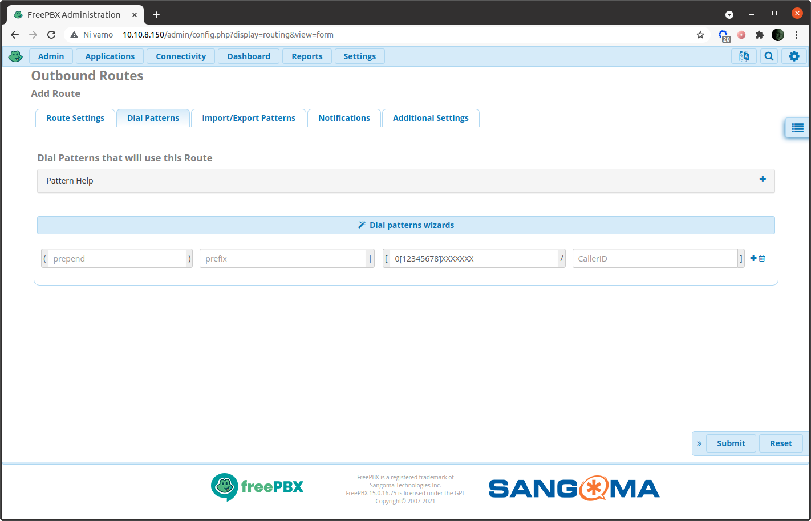

Kliknite gumb *Submit* in nato *Apply config*.


#### Nastavitev klicnih predpon za odhodne klice

Če želite, da mora uporabnik za klicanje ven (torej, za uporabo vaše izhodne povezave) vnesti določeno številko, na primer `0`, pojdite na nastavitve vaše izhodne povezave in izberite `Dial Patterns`. Nato pojdite na polje `prefix` in vnesite `0`.

S tem boste nastavili, da ko bo neka vaša interni uporabnik želel poklicati zunanjo številko, npr. `031987654`, bo moral najprej pritisniti `0` in šele nato vnesti številko ki jo kliče (v našem primeru `031987654`). Brez tega klic na zunanje številke ne bo mogoč.

### Nastavitev internih telefonskih številk

Zdaj lahko končno nastavimo naše interne telefonske številke. V telefonski terminologiji se za to uporablja angleški izraz *extension*, kar bi lahko zelo grobo prevedli kot *razširitev*. Gre za lokalne telefonske številke znotraj našega telefonskega sistema. V FreePBX kliknite `Applications` → `Extensions`. Kliknite na gumb `Add Extension` in dodajte novo številko tipa `SIP [chan_pjsip] extension`.

Nato sledijo nastavite:

- `User extension`: lahko je poljubna številka, sam sem se odločil za 4-mestne številke in v mojem primeru sem vnesel `1000`.
- `Display name`: prikazno ime je seveda ime uporabnika ali naprave. Sam sem vpisal `Matej - racunalnik`, saj to številko nameravam uporabljati na svojem računalniku.
- `Secret`: tukaj se nahaja geslo za vašo interno telefonsko številko (oziroma vaš SIP račun). to geslo je samodejno ustvarjeno, lahko pa ga poljubno spremenite. Na primer, v ... no, tega vam seveda ne izdam, saj morajo gesla ostati tajna, kajne?


Na tem mestu pa lahko postorite še nekaj zanimivih stvari. Pod izbiro `Voicemail` lahko omogočite zvočno pošto. Poglejmo si nekaj uporabnih nastavitev:

- Nastavitev gesla `Voicemail Password` (uporabite samo številke).
- `Disable (*) in Voicemail Menu`: nastavite na **ne** (**no**), kar vam bo omogočilo, da s pomočjo telefona lahko uporabljate zvočne menije.
- `Require From Same Extension`: nastavite na **da** (**yes**), s čimer določite, da uporabnik do svoje zvočne pošte lahko dostopa samo preko svoje interne telefonske številke.
- Nastavite e-naslov uporabnika (`e-mail address`), `pager address` je namenjen pošiljanju res zelo kratkih e-sporočil.
- `Email Attachment`: če nastavite na **da** (**yes**), bodo zvočna sporočila uporabnika poslana na njegov e-naslov kot priložena zvočna datoteka.
- `Delete Voicemail`: če nastavite na **da** (**yes**), bodo zvočna sporočila iz sistema izbrisana takoj, ko bodo uporabniku poslana po e-pošti.


Kliknite *Submit* za pošiljanje sprememb in nato *Apply config*. Seveda v sistem lahko dodate več telefonskih številk, lahko tudi za vse svoje prijatelje in znance. Vendar pa se zavedajte, da bodo pri trenutnih nastavitvah vse te interne številke lahko uporabljale vašo trunk povezavo za izhodne klice, kar lahko vodi do nepredvidenih stroškov. A brez skrbi, v nadaljevanju si bomo pogledali kako tem dodatnim številkam omejiti klicanje ven.

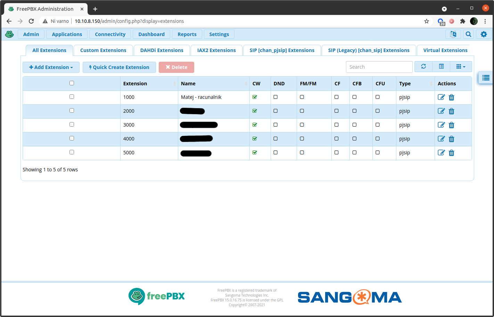

### Nastavljanje dohodnih povezav

Končno lahko nastavimo še, kam (na katere interne telefonske številke) bodo usmerjeni dohodni klici. V FreePBX kliknite `Connectivity` → `Inbound routes`. Kliknite gumb 'Inbound Route' in nastavite:

- `Description`: vnesite ime vaše dohodne povezave, sam sem uporabil `gsm_in`.
- `Set destination` - `Select Extensions` in izberite interno telefonsko številko, kamor bodo posredovani dohodni klici. Sam sem izbral `1000 - "Matej - racunalnik"`.

Kliknite *Submit* za pošiljanje sprememb in nato *Apply config*. In to je to. Pravzaprav ne še čisto zares, je pa sedaj čas za nekaj preskusov.

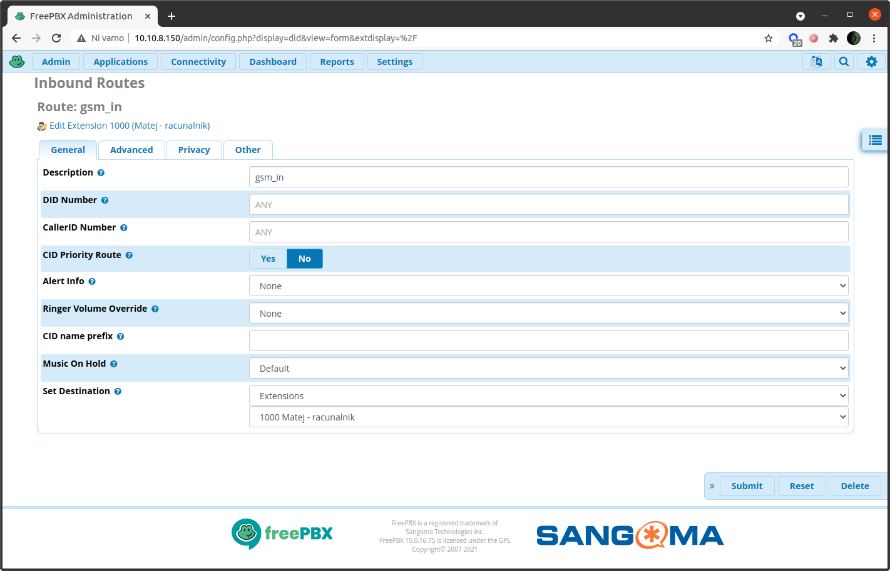

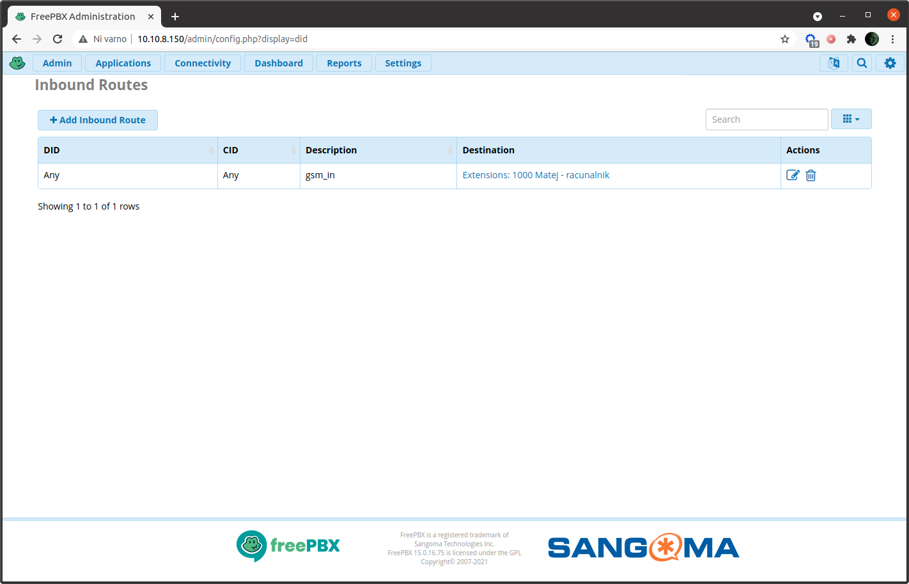

Če sedaj pokličemo naš RasPBX sistem (torej telefonsko številko SIM kartice, ki je vstavljena v USB modem) z mobilnega ali navadnega telefona, bomo slišali glasovno sporočilo, da lokalna številka 1000 ni na voljo. To pomeni, da naš sistem deluje, ker pa še nismo nastavili nobenega SIP odjemalca oziroma ker na sistem nismo povezali še nobenega telefona, klica ne moremo sprejeti.

### Dodatne SIP nastavitve

Zdaj lahko nastavimo še nekaj dodatnih stvari, vključno z nekaterimi **dobrimi varnostnimi praksami**. V FreePBX kliknite `Settings` → `Asterisk SIP settings` in pojdite na `General SIP Settings`. Tukaj morate nastaviti:

- `Allow SIP Guests`: nastavite na **ne** (**no**), saj je to dobra varnostna praksa.
- omogočite dodatni kodek `g729`, ki smo ga namestili v terminalu.
- lahko omogočite tudi video podporo, če želite (vendar bo to delovalo samo za interne klice).

Zdaj izberite `SIP Legacy Settings [chan_sip]` (`Settings` → `Asterisk SIP settings` ter pojdite na `SIP Legacy Settings [chan_sip]`. Izberite `Other SIP Settings` in vnesite `alwaysauthreject`=`yes` (to je tudi dobra varnostna praksa).

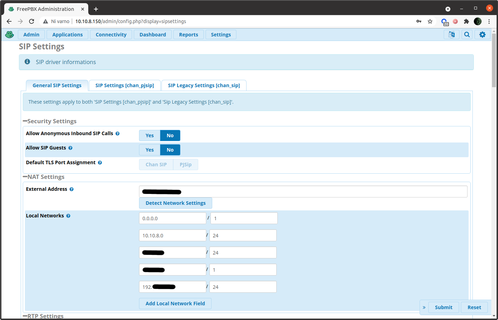

Kliknite *Submit* za pošiljanje sprememb in nato *Apply config*.

### Omogočanje TCP namesto UDP

Pri uporabi internetne telefonije včasih pride do težav zaradi nastavitev omrežne opreme. Nekatere funkcije domačih omrežnih usmerjevalnikov namreč lahko nenamerno motijo promet VoIP. Ena od funkcij, ki povzročajo težave, je SIP ALG. ALG ali Application Layer Gateway je zasnovan za omogočanje posredovanja določenih vrst prometa čez NAT in požarni zid vašega usmerjevalnika. SIP ALG je posebej zasnovan za prenos prometa SIP skozi NAT/požarni zid vašega usmerjevalnika, tako da SIP promet lahko doseže telefone za NAT-om. Problem pa nastopi takrat, ko so paketi SIP že optimizirani za prehod skozi NAT/požarne zidove brez dodatne pomoči. SIP ALG takrat povzroča težave. Razlog je v tem, da SIP ALG prepiše TCP naslove paketov SIP, to pa potem ovira proces dostave. Posledica tega je, da naprava, ki jo kličete misli, da vaš telefon ni za NAT-om, čeprav v resnici je. Če ALG nastavitev moti SIP promet, se to manifestira kot nezmožnost sprejemanja dohodnih klicev, VoIP telefoni pa se odjavljajo iz omrežja.

Podobne težave sem imel tudi sam. Težave so se kazale v nezmožnosti sprejemanja dohodnih klicev, odhodni klici pa so bili samodejno prekinjeni po 30 sekundah. Ker onemogočanje SIP ALG nastavitve na mojem usmerjevalniku ni preprečilo težav s kakovostjo klicev, sem se odločil za nekoliko bolj drastične ukrepe. Večje težave namreč včasih *lahko* rešimo z večjim kladivom.

Taka rešitev je bila v mojem primeru onemogočanje UDP protokola. Namesto UDP sem za SIP promet uporabil TCP protokol. Za tiste, ki ne veste o čem je govora - TCP in UDP sta internetna protokola. Sporočila preko protokola TCP se zaradi vzpostavljene povezave med odjemalcem in servisom prenašajo zanesljivo v obe smeri, so brez napak, podvojevanja in v pravem vrstnem redu. UDP pa je nepovezovalni protokol za prenašanje paketov, kar pomeni, da odjemalec in strežnik ne vzpostavita povezave, ampak strežnik pošilja pakete odjemalcu in ne preverja, če je odjemalec pakete dobil. Tak način prenosa podatkov je sicer manj zanesljiv, a po drugi strani hitrejši, zato se pogosto uporablja pri VoIP komunikacijah.

V FreePBX torej kliknete `Settings` → `Asterisk SIP settings` in izberete `SIP Settings [chan_pjsip]`. Tukaj nato onemogočite UDP in omogočite TCP.


Kliknite *Submit* za pošiljanje sprememb in nato *Apply config*.

## Nastavljanje SIP odjemalcev

Končno se lahko lotimo nastavitev naših SIP odjemalcev (tim. *sofphones*). Sam uporabljam več operacijskih sistemov, in sicer: Ubuntu Linux, Windows in MacOS na računalniku ter Android in iPhone na telefonih. Seveda sem skušal najti *najboljšega odjemalca* za vsakega od teh sistemov, po možnosti takega, ki je odprtokoden, vendar sem hitro ugotovil, da obstaja veliko izdelkov, a vsak od njih ima kup svojih težav. Končno sem končal na aplikaciji Zoiper, ki sicer ni odprtokoden, vendar pa brezplačna različica deluje zelo dobro. Ker pri brezplačni različici pogrešam predvsem funkcijo ZRTP šifriranja, pa vse bralce naprošam, če mi predlagajo katere SIP odjemalce za različne operacijske sisteme bi se splačalo uporabiti oz. preskusiti.

Kot že omenjeno, obstaja več odjemalcev SIP, v bistvu pa morate pri vsakem nastaviti uporabniški ID ali uporabniško ime (to je vaša interna telefonska številka, na primer `1000`), domeno (to je IP naslov vaše RasPBX naprave; prav tako je smiselno, da dodate številko vrat, ki je v našem primeru 5060, tako da vnesete `10.10.8.150:5060`) in geslo vaše interne telefonske številke. Običajno boste morali izbrati tudi transportni protokol, ki je v našem primeru `TCP`.


Ko je vaš SIP odjemalec uspešno poveže na telefonsko centralo (če ste vnesli napačno geslo, vas bo `fail2ban` blokiral za pol ure oziroma boste morali odblokirati blokiran IP naslov), lahko izvedete prvi testni klic... in nato seveda poskusite sprejeti testni klic od zunaj. Poskusite pa lahko tudi interne klice med vašimi internimi telefonskimi številkami.

### Nastavitve glasovne pošte

Zdaj lahko nastavite še svojo glasovno pošto (če ste jo pred tem omogočili v FreePBX). S SIP odjemalcem pokličite `*97` vnesite svoje geslo za glasovno pošto in že lahko slišite glasovni meni. Sedaj pritisnite "0" in `1`, da posnamete svoje *sporočilo o tem, da niste dosegljivi*. Ko končate, pritisnite `#` in nato `1`, da sprejmete in shranite sporočilo. Posnamete lahko tudi *sporočilo, da ste zasedeni* itd.

Nato svojega SIP odjemalca odjavite iz sistema (da ne bo dosegljiv) in ga poskusite poklicati. Če ste vse nastavili pravilno, boste slišali *sporočilo o tem, da niste dosegljivi*, sistem pa vam bo nato omogočil, da pustite glasovno sporočilo. To sporočilo bo posneto in poslano na vaš e-poštni naslov, kjer si ga lahko predvajate. To pa je kul rešitev, kaj?

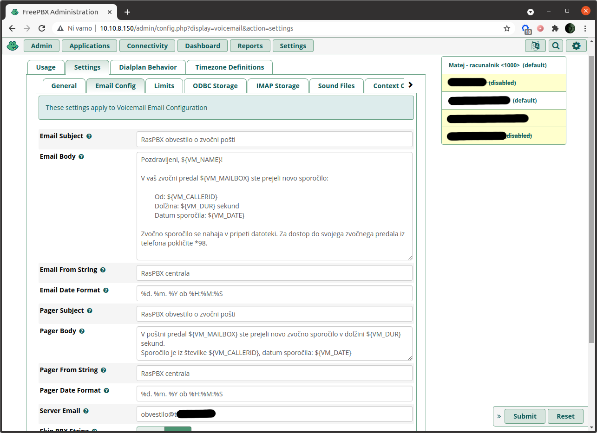

Naj na koncu omenimo še eno malenkost. Če greste v FreePBX v `Settings` → `Voicemail Admin` → `Settings` → `Email Config`, lahko spremenite vsebino e-pošte z obvestilom, ki se pošlje uporabniku, ko prejme glasovno pošto. Sam sem odstranil sklic na `http://AMPWEBADDRESS/ucp`, saj modul *User Control Panel*, preko katerega lahko zunanji uporabniki dostopajo do svoje glasovne pošte in nekaterih nastavitev, privzeto ni nameščen. Poleg tega omogočanje dostopa zunanjim uporabnikom predstavlja tudi varnostno tveganje, sam osebno pa tudi menim, da je za uporabnike bolj enostavno, da glasovna sporočila prejmejo kot prilogo e-pošte.

### Nastavitve e-pošte skrbnika glasovne pošte

E-pošto za skrbnika glasovne pošte najdete pod `Settings` → `Voicemail Admin` → `Settings` → `Email Config`. Tukaj lahko urejate polje `from`, `subject` in `body` e-poštnega obvestila o novem sporočilu glasovne pošte. Preverite tudi polje `Server e-mail` in vnesite svoj elektronski naslov za obvestila (v mojem primeru `obvestilo@xxxxx.si`).

Še kratka opomba - če imate težave z dostavo e-pošte, preverite dnevniške zapise poštnega strežnika `exim4` na vašem RasPBX. Na RasPBX se povežite preko SSH in si oglejte vsebino datoteke z dnevniškimi zapisi z ukazom: `cat /var/log/exim4/mainlog`.

## Še nekaj drugih malenkosti

### Blokada odhodnih klicev

Pozorni bralci se spomnite obljube, da si bomo pogledali, kako lahko blokiramo določeno interno številko, da ne more klicati ven. Čas je za izpolnitev obljube.

Blokado odhodnih klicev lahko naredimo na več načinov, v našem primeru pa bomo to naredili tako, da bomo za konkretno interno telefonsko številko ustvarili posebno izhodno povezavo. V FreePBX kliknemo `Connectivity` → `Outbound routes` in nato na gumb `Add Outbound Route`. Zdaj nastavimo naslednje:

- `Route Name`: to povezavo bomo poimenovali `4000_no_out`, saj je povezava namenjena blokadi izhodnih klicev interne številke `4000`.
- `Dial Patterns`: iizberemo polje `match pattern` in vnesemo `0[12345678]XXXXXXX`.
- `Dial Patterns`: izberemo polje `CallerID` in vnesemo interno telefonsko številko, za katero želimo blokirati odhodne klice, v našem primeru je to `4000`.
- **Ne nastavimo** `Trunk Sequence for Matched Routes`.

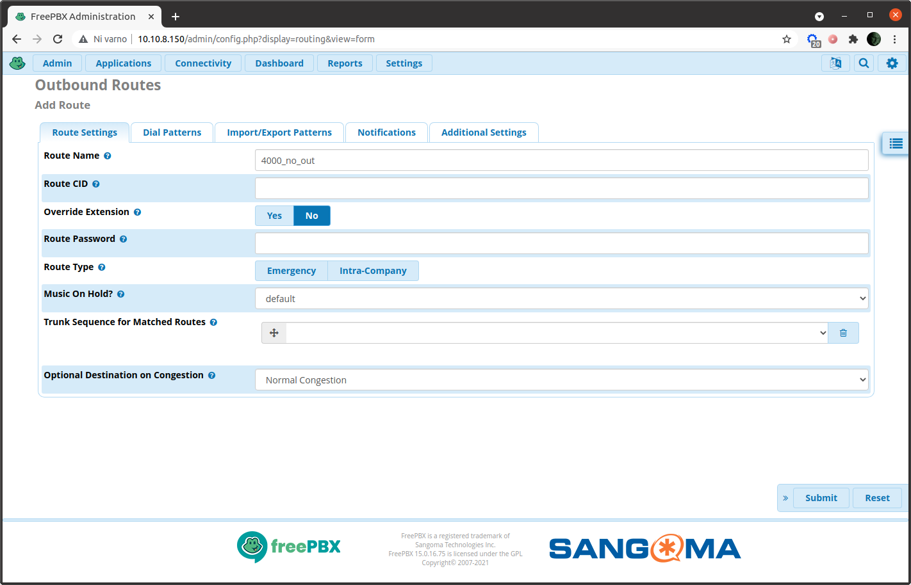


Ob kliku na gumb *Submit*, vas bo sistem vrnil na seznam izhodnih povezav. Z miško primite povezavo, ki ste jo ravnokar ustvarili (nahaja se na dnu seznama) in jo *potegnite na vrh seznama*. Nato kliknite *Apply config*.

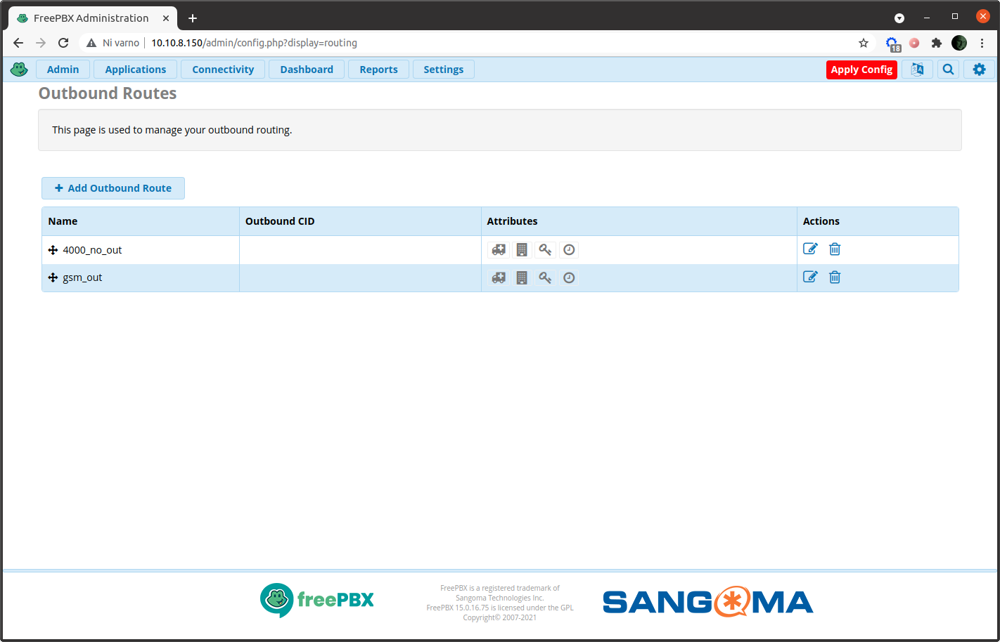

### Omejevanje interne številko na klicanje samo določene zunanje številke

Kaj pa, če želimo, da bo določena interna številka, recimo "3000", lahko klicala samo določeno zunanjo številko (na primer "031987654"). Ali je to mogoče storiti?

Seveda se da, je pa nekoliko zapleteno. Nastaviti je potrebno izhodni povezavi, pri čemer pa je potrebno upoštevati, da se izhodne povezave procesirajo od zgoraj navzdol. To pomeni, da se najprej preveri prvo pravilo, nato drugo itd.

Torej bomo imeli naslednji algoritem:

- Prvo pravilo: če interna telefonska številka `3000` kliče zunanjo številko `031987654`, je klic dovoljen.
- Če interna telefonska številka 3000 pokliče katero koli drugo zunanjo številko, skočimo na drugo pravilo.
- Drugo pravilo: če interna telefonska številka `3000` pokliče katero koli zunanjo številko (ne katero koli drugo, ampak katero koli!), klic ni dovoljen. In to je konec pravil za interno telefonsko številko "3000".

Sedaj ustvarimo prvo pravilo (prvo izhodno povezavo), ki bo določilo, da interna telefonska številka 3000 lahko pokliče zunanjo številko 031987654. V FreePBX kliknemo `Connectivity` → `Outbound routes` in nato gumb `Add Outbound Route`. Sedaj definiramo izhodno povezavo:

- `Route Name`: `3000_to_my_mobile` (ta interna številka bo lahko klicala samo mojo mobilno številko).
- `Trunk Sequence for Matched Route`: iz menija izberemo `gsm_dongle0`.
- `Dial Patterns`: v polje `match pattern` vnesemo`031987654` (zunanja številka, katere klicanje je dovoljeno).

Zdaj dodamo še drugo pravilo (oz. drugo izhodno povezavo). V FreePBX kliknemo `Connectivity` → `Outbound routes` in nato gumb `Add Outbound Route`. Sedaj definiramo:

- `Route Name`: `3000_no_out`.
- `Dial Patterns`: v polje `match pattern` vnesemo `0[12345678]XXXXXXX`.
- `Dial Patterns`: v polje `CallerID` vnesemo interno telefonsko številko, ki jo želimo blokirati, v našem primeru `3000`.
- **Ne nastavimo** `Trunk Sequence for Matched Routes`.

Na koncu pravila za izhodne povezave uredite tako, da bo prvo pravilo `3000_to_my_mobile`, drugo pa `3000_no_out`. Privzeta pot `gsm_out` pa ostane na dnu seznama. Nato kliknite *Apply config* in to je to.

Vse to zveni precej preprosto, a je težava v tem, da če imate veliko pravil, celoten sistem hitro postane zelo nepregleden. Ena od rešitev je uporaba vzorcev klicanja v polju ID klicatelja. Ko nastavljate izhodne povezave, pojdite na `Dial Patterns` v polju `CallerID` in vnesite vzorec klicanja interne številke, ki jo želite blokirati, na primer `3XXX`. To pomeni, da bo izhodna pot veljala za vse razširitve od »3000« do »3999«. Potem imate lahko naslednjo shemo dodeljevanja številk:

- 1XXX številke so dodeljene vam in vašim prijateljem,
- 3XXX številke so dodeljene ljudem, ki vas imajo radi (in vas torej lahko pokličejo), vendar jih vi ne marate (zato jim ne dovolite, da oni pokličejo koga drugega),
- 4XXX razširitve so dodeljene osebam, ki jih sploh ne marate, zato sploh ne morejo klicati zunaj vašega sistema,
- ljudem, ki pa jih prav resnično sovražite, pa seveda ne dodeljujte telefonskih številk v vašem RasPBX sistemu.

No, to je bilo malo za šalo, ampak zdaj verjetno razumete kako uporabiti klicne vzorce (*dial patterns*), kajne?


## Posodabljanje sistema

Vaš FreePBX je nastavljen tako, da se samodejno posodablja, vendar to ne velja za operacijski sistem RaspPBX. Tega morate še vedno posodabljati sami. Vseeno pa lahko ročno posodobite tudi FreePBX komponento.

To storite tako, da v FreePBX kliknete `Admin` → `Module Admin` ter izberete `Check Online`. Sistem bo nato sam poiskal module, ki jih je potrebno posodobiti. Pri tem je priporočljivo, da postopek iskanja posodobitev ob začetni postavitvi sistema zaženete ročno nekajkrat, saj se učasih zgodi, da pri posodabljanju včasih pride do zastojev.

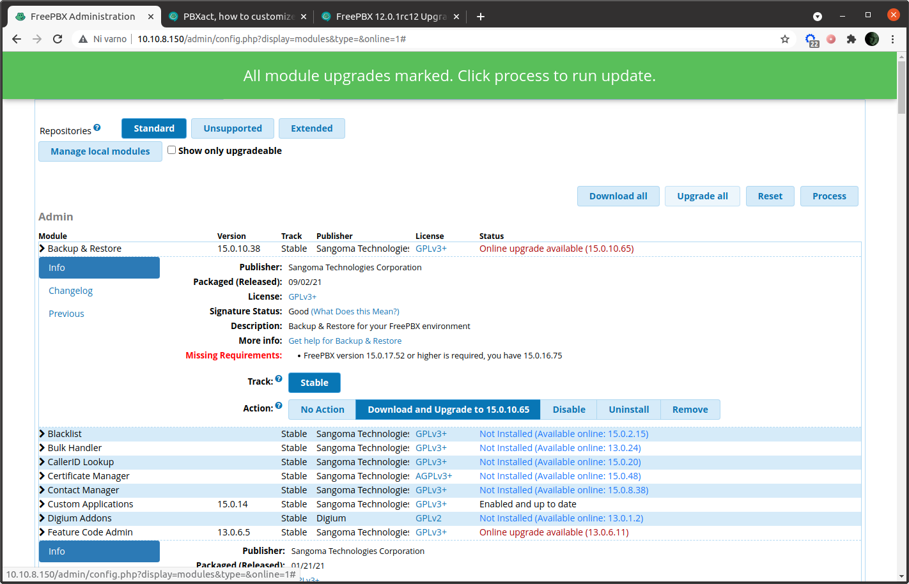


Za posodobitev operacijskega sistema (RasPBX), pa se s SSH povežite na vaš RaspberryPi in zaženite ukaz `raspbx-upgrade`.

## Varnostne kopije

V FreePBX izberite `Settings` → `Filestore`. Izberite zavihek `Local` in kliknite `+Add Local Path`. Vnesite ime poti, opis in ime mape, kamor se bodo shranjevale varnostne kopije. Sam sem vnesel `/var/spool/asterisk/backup`. Ko končate, zgoraj desno kliknite *Submit*.

Zdaj v FreePBX izberite `Admin` in nato `Backup & Restore`. Nato izberite `+Add Backup`. Pod `Add Backup` vnesite ime varnostnega arhiva in opis. Pod `Storage` nastavite še e-nasov za obvestila, iz spustnega menija pa izberite mesto za shranjevanje varnostnih kopij, ki ste ga ustvarili v prejšnjem koraku.

Zgoraj desno kliknite *Submit*. Na glavni strani `Backup & Restore` modula lahko sedaj ustvarjanje varnostne kopije sprožite ročno. Ali pa nastavite samodejno varnostno kopiranje ob določenem času.


Varnostne kopije se sedaj nahajajo v mapi `/var/spool/asterisk/backup`. Če se na RasPBX sistem povežete preko SSH in vneste ukaz `ls -lha /var/spool/asterisk/backup`, lahko vidite datoteke z varnostnimi kopijami:

    total 32M
    drwxr-xr-x  3 asterisk asterisk 4,0K okt 29 22:21 .
    drwxrwxr-x 13 asterisk asterisk 4,0K okt 29 22:03 ..
    -rw-r--r--  1 asterisk asterisk  32M okt 29 22:21 20211029-222115-1635538875-15.0.17.55-77834617.tar.gz
    drwxr-xr-x  2 asterisk asterisk 4,0K okt 29 22:21 Manual-backup

Seveda je smiselno, da si te varnostne kopije shranite tudi na zunanjo lokacijo, ampak to itak že veste.

## Kaj še lahko naredimo s takim sistemom?

### Testiranje

Seveda je smiselno da tak sistem čim obsežneje pretestiramo, da vidimo kako se obnaša v praksi. Sam sem preko VPN preskusil tudi povezavo iz Chicaga, ZDA v Slovenijo in interni telefonski klici so delovali odlično (predvsem je izstopal zelo čist zvok). Iz Chicaga sem preskusil tudi odhodne klice preko GSM modema (`gsm_dongle0`) in klici so delovali, vendar kakovost zvoka ni bila zelo dobra. Res pa je, da je bil RasPBX z GSM modemom postavljen na lokaciji, kjer je sprejem mobilnega signala bolj slab, kar je tudi možen vzrok za slabo kakovost zvoka. Vsekakor bi bilo smiselno narediti še več testov in če bo kdo izmed vas bralcev postavil podoben sistem ter ga stestiral, vas vabim, da svoje izkušnje delite z mano.

### Povezava fizičnega telefona

Sedaj, ko imate svojo lastno telefonsko centralo, se verjetno sprašujete, ali bi bilo mogoče nanjo povezati tudi fizični telefon? Odgovor je seveda – da! Brez težav si kupite namizni VoIP telefon (podpirati mora seveda SIP protokol), ki ga nato preprosto povežete v vaše omrežje in na njem nastavite ustrezno interno telefonsko številko iz vašega RasPBX sistema. Na trgu je na voljo več SIP telefonov, pred nakupom pa [preverite seznam podprtih naprav](https://wiki.freepbx.org/display/FPG/EPM-Supported+Devices).

Sam sem se odločil sem se za nakup enega od [telefonov Aastra](https://wiki.freepbx.org/display/FOP/Aastra), in sicer [Aastra 6730i](https://wiki.freepbx.org/display/FPG/Supported+Devices-Aastra#SupportedDevices-Aastra-Aastra6730i&6731i), ki je v celoti podprt s strani FreePBX.

Telefon sem uspelo dobiti po precej ugodni ceni in tako je nekega sončnega jutra na moja vrata pozvonil poštar, nekaj minut kasneje pa sem imel na mizi odpakirano čisto novo *Aastra 6730i*. Jupi!

#### Konfiguriranje in povezava VoIP telefona v lokalno omrežje

Telefon sem najprej povezal v svoje lokalno omrežje ter z orodjem `nmap` ugotovil, da ima telefon Aastra lokalni IP naslov `192.168.1.225` ter da ima odprta dvoje TCP vrat - `443/TCP`, kar običajno pomeni, da na napravi teče spletni strežnik HTTPS in `23/TCP`, kar običajno pomeni, da je naprava dostopna prek protokola `telnet`. Slednje ni slišati dobro, saj `telnet` ne ponuja šifriranih povezav in bi morala biti njegova uporaba opuščena. Pravzaprav je `telnet` protokol že leta 1995 (se pravi tako rekoč v prazgodovini) nadomestil protokol `ssh`. Kakorkoli, ko sem se v telefon skušal prijaviti z ukazom `telnet`, se je bila povezava sicer vzpostavila, vendar s telefona sploh nisem dobil nikakršnega odgovora. Kot kaže je torej upravljanje navsezadnje možno le preko spletnega vmesnika.

Obstaja pa še en način, da ugotovimo IP naslov Aastre. In sicer tako, da ga preberemo iz samega telefona. Na telefonu preprosto pritisnemo tipko 'Možnosti' in s tipkami za pomikanje izberemo `3 - Phone status` nato pa `IP&MAC Addresses`.

Naslednji korak je, da zaženemo spletni brskalnik in vnesemo IP telefona Aastra v vrstico URL: `https://192.168.1.225`. Po pričakovanjih bomo prejeli več opozoril glede slabe varnosti HTTPS, pretečenega digitalnega potrdila (digitalno potrdilo je bilo izdano septembra 2006 in je poteklo septembra 2009) itd. A to ni velika težava, saj smo konec koncev v lokalnem omrežju, kjer lahko svoj VoIP telefon zaščitimo z drugimi ukrepi.

Za prijavo v telefon, je potrebno vnesti uporabniško ime in geslo. Skrbniško uporabniško ime je `admin` geslo pa `22222`. Tega privzetega gesla pa žal ni mogoče spremeniti. Ob tem sem sicer za nekaj sekund ostal široko odprtih ust... ampak OK, dajmo telefon najprej pripraviti za telefoniranje.

Preko spletnega vmesnika gremo v `Basic Settings` → `Preferences` in pod `Ringtones` poiščemo `Tone Set` ter ga nastavimo na `Europe`. To ni zelo pomembna nastavitev, vendar so nastavitve zato, da se ustrezno spremenijo, kajne? Naslednja stvar je, da nastavimo `Date Format` pod `Time and Date Setting` in preverimo, da so časovni strežniki (`NTP time servers`) omogočeni (pri meni so bili).

Potem pa so na vrsti nastavitve računa SIP! V FreePBX najprej ustvarimo novo interno telefonsko številko `SIP [chan_pjsip]` s številko `7000` in se lotimo zadeve.

Preko spletnega vmesnika VoIP telefona gremo v `Advanced Settings` → `Global SIP` in pod `Advanced SIP Settings` spremenimo `Transport Protocol` v `TCP` ter potrdimo, da je `Local SIP UDP/TCP Port` nastavljen na `5060`. Spremenimo tudi `Codec Preference List` (na vrh sem nastavil `G.729`), nato pa kliknemo `Save Settings`.

Nato gremo v `Advanced Settings` → `Line 1` in nastavimo naslednje:

| Nastavitev | Vrednost |
| :----- | :---- |
|`Screen Name`|`Matej` (to je seveda moje ime)|
|`Phone Number`|`7000`|
|`Caller ID`|`7000`|
|`Authentication Name`|`7000` (vse te tri številke so tim *extension number* oz. naša interna telefonska številka)|
|`Password`|tukaj sem seveda vpisal geslo svoje interne telefonske številke|
|`Proxy Server`|`192.168.1.150`|
|`Proxy Port`|`5060`|
|`Outbound Proxy Server`|`192.168.1.150`|
|`Outbound Proxy Port`|`5060`|
|`Registrar Server`|`192.168.1.150`|
|`Registrar Port`|`5060`|

Druge nastavitve niso bile spremenjene. Kot lahko vidimo, sem pod *proxy server*, *outbound proxy server* in *registrar server* vnesel lokalni IP naslov mojega RasPBX strežnika (`192.168.1.150`) in vrata (`5060`).

V nastavitvah - `Basic Settings` → `Preferences` sem pod `General` odstranil `Local Dial Plan` (nastavljen je bil na `x+#|xx+*`), saj bodo omejitve klicanja implementirane na FreePBX.

Ko kliknemo `Save Settings`, je potrebno telefon ponovno zagnati , pravi hekerji pa to seveda najraje naredijo preko omrežja, na daljavo. Izberemo torej `Operation` → `Reset` in pod `Phone` kliknemo `Restart`. Dobra minuta in VoIP telefon je ponovno zagnan ter uspešno povezan z mojo RasPBX centralo!

Ko se ponovno prijavite v telefon, to lahko vidite pod `Status` → `System Information`. `SIP Status`, ki dokazuje, da je vaš telefon povezan na RasPBX je izpisan na dnu strani.

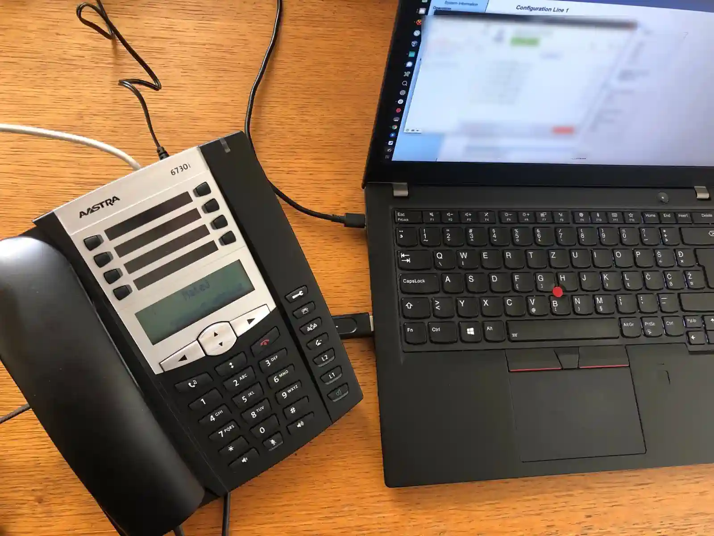

Zdaj seveda lahko kličemo, sprejemamo klice itd. ... in vse je super in krasno, a najprej je treba poskrbeti za varnost.

Prva stvar, ki se je bomo znebili je zastareli HTTPS protokol SSL 3.0 HTTPS. Gremo v `Advanced Settings` → `Network` in pod `HTTPS Settings` nastavimo `HTTPS Client Method` na `TLS 1.0`. To sicer ni idealno, saj se v letu 2021 vse HTTPS kriptografske protokole manj od TLS 1.2 šteje za ne dovolj varne, je pa veliko boljše od prazgodovinskega SSL 3.0. A po drugi strani to ni zelo pomembno, če hkrati ne moremo spremeniti privzetega skrbniškega gesla. A vseeno, pokažimo, da varnost jemljemo resno!

Naslednja težava je, da je strojna programska oprema na telefonu nekoliko zastarel in ji posodobitev ne bi škodila. Na žalost strojne programske opreme za ta telefon na uradnem spletnem mestu Aastre ni mogoče najti, sem jo pa našel na [Softpediji](https://drivers.softpedia.com/get/VoIP-Voice-over-IP/Aastra/Aastra-6730i-SIP-Phone-Firmware-3312217.shtml). Vendar pa postopek posodobitve strojne programske opreme sploh ni enostaven. Najprej si moramo datoteko s končnico `.st` shraniti na naš strežnik, in sicer TFTP, FTP ali HTTP. Nato je potrebno v telefon vnesti IP naslov strežnika in ime datoteke z nadgradnjo, to datoteko ročno prenesti na telefon in posodobitev nato ročno zagnati. Priznam, tega se nisem lotil, med drugim tudi zato, ker iz priloženih navodil ni jasno kako, oziroma ali sploh se preverja integriteta posodobitvenega paketa s strojno programsko opremo. In če gre med nadgradnjo kaj narobe, se mimogrede zgodim da bomo telefon popolnoma okvarili. Tako okvarjen telefon pa uporaben kvečjemu kot – kos opeke. Teoretično bi lahko *oblokiranje* tako okvarjeneg atelefona naredili tako, da telefon opremo ter notranji pomnilnik preprogramiramo s pomočjo programatorja strojne opreme... Vendar za to potrebujemo posebno opremo, ustrezno znanje o strojni opremi telefona, itd. Vse to pa je nekaj, s čimer se običajni uporabniki navadno ne želijo ukvarjati. Tako bo strojna programska oprema na telefonu zaenkrat ostalo takšna, kakršna je.

#### Povezovanje VoIP telefona prekp VPN

Vse to se sliši v super, a težava je v tem, da če je vaš telefon z RasPBX centralo povezan preko vašega lokalnega omrežja, to predstavlja rahlo omejitev. Še posebej, če bi radi telefon uporabljali na kakšni oddaljeni lokaciji. Kot vemo, je po standardu največja dolžina ethernetnega kabla omejena na 100 metrov – in to ni ravno velika razdalja.

A brez skrbi, to težavo je mogoče rešiti z VPN. In natanko to bomo tudi storili.

Ideja je preprosta. Svoj VoIP telefon morate samo povezati v VPN omrežje, v telefonu nastaviti *proxy server*, *outbound proxy server* ter *registrar server* tako, da bodo kazali na IP nslov RasPBX centrale v VPN omrežju in vse skupaj bi moralo delovati brez težav.

Nekateri telefoni VoIP že imajo vgrajeno podporo za OpenVPN, kar pa ni veljalo za mojo Aastro 6730i. In kaj, če bi nekega dne morda želeli telefon povezati v VPN z Wireguardom ali kakšno drugo vrsto omrežja VPN? Kako torej povezati svoj *stari* telefon s *sodobnim* omrežjem VPN?

Odgovor je preprost. Z RaspberryPi.

##### RaspberryPi kot usmerjevalnik za žično omrežje

Ker se mi je v omari slučajno valjal neuporabljen RaspberryPi 3, sem se odločil, da ga uporabim za žični usmerjevalnik. Ideja je, da bo RaspberryPi povezan z žičnim omrežjem, na njem bo odjemalec VPN, VoIP telefon pa bo nato povezan na RaspberryPi z omrežnim kablom. Z drugimi besedami, RaspberryPi bo za VoIP telefon deloval kot nekakšen most do omrežja VPN.

Ideja je na papirju videti v redu, vendar pa ima RaspberryPi samo eno Ethernet povezavo. Zato je potrebno kupiti žični USB vmesnik (USB na RJ45), ki stane nekaj Evrov. RaspberryPi ima tudi WiFi povezavo, zato bi teoretično RaspberryPi v omrežje povezali preko WiFi povezave, vendar brezžične povezave niso tako zanesljive kot žične, zato sem se odločil da uporabim USB vmesnik. Si bomo pa vseeno pogledali, kako povezavo vzpostavimo tudi preko brezžične povezave.

Postopek poznamo, zato se samo na hitro sprehodimo čez namestitev RaspberryPi OS. RaspberryPi OS najprej prekopiramo na kartico SD z *RaspberryPi Imager* in preden kartico vstavimo v RaspberryPi, na njej na razdelku `/boot` najprej ustvarimo datoteko z imenom `ssh`. Zakaj? Ker to aktivira SSH strežnik na RaspberryPi - in te naprave seveda želimo upravljati na daljavo, prek omrežja. V Linuxu preprosto gremo v mapo `/boot` SD kartice in uporabimo ukaz `touch ssh`.


Nato se z ukazom `ssh pi@192.168.1.228` prijavimo v sveže nameščen RaspberryPi OS (tukaj seveda vpišete IP vaše naprave). Privzeto uporabniško ime je `pi`, privzeto geslo pa `raspberry`.

Hiter sprehod skozi ukaze:

- Z ukazom `passwd` spremenimo geslo.
- Posodobimo sistem (`sudo apt update`, `sudo apt upgrade`) in odstranimo neuporabljene pakete (`sudo apt autoremove`).
- Zaženimo `sudo raspi-config` in pod `System Options` nastavimo ime gostitelja (sam sem ga spremenil v `vpnbridge`), pod `Localisation Options` nastavimo svoj časovni pas, tipkovnico in WLAN državo. Nazadnje pod `Advanced Options` izberemo `Expand Filesystem`. Po tem je treba RaspberryPi ponovno zagnati.
- Sledil je zagon `sudo dpkg-reconfigure locales`, saj uporabljam slovensko lokalizacijo.
- Namestimo tudi paket `ntp` (`fake-hwclock` je bil že nameščen) in nastavimo strežnike NTP.
- Na koncu pa namestimo programski paket `openvpn` in nastavimo odjemalca za VPN omrežje. In seveda, ne pozabimo poskrbeti za varnostne nastavitve o katerih smo že dovolj obširno govorili.

Zdaj moramo nastaviti samo še vmesnik USB na Ethernet. V našem sistemu se imenuje `eth1` (to lahko preverimo z ukazom `ip a`, zato ustvarimo posebno konfiguracijsko datoteko: `sudo nano /etc/network/interfaces.d/eth1` in vanjo zapišemo naslednje:

    auto eth1
    iface eth1 inet static
    address 192.168.100.1
    netmask 255.255.255.0

To bo operacijskemu sistemu povedalo, naj na omrežni vmesnik `eth1` (pretvornik USB na RJ45) nastavi statični naslov IP in ta IP naslov naj bo `192.168.100.1`. Za omrežje vezano na `eth1` vmesnik moramo namreč uporabiti druge omrežne nastavitve (drug nabor IP naslovov), kot se uporabljajo na omrežju vezanem na vmesnik `eth0`. Seveda pa glede na vaše omrežne nastavitve lahko uporabite drugačen IP naslov, pomembno je le, da razumete logiko delovanja omrežij in ne naredite kakšne napake.

Zdaj moramo namestiti strežnik DHCP:

    sudo apt install isc-dhcp-server

Nastavimo ga tako, da odpremo konfiguracijsko datoteko z ukazom: `sudo nano /etc/dhcp/dhcpd.conf`. V datoteki je treba nastaviti `domain-name` in `domain-name-servers`:

Poiščimo in odkomentirajmo pe authoritative; vrstico, da bo videti takole:

    authoritative;

V konfiguracijsko datoteko dodamo še naslednje vrstive:

    subnet 192.168.100.0 netmask 255.255.255.0 {
        range 192.168.100.50 192.168.100.240;
        option routers 192.168.100.1;
        option subnet-mask 255.255.255.0;
    }

Datoteko sedaj lahko shranimo.

Nato odpremo naslednjo konfiguracijsko datoteko: `sudo nano /etc/default/isc-dhcp-server` in nastavimo `INTERFACESv4` na `eth1`:

    INTERFACESv4="eth1"

Vse te nastavitve bodo strežniku DHCP povedale, naj posluša na omrežnem vmesniku `eth1`, in ko se nanj poveže nova omrežna naprava, naj ji preko DHCP protokola dodeli IP naslov v razponu od `192.168.100.50` do `192.168.100.240`.

Zdaj lahko znova zaženemo napravo: `sudo reboot`.

Ko se naprava znova zažene, se nanjo povežemo s pomočjo SSH. Naprava ima zdaj tri omrežne vmesnike (pravzaprav več, vendar je eden tim. lokalni gostitelj (*localhost*) in en vmesnik Wi-Fi):

| Vmesnik | Opis |
| ------- | ---- |
| `eth0` | preko katerega je RaspberryPi povezan z internetom (WAN) |
| `eth1` | nanj bomo povezali VoIP telefon (LAN) |
| `wg0` | preko njega je RaspberryPi povezan v omrežje VPN |

Sedaj torej povežimo telefon na omrežni USB vmesnik.

Čim to naredimo, bo strežnik DHCP, ki posluša na `eth1`, samodejno dodelil IP naslov VoIP telefonu. To lahko preverimo z ukazom: `sudo systemctl status isc-dhcp-server`

    ● isc-dhcp-server.service - LSB: DHCP server
       Loaded: loaded (/etc/init.d/isc-dhcp-server; generated)
       Active: active (running) since Tue 2021-11-09 20:18:12 CET; 26min ago
         Docs: man:systemd-sysv-generator(8)
      Process: 537 ExecStart=/etc/init.d/isc-dhcp-server start (code=exited, status=0/SUCCESS)
        Tasks: 1 (limit: 2059)
       CGroup: /system.slice/isc-dhcp-server.service
               └─585 /usr/sbin/dhcpd -4 -q -cf /etc/dhcp/dhcpd.conf eth1
    
    nov 09 20:42:08 vpnbridge dhcpd[585]: DHCPACK on 192.168.100.50 to 00:e0:4c:86:a3:a2 (vpnbridge) via eth1
    nov 09 20:42:27 vpnbridge dhcpd[585]: reuse_lease: lease age 35 (secs) under 25% threshold, reply with unaltered, existing lease for 192.168.100.50
    nov 09 20:42:27 vpnbridge dhcpd[585]: DHCPREQUEST for 192.168.100.50 from 00:e0:4c:86:a3:a2 (vpnbridge) via eth1
    nov 09 20:42:27 vpnbridge dhcpd[585]: DHCPACK on 192.168.100.50 to 00:e0:4c:86:a3:a2 (vpnbridge) via eth1
    nov 09 20:42:40 vpnbridge dhcpd[585]: reuse_lease: lease age 41 (secs) under 25% threshold, reply with unaltered, existing lease for 192.168.100.51
    nov 09 20:42:40 vpnbridge dhcpd[585]: DHCPDISCOVER from 00:08:5d:30:a8:a7 (6730i00085D30A8A7) via eth1
    nov 09 20:42:40 vpnbridge dhcpd[585]: DHCPOFFER on 192.168.100.51 to 00:08:5d:30:a8:a7 (6730i00085D30A8A7) via eth1
    nov 09 20:42:45 vpnbridge dhcpd[585]: reuse_lease: lease age 46 (secs) under 25% threshold, reply with unaltered, existing lease for 192.168.100.51
    nov 09 20:42:45 vpnbridge dhcpd[585]: DHCPREQUEST for 192.168.100.51 (192.168.100.1) from 00:08:5d:30:a8:a7 (6730i00085D30A8A7) via eth1
    nov 09 20:42:45 vpnbridge dhcpd[585]: DHCPACK on 192.168.100.51 to 00:08:5d:30:a8:a7 (6730i00085D30A8A7) via eth1

Kot lahko vidimo iz vrstice `DHCPACK`, ima VoIP telefon Aastra z naslovom MAC `00:08:5d:30:a8:a7` in imenom gostitelja `6730i00085D30A8A7` dodeljen IP naslov `192.168.100.51`.

To je torej IP naslov našega VoIP telefona. (Mimogrede, te informacije lahko dobimo tudi iz datoteke `/var/lib/dhcp/dhcpd.leases`).

Ker so DHCP naslovi v osnovi dinamični, se lahko zgodi, da bo naslednjič DHCP strežnik naši napravi dodelil drug naslov IP. Smiselno je torej, da napravi glede na njen MAC naslov nastavimo statični IP. To ni težko, če vemo, kaj delamo.

Prvi korak je torej, da ugotovimo MAC naslov našega VoIP telefona (to smo videli v zgornjem izpisu v vrstici `DHCPACK`). Nato je potrebno samo odpreti konfiguracijsko datoteko strežnika DHCP z ukazom `sudo nano /etc/dhcp/dhcpd.conf` in ji dodati naslednje nastavitve:

    host aastraphone {
      hardware ethernet 00:08:5d:30:a8:a7;
      fixed-address 192.168.100.51;
    }

Nastavitve so precej enostavne in ne potrebujejo dodatne razlage.

Na koncu znova zaženemo strežnik DHCP, da vidimo, ali vse deluje pravilno, in stvar je gotova: `sudo systemctl restart isc-dhcp-server.service`

Zdaj je naš telefon povezan z *vpnbridge* napravo RaspberryPi in ima dodeljen statični IP naslov, vendar se ne poveže v omrežje. Le zakaj?

Zato, ker je potrebno nastaviti še posredovanje omrežnega prometa. Najprej bomo torej omogočili posredovanje IPv4 prometa, tako da se lahko ves promet iz `eth1` posreduje v internet ali VPN. Vnesemo ukaz: `sudo sysctl -w net.ipv4.ip_forward=1` in to je to. Ker pa seveda želimo, da IP posredovanje ostane aktivno po ponovnem zagonu, Raspberrya moramo odpreti datoteko `sysctl.conf`: `sudo nano /etc/sysctl.conf` in nato odkomentirati vrstico, ki določa posredovanje IPv4 omrežnega prometa:

    net.ipv4.ip_forward=1

Nato samo ponovno naložimo sysctl spremembe: `sudo sysctl -p`, in to je to. Če je posredovanje IPv4 aktivno, lahko preverimo z vnosom ukaza: `cat /proc/sys/net/ipv4/ip_forward` - izpisalo se bo `1`, če je posredovanje IPv4 aktivno, in `0`, če ni.

Na koncu pa je treba operacijskemu sistemu povedati, kateri omrežni promet naj se posreduje in kam točno. V našem primeru želimo, da bo promet iz VoIP telefona usmerjen neposredno v VPN, z drugimi besedami, želimo tole: `eth1` → `wg0`. Operacijskemu sistemu to povemo v njegovem jeziku takole:

```sh
sudo iptables -t nat -A POSTROUTING -o wg0 -j MASQUERADE
sudo iptables -A FORWARD -i wg0 -o eth1 -m state --state RELATED,ESTABLISHED -j ACCEPT
sudo iptables -A FORWARD -i eth1 -o wg0 -j ACCEPT
```

Zdaj ima naš VoIP telefon neposreden dostop do omrežja VPN! Seveda želimo, da pravila požarnega zidu po ponovnem zagonu sistema ostanejo aktivna, zato odpremo datoteko: `sudo nano /etc/openvpn/update-resolv-conf` in na konec dodamo naslednje vrstice:

```sh
# Posredovanje prometa iz eth1 na VPN!
sudo iptables -t nat -A POSTROUTING -o wg0 -j MASQUERADE
sudo iptables -A FORWARD -i wg0 -o eth1 -m state --state RELATED,ESTABLISHED -j ACCEPT
sudo iptables -A FORWARD -i eth1 -o wg0 -j ACCEPT
```

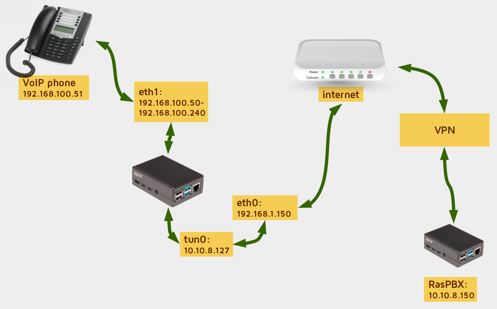

Po ponovnem zagonu bo RaspberryPi napravam, ki bodo nanj omrežno povezane preko USB Ethernet adapterja, dodelil IP naslov iz območja med `192.168.100.50` in `192.168.100.240`, ta naprava pa bo imela neposreden dostop do omrežja VPN (mimogrede, s pomočjo omrežnega stikala lahko na USB Ethernet adapter priključimo več naprav).

##### Dostop do VoIP telefona iz omrežja VPN

Zdaj imajo naprave, povezane z RaspberryPi, dostop do omrežja VPN. Hkrati pa bi morda želeli tudi dostop do VoIP telefona **iz omrežja VPN**. Povedano drugače, preko VPN omrežja bi radi dostopali do spletnega vmesnika za upravljanje VoIP telefona.

To bomo rešili s spletnim posredniškim strežnikom (angl. *proxy*). Najprej namestimo spletni strežnik `nginx`: `sudo apt install nginx`. Nato odprimo nastavitveno datoteko `sudo nano /etc/nginx/nginx.conf` in spremenimo (ali dodamo) vrstico:

```nginx
worker_processes 1;
```

Nato uredimo nastavitveno datoteko `sites-enabled`: `sudo nano /etc/nginx/sites-enabled/default`. Vsebuje naj naslednje nastavitve:

```nginx
# Preusmeritev na Aastra telefon
server {
    listen 443 default_server;

    root /var/www/html;
    index index.html index.htm;
    server_name _;

    ssl on;
    ssl_certificate /etc/ssl/certs/ssl-cert-snakeoil.pem;
    ssl_certificate_key /etc/ssl/private/ssl-cert-snakeoil.key;

    location / {
        proxy_set_header X-Forwarded-For $proxy_add_x_forwarded_for;
        proxy_set_header Host $http_host;
        proxy_set_header X-Forwarded-Proto https;
        proxy_redirect off;
        proxy_pass https://192.168.100.51;
        proxy_http_version 1.1;
    }
}
```

Kaj točno določajo te nastavitve? Nekaj zelo uporabnih stvari.

Najprej se bo na našem RaspberryPi zagnal spletni strežnik HTTPS. Ta spletni strežnik bo dostopen na VPN IP naslovu na našega RaspberryPi (v mojem primeru je to na `https://10.10.8.127`). Nadalje, v našem primeru za HTTPS uporabljamo samopodpisana (tim. "snakeoil") digitalna potrdila, seveda pa vam nihče ne brani, da si ustvarite svoja lastna potrdila in jih podpišete z Let's Encrypt ali kakšnim drugim ponudnikom digitalnega podpisovanja digitalnih potrdil. Seveda je to mogoče samo, če je vaš telefon dostopen neposredno prek interneta, česar pa vam ne priporočam! uporaba samopodpisanih digitalnih potrdil v nejavnem omrežju sicer ni sporna. Ko je HTTPS povezava med spletnim brskalnikom in spletnim strežnikom na RaspberryPi vzpostavljena, pa se ves spletni promet preusmeri na IP naslov VoIP telefona (`192.168.100.51`).

Najbolj kul stvar pri vsem skupaj pa je tole: ko se sedaj povežete na RaspberryPi (`https://10.10.8.127/`), bo vaša HTTPS povezava vzpostavljena s sodobnimi šifrirnimi protokoli (TLS 1.2 ali več). Nginx pa bo nato do VoIP telefona vzpostavil drugo šifrirano povezavo, lahko tudi s slabšimi šifrirnimi protokoli kot na primer TLS 1.0 ali celo SSL 3.0. Povedano drugače, gre za **ponovno šifriranje** HTTPS povezave, ki vam omogoča, da do VoIP telefona dostopate s sodobnim HTTPS šifriranjem, pa čeprav VoIP telefon sodobnih šifrirnih protokolov ne podpira.

Pravzaprav je potrebno nastaviti samo eno malenkost, in sicer določiti katere šifrirne protokole naj spletni strežnik uporabi ob vzpostavljanju HTTPS povezave. Odprimo datoteko `/etc/nginx/sites-enabled/default` in pred `location` dodajmo naslednje vrstice:

```nginx
ssl_protocols TLSv1.2 TLSv1.3;
ssl_prefer_server_ciphers on;
ssl_ciphers 'TLS13-CHACHA20-POLY1305-SHA256:TLS13-AES-256-GCM-SHA384:TLS13-AES-128-GCM-SHA256:ECDHE-ECDSA-AES256-GCM-SHA384:ECDHE-RSA-AES256-GCM-SHA384:ECDHE-ECDSA-CHACHA20-POLY1305:ECDHE-RSA-CHACHA20-POLY1305:ECDHE-ECDSA-AES128-GCM-SHA256:ECDHE-RSA-AES128-GCM-SHA256:ECDHE-ECDSA-AES256-SHA384:ECDHE-RSA-AES256-SHA384:ECDHE-ECDSA-AES128-SHA256:ECDHE-RSA-AES128-SHA256';
```

Zdaj bomo torej lahko z RaspberryPi (*vpnbridge*) vzpostavili visokokakovostno šifrirno povezavo (TLS 1.3 ali 1.2), Nginx pa bo nato vzpostavil manj varno povezavo z VoIP telefonom ter nam tako omogočil dostop do spletnega vmesnika VoIP telefona preko kvalitetne HTTPS povezave.

A najprej je potrebno preizkusiti še če so Nginx nastavitve brez napak: `sudo nginx -t` - upajmo, da so in če je vse v redu, bi morali videti takle izpis:

    nginx: the configuration file /etc/nginx/nginx.conf syntax is ok
    nginx: configuration file /etc/nginx/nginx.conf test is successful

Končno lahko Nginx spletni strežnik ponovno zaženemo: `sudo service nginx restart`. Zdaj lahko zaženemo spletni brskalnik ter se povežemo na Aastra VoIP telefon preko naprave **vpnbridge**: `https://10.10.8.127/`.

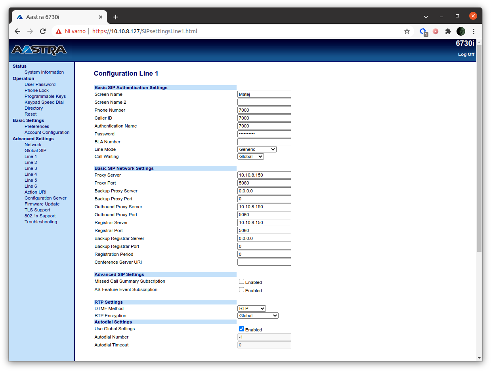

Na koncu bomo nastavili še požarni zid (`sudo apt install ufw`) ter določili naslednja pravila:

- nabor privzetih pravil (`sudo ufw default deny incoming` in `sudo ufw default allow outgoing`);
- dovolimo povezave SSH od kjerkoli: `sudo ufw allow 22/tcp`;
- dovolimo dostop do spletnega vmesnika VoIP telefona iz mojega računalnika, **vendar le, če je povezan v VPN** (moj VPN IP je `10.10.8.10`): `sudo ufw allow from 10.10.8.10 to any port 443 proto tcp`.

Ko je to storjeno, aktiviramo požarni zid z `sudo ufw enable`. Upoštevajte, da je to požarni zid, ki deluje na napravi RaspberryPi *vpnbridge*, zato seveda omejuje dostop do naprave *vpnbridge*. A posredno ta požarni zid omejuje tudi dostop do VoIP telefona, povezanega z našim *vpnbridgeom*.

Kaj smo torej naredili?. VoIP telefon je dostopen iz VPN, čeprav ni dovolj zmogljiv, da bi lahko poganjal VPN odjemalca. Zaščiten je tudi s požarnim zidom in dobrim HTTPS šifriranjem (TLS 1.2 ali več), pa čeprav VoIP telefon nima možnosti zaganjanja požarnega zidu in podpore sodobnih HTTPS šifrirnih protokolov.

##### Spreminjanje *nespremenljivega* privzetega gesla

Zdaj se morda sprašujete, ali bi bilo mogoče spremeniti tudi *nespremenljivo* geslo za administracijo telefona Aastra? Da, z nekaj triki je mogoče tudi to. Ampak najprej poglejmo, kako se gesla znebiti.

Najprej moramo zakodirati privzeto uporabniško ime in geslo telefona Aastra (z Base64 algoritmom). To lahko naredimo kar na RaspberryPi, in sicer tako, da zaženemo ukaz `echo -n "admin:22222" | base64`. Dobili bomo: `YWRtaW46MjIyMjI=`.

Zdaj odpremo nastavitveno datoteko `sites-enabled`, tako da vnesemo ukaz `sudo nano /etc/nginx/sites-enabled/default`. Poiščemo razdelek `location` in za `proxy_pass` dodajmo naslednjo vrstico :

```nginx
proxy_set_header Authorization "Basic YWRtaW46MjIyMjI=";
```

Shranimo datoteko in ponovno zaženimo Nginx: `sudo service nginx restart`. Kaj se zgodi? Do spletnega vmesnika za upravljanje telefona Aastra bomo lahko dostopali neposredno, ne da bi bilo potrebno vnašati uporabniško ime in geslo.

V naslednjem koraku pa moramo v Nginx posredniškemu strežniku narediti novo uporabniško ime in geslo. Recimo, da bo naše uporabniško ime `matej` in geslo `MySuperCoolPWD123!`.

Vnesemo ukaz: `sudo sh -c "echo -n 'matej:' >> /etc/nginx/.htpasswd"`, s čimer zapišemo naše uporabniško ime v datoteko `.htpasswd`. Nato pa: `sudo sh -c "openssl passwd -apr1 >> /etc/nginx/.htpasswd"`. Zdaj vnesemo še naše strašno skrivnostno geslo, in stvar je gotova.

Uporabniško ime in geslo za preverjanje pristnosti sta zdaj shranjena v `/etc/nginx/.htpasswd`, ki izgleda takole:

    matej:$apr1$cUzlGR14$WRgaPJ.0GAJeRgLN81vot.

Pa še ena zanimivost – v to datoteko lahko dodamo več uporabnikov (z različnimi gesli), potrebno je samo ponoviti ta dva ukaza!

A le počasi, nismo še končali. Če želimo omogočiti preverjanje pristnosti z datoteko `.htpasswd`, moramo znova odpreti nastavitveno datoteko `sites-enabled` (`sudo nano /etc/nginx/sites-enabled/default`) in pod razdelek `server` dodati naslednji dve vrstici:

```nginx
auth_basic "VoIP phone";
auth_basic_user_file /etc/nginx/.htpasswd;
```

Znova zaženemo Nginx s `sudo service nginx restart` in to je to! Zdaj je vaš stari VoIP telefon varno spravljen za požarnim zidom, podpira sodobne protokole HTTPS, lahko pa tudi spreminjate *nespremenljiva* gesla tudi za dostop do njegovega vmesnika za upravljanje! Kaj ni to totalno kul?

Ah, če ste slučajno pozabili geslo ali če želite kaj spremeniti, pa lahko vedno uredite datoteko `/etc/nginx/.htpasswd`. Ali pa jo preprosto odstranite in uporabnika ter geslo zanj ustvarite od začetka.

Mimogrede, če uporabljate VoIP telefon prek omrežja VPN, lahko prihaja do omrežnih zakasnitev. Sam takšnih takšnih težav nisem zaznal, sem pa zasledil, da če se klici prekinjajo ali telefon izgublja registracijo, lahko težavo rešite z omogočanjem ali povečanjem tim. SIP keep-alive nastavitve. V tem primeru v telefonu odprite `Advanced Settings` → `Line 1` in spremenite `Registration Period` (pod `Basic SIP Network Settings`) na nižjo številko.

##### Pa naredimo svoj stari VoIP telefon še brezžičen

Kaj pa, če želimo naš stari VoIP telefon narediti "brezžičen", torej, da se bo v omrežje povezoval prek WiFi in ne prek žične povezave?

Običajno si tega sicer ne želimo, saj so omrežja WiFi bolj nezanesljiva kot žična. Če pa recimo nimate možnosti potegniti omrežnega kabla, pa lahko RaspberryPi povežete preko WiFi omrežja. Prva stvar je seveda, da poiščemo razpoložljiva WiFi omrežja.

Vnesemo ukaz `sudo iwlist wlan0 scan`, ki pa bo izpisal veliko nepotrebnih podatkov, zato lahko izpis nekoliko filtriramo in prikažemo samo imena razpoložljivih WiFi omrežij: `sudo iwlist wlan0 scan | grep ESSID`. Izpisalo se bo nekaj takega:

    ESSID:"MyHome"
    ESSID:"DIRECT-14-HP DeskJet Plus 4100"
    ESSID:"Telelink"
    ESSID:"AndroidAP5ED8"

Zdaj lahko odpremo datoteko `wpa_supplicant.conf` z ukazom: `sudo nano /etc/wpa_supplicant/wpa_supplicant.conf`. Na konec dodajmo SSID omrežja in geslo za dostop:

    network={
       ssid="MyHome"
       psk="MySuperStrongPassword!"
    }

Datoteko shranimo in čez nekaj trenutkov se bo RaspberryPi samodejno povezal v naše WiFi omrežje (`MyHome`). To lahko preverimo z ukazoma `iwconfig wlan0` ali `iwgetid` commands. Če se RaspberryPi v WiFi omrežje ne bo povezal samodejno, pa bo potreben njegov ponoven zagon.

```
ifconfig wlan0
wlan0: flags=4163<UP,BROADCAST,RUNNING,MULTICAST>  mtu 1500
        inet 192.168.200.221  netmask 255.255.255.0  broadcast 192.168.200.255
        inet6 fe80::c582:9f73:aac0:5cc3  prefixlen 64  scopeid 0x20<link>
        ether b8:27:eb:a0:1c:b0  txqueuelen 1000  (Ethernet)
        RX packets 37  bytes 4284 (4.1 KiB)
        RX errors 0  dropped 0  overruns 0  frame 0
        TX packets 39  bytes 5962 (5.8 KiB)
        TX errors 0  dropped 0 overruns 0  carrier 0  collisions 0
```

Najboljše pri vsem pa je, da se bo VPN povezava vzpostavila samodejno in vam zato ni potrebno spreminjati nikakršnih nastavitev.

### Glasnost sporočil glasovne pošte

Pri uporabi glasovne pošte (govorimo o zvočnih sporočilih ob odsotnosti, ki nam jih sistem pošlje preko e-pošte) sem opazil, da imajo zvočni posnetki precej nizko glasnost. Rešitev je enostavna. V FreePBX pojdite na `Settings` → `Voicemail Admin` → `Settings` → `General` in poiščite polje `Volume Gain`. Ta parameter vam omogoča, da določite, za koliko želite povečati glasnost sporočil v glasovni pošti. Pozorni bralci boste opazili opombo, ki pravi, da mora biti na sistemu nameščen programski paket `sox`, vendar je na RasPBX že poskrbljeno za to.

Sam sem to številko nastavil na `7` in glasovna sporočila so zdaj veliko glasnejša. Splošno pravilo je: večja številka, večja glasnost. Poskusite z različnimi številkami (na primer `2` ali `9`) in poiščite kaj je najbolj primerno za vaš sistem.

## Kaj pa lahko naredite *vi*?

Upam, da je bil članek zanimiv, in če se vam kje v omari valja kakšen odvečen RaspberryPi, lahko poskusite tudi sami postaviti RasPBX.

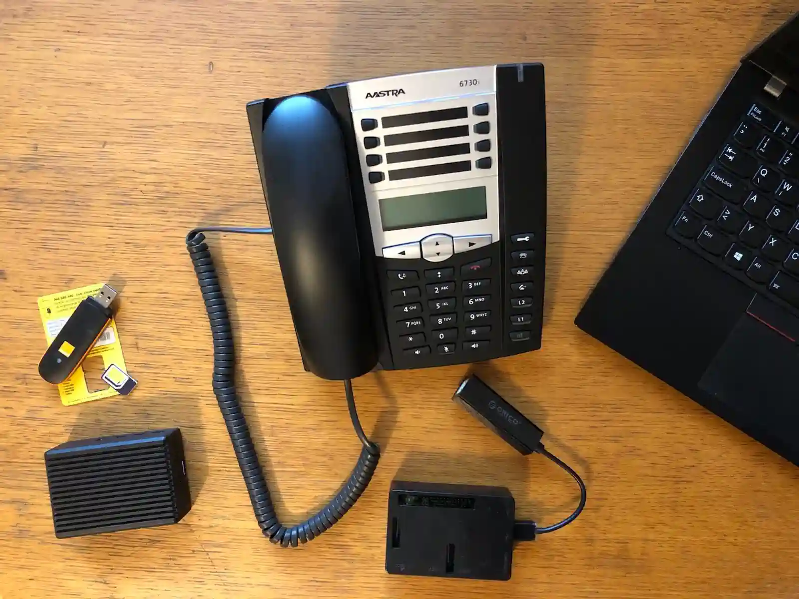

Obstaja pa tudi nekaj, kar lahko storite tudi **vi**.

Če ste spletni oblikovalec, lahko sestavite kakšno lepo stran za pošiljanje SMS sporočil (in tudi USSD sporočil).

Če ste razvijalec, lahko poskusite popraviti prejemanje MMS sporočil, ki sploh ne deluje.

Vesel bom tudi vaših predlogov o tem, kateri SIP odjemalci dobro izgledajo ter so enostavni za uporabo (ter predvsem in brez zoprnih hroščev). Kot rečeno, najraje imam odprtokodne SIP odjemalce in tiste, ki podpirajo SRTP, ZRTP šifriranje ter imajo še druge varnostne funkcionalnosti. Te stvari mi lahko sporočite preko *Github issues*.

Seveda je gotovo še veliko stvari, ki bi jih bilo mogoče narediti z RasPBX, in z veseljem bom slišal vaše ideje, zamisli, izkušnje in vprašanja. Tudi to mi lahko sporočite preko Githuba. Prav tako me lahko opozorite na napake v članku oziroma če sem vanj zapisal kakšno traparijo (skoraj gotovo sem jo).

Za konec pa si lahko ogledate nekaj mojih predavanj in projektov, na primer:

- [Video prikaz ponarejanja klicne identifikacije in prestrezanje VoIP komunikacijam](http://videolectures.net/single_kovacic_varnost_voip/).
- [Hekanje GSM telefonije in nekaj malega o varnosti GSM telefonije](http://videolectures.net/single_kovacic_phonebusters/) ([PDF prosojnice](https://telefoncek.si/static/2014/01/The_Phonebusters_2014.pdf)).
- [Vse o VPNjih](http://videolectures.net/water4cities_kovacic_virtual_private_networks/) ([PDF prosojnice](https://telefoncek.si/predavanja/VPN_2021.pdf)).
- [Forenzična analiza omrežnega prometa mobilnega telefona](http://videolectures.net/water4cities_kovacic_network_forensic_analysis/) ([PDF prosojnice](https://telefoncek.si/predavanja/Network_forensic_analysis_of_a_mobile_phone_2021.pdf)).
- ...in še [mnogo več](https://telefoncek.si/predavanja/).

*Ostanite z nami in veselo hekanje še naprej!*
