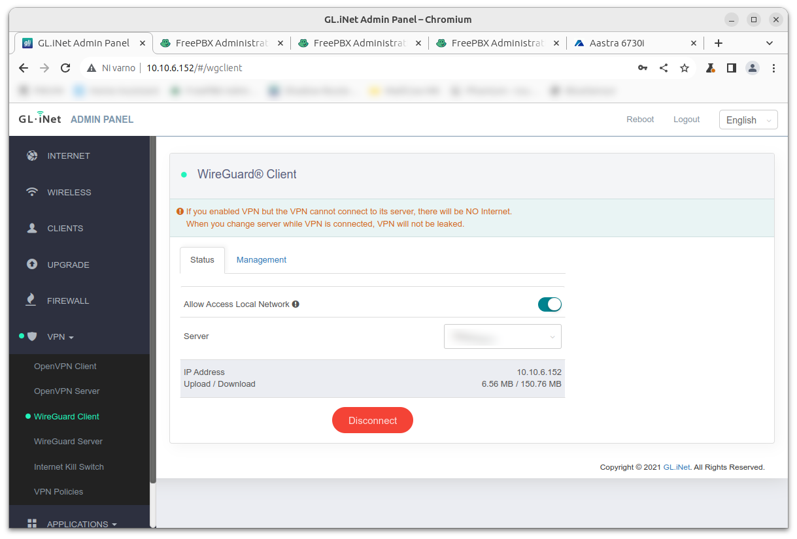
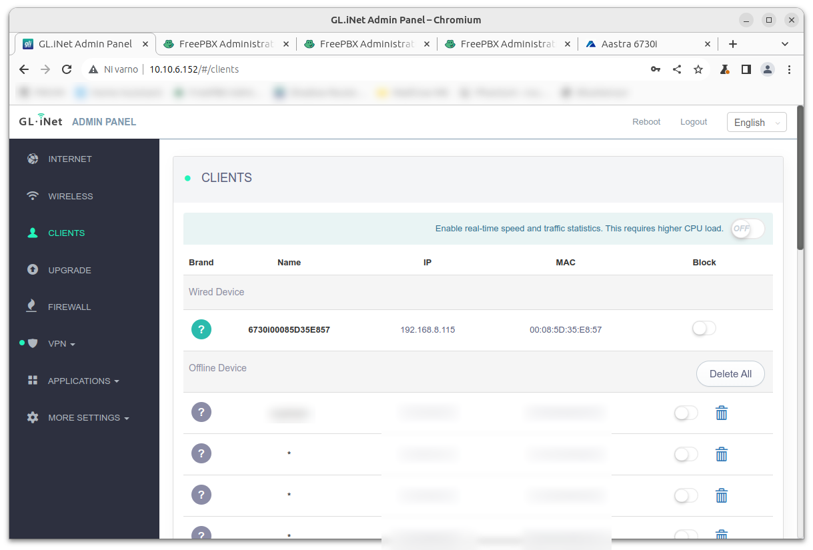
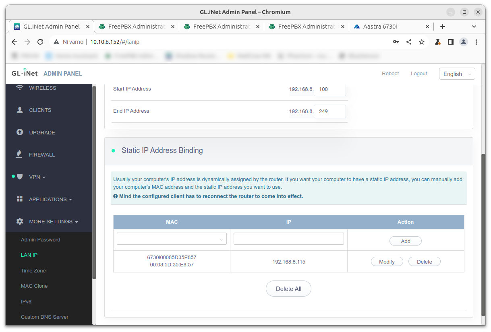
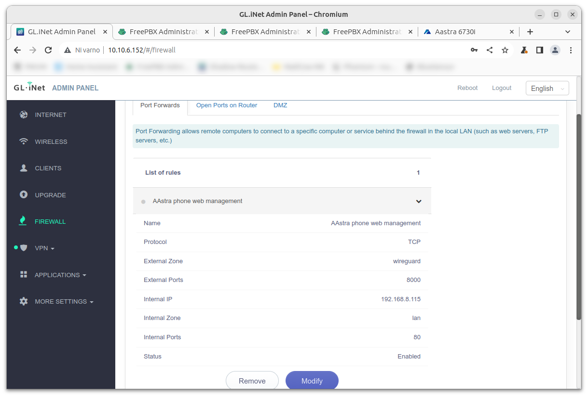

Old VoIP phones could be connected to the modern VPN network through a small, VPN capable router and I had already shown how to do this with Raspberry Pi. However, there is much easier way, and that is to use [GL.iNet GL-AR300M Shadow router](https://www.gl-inet.com/products/gl-ar300m/). This is an ARM based pocket-size device supporting various VPN services. It is running OpenWrt and is easily configurable through web interface.

Device has two Ethernet ports (WAN and LAN), but can be also used as WiFi repeater or could be connected to the mobile network through USB modem or via tethering through mobile phone. It supports OpenVPN and Wireguard VPN connections.

First, we need to connect the router to the internet. We can do this via WAN port, WiFi (we can scan nearby WiFi networks and connect to one), USB modem or with USB cable to a mobile phone.

Then we need to connect the router to the VPN. Through web interface of the router we can enter configuration for Wireguard or OpenVPN. Also, in the `VPN` menu we should enable `Allow Access Local Network` if we want to access web management of the VoIP phone.

Finally, we can connect VoIP phone to the LAN port.

Now we can go to the `Client` menu. We can see the MAC address of a VoIP phone and its LAN IP address (in our case it is `192.168.8.115`).

Now we want to make LAN IP address of this device static. We go to `More settings` → `LAN IP` and under `Static IP Address Binding` we select MAC address of the device and bind it to IP address.

Finally, we need to enable access to the web management of the VoIP phone through VPN. We go to the `Firewall` and under `Port Forwards` enter the rule that all TCP traffic to port `8000` coming from VPN (`External zone`) will be directed to the port `80` and internal IP of the VoIP phone (`Internal zone`).

And that is basically it. We can now access open web management of the VoIP phone through the VPN IP of our *Shadow* router and port `8000`. In our case that is: `http://10.10.6.152:8000`.

We enter the SIP details to the configuration of the VoIP phone. While I was testing Aastra 6730i phone, I experienced some weird network problems. After exactly a minute VoIP phone lost the connection to the RasPBX. When I opened FreePBX web interface - `Reports` → `Asterisk Info` - the extension went from `ONLINE` to `OFFLINE` after a minute. After that I was unable to call this extension, however I was able to place calls *from* this extension to other extensions!

Luckily, I was able to solve the problem. In the web management of the VoIP phone I changed so called SIP keep-alive settings. I did this under `Advanced Settings` → `Line 1` and changed `Registration Period` (under `Basic SIP Network Settings`) to `0`.

Just a funny note, this setting has been originally set to `60` (seconds), which is exactly that one minute when my extension went from `ONLINE` to `OFFLINE`. Also, if you are experiencing that your calls are cutting out, or the phone loses registration, setting the `Registration Period` to lower number is also the right solution.

Since the *Shadow* router is really small, the final setup is highly portable. You can also run *Shadow* router on a power bank (I tested 50.000 mAh and it is running around three days), however you will need electricity for powering VoIP phone.

Since the the *Shadow* router could be connected to mobile network with USB modem or through mobile phone, you can install plain old VoIP phone on your car or (even better) on your bicycle and have a truly mobile office. Wouldn't be that fun?
